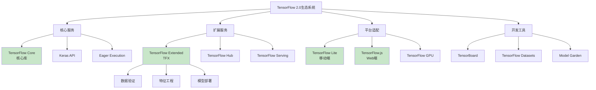

# HCIA-AI 题目分析 - TensorFlow2.0支持的服务

## 题目内容

**问题**: TensorFlow2.0支持的服务有？

**选项**:
- A. TensorFlow2.0核心库
- B. Extended
- C. Lite
- D. JavaScript

## 选项分析表格

| 选项 | 内容 | 正确性 | 详细分析 | 知识点 |
|------|------|--------|----------|--------|
| A | TensorFlow2.0核心库 | ✅ | TensorFlow2.0核心库是主要的深度学习框架，提供完整的机器学习和深度学习功能，包括模型构建、训练、部署等核心服务。 | TensorFlow核心 |
| B | Extended | ✅ | TensorFlow Extended(TFX)是TensorFlow的扩展平台，提供端到端的机器学习管道，包括数据验证、特征工程、模型训练、验证和部署等服务。 | TFX平台 |
| C | Lite | ✅ | TensorFlow Lite是专为移动设备和嵌入式设备优化的轻量级解决方案，支持在Android、iOS等移动平台上部署机器学习模型。 | 移动端部署 |
| D | JavaScript | ✅ | TensorFlow.js是TensorFlow的JavaScript版本，支持在浏览器和Node.js环境中运行机器学习模型，实现前端AI应用。 | Web端AI |

## 正确答案
**答案**: ABCD

**解题思路**: 
1. 了解TensorFlow2.0的完整生态系统
2. 理解不同平台和场景的TensorFlow变体
3. 掌握TensorFlow在各个领域的应用
4. 认识TensorFlow的扩展服务和工具

## 概念图解

## 知识点总结

### 核心概念
- **TensorFlow Core**: 主要的深度学习框架
- **TFX**: 端到端机器学习管道平台
- **TensorFlow Lite**: 移动端轻量级解决方案
- **TensorFlow.js**: Web端JavaScript实现

### 相关技术
- **模型训练**: 使用TensorFlow Core进行深度学习
- **生产部署**: 通过TFX构建ML管道
- **移动应用**: 使用TF Lite在手机上运行模型
- **Web应用**: 使用TF.js在浏览器中运行AI

### 记忆要点
- **Core**: **核心**深度学习框架
- **Extended(TFX)**: **扩展**平台，端到端ML管道
- **Lite**: **轻量级**，移动端优化
- **JavaScript**: **Web端**AI解决方案

## 扩展学习

### 相关文档
- TensorFlow官方文档
- TensorFlow Extended(TFX)指南
- TensorFlow Lite开发指南
- TensorFlow.js教程

### 实践应用
- **Core**: 训练大型深度学习模型
- **TFX**: 构建生产级ML管道
- **Lite**: 开发移动AI应用
- **JavaScript**: 构建Web端AI应用