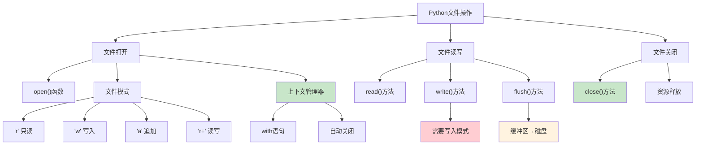

# HCIA-AI 题目分析 - Python IO操作

## 题目内容

**问题**: 关于Python IO操作正确的是？

**选项**:
- A. 在模式下，可以使用write方法将数据写入文件
- B. 可以使用上下文管理器打开文件进行操作
- C. 文件操作完成后要使用close方法进行关闭
- D. 使用flush方法可以将数据写入内存中

## 选项分析表格

| 选项 | 内容 | 正确性 | 详细分析 | 知识点 |
|------|------|--------|----------|--------|
| A | 在模式下，可以使用write方法将数据写入文件 | ❌ | 题目中"在模式下"表述不完整，应该是"在写入模式下"。在只读模式('r')下不能使用write方法，只有在写入模式('w', 'a', 'w+', 'a+'等)下才能使用write方法。 | 文件打开模式 |
| B | 可以使用上下文管理器打开文件进行操作 | ✅ | Python支持使用with语句作为上下文管理器来打开文件，这样可以自动处理文件的打开和关闭，即使出现异常也能确保文件被正确关闭。 | 上下文管理器 |
| C | 文件操作完成后要使用close方法进行关闭 | ✅ | 文件操作完成后必须使用close()方法关闭文件，释放系统资源。如果不关闭文件，可能导致数据丢失或资源泄露。 | 文件关闭 |
| D | 使用flush方法可以将数据写入内存中 | ❌ | flush()方法的作用是将缓冲区中的数据强制写入磁盘文件，而不是写入内存。它是将内存缓冲区的数据刷新到文件中。 | 缓冲区刷新 |

## 正确答案
**答案**: BC

**解题思路**: 
1. 理解Python文件操作的基本概念
2. 掌握文件打开模式的区别
3. 了解上下文管理器的优势
4. 明确flush方法的真正作用

## 概念图解

## 知识点总结

### 核心概念
- **文件模式**: 决定文件的访问权限
- **上下文管理器**: with语句自动管理资源
- **缓冲区**: 内存中的临时存储区域
- **文件关闭**: 释放系统资源的必要操作

### 相关技术
- **文件I/O**: Python的基础操作
- **异常处理**: 确保文件正确关闭
- **资源管理**: 避免内存泄露
- **数据持久化**: 将数据保存到磁盘

### 记忆要点
- **write方法**: 只能在**写入模式**下使用
- **with语句**: **上下文管理器**，自动关闭
- **close方法**: **必须调用**，释放资源
- **flush方法**: 缓冲区数据**写入磁盘**

## 扩展学习

### 相关文档
- Python官方文档 - 文件和目录访问
- Python文件I/O最佳实践
- 上下文管理器详解

### 实践应用
- 数据文件读写：CSV、JSON处理
- 日志文件管理：应用程序日志
- 配置文件操作：系统配置管理
- 大文件处理：分块读写技术