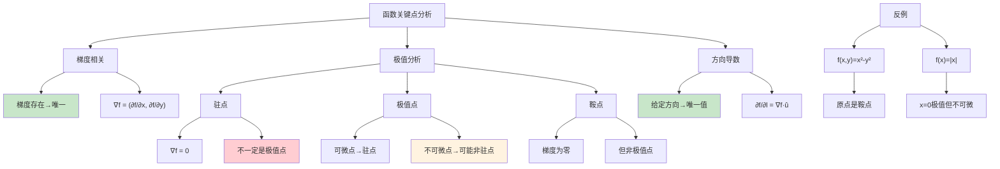

# HCIA-AI 题目分析 - 函数梯度与极值

## 题目内容

**问题**: 以下说法正确的是？

**选项**:
- A. 若函数在某一点梯度存在，则其梯度唯一
- B. 函数的驻点一定是极值点
- C. 函数的极值点一定是驻点
- D. 若函数在某一点处方向导数存在，则其方向导数唯一

## 选项分析表格

| 选项 | 内容 | 正确性 | 详细分析 | 知识点 |
|------|------|--------|----------|--------|
| A | 若函数在某一点梯度存在，则其梯度唯一 | ✅ | 梯度是函数在某点处所有偏导数组成的向量，如果梯度存在，则它是唯一确定的。梯度∇f(x,y) = (∂f/∂x, ∂f/∂y)在给定点处有唯一值。 | 梯度唯一性 |
| B | 函数的驻点一定是极值点 | ❌ | 驻点是梯度为零的点，但不一定是极值点。例如鞍点f(x,y)=x²-y²在原点(0,0)处梯度为零，但它是鞍点而非极值点。 | 驻点与极值 |
| C | 函数的极值点一定是驻点 | ❌ | 这个说法不完全正确。在可微点处，极值点确实是驻点；但在不可微点处，极值点可能不是驻点。例如f(x)=|x|在x=0处是极值点但不可微。 | 极值点条件 |
| D | 若函数在某一点处方向导数存在，则其方向导数唯一 | ✅ | 方向导数是函数在给定点沿特定方向的变化率，对于确定的点和方向，方向导数值是唯一的。∂f/∂l = ∇f·û，其中û是单位方向向量。 | 方向导数唯一性 |

## 正确答案
**答案**: AD

**解题思路**: 
1. 理解梯度的数学定义和唯一性
2. 区分驻点、极值点、鞍点的概念
3. 掌握极值点的充分必要条件
4. 理解方向导数的计算和性质

## 概念图解

## 知识点总结

### 核心概念
- **梯度**: 函数在某点的所有偏导数组成的向量
- **驻点**: 梯度为零的点
- **极值点**: 函数取得极大值或极小值的点
- **方向导数**: 函数沿特定方向的变化率

### 相关技术
- **多元微积分**: 偏导数、梯度计算
- **优化理论**: 极值点寻找
- **机器学习**: 梯度下降算法
- **深度学习**: 反向传播算法

### 记忆要点
- **梯度存在**: 则**唯一确定**
- **驻点**: **不一定**是极值点（可能是鞍点）
- **极值点**: 可微时是驻点，**不可微时可能不是**
- **方向导数**: 给定方向下**唯一**

## 扩展学习

### 相关文档
- 《高等数学》多元函数微分学
- 《最优化理论与算法》
- 机器学习中的梯度下降

### 实践应用
- 神经网络训练：梯度下降优化
- 图像处理：梯度检测边缘
- 最优化问题：寻找函数极值
- 物理仿真：力场梯度计算