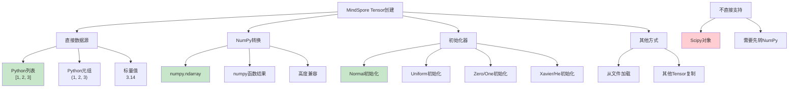

# HCIA-AI 题目分析 - MindSpore构建Tensor的方式

## 题目内容

**问题**: MindSpore构建Tensor的方式有以下哪些选项？

**选项**:
- A. 根据数据直接生成
- B. 从NumPy数组生成
- C. 从Scipy直接生成
- D. 使用init初始化器构造张量

## 选项分析表格

| 选项 | 内容 | 正确性 | 详细分析 | 知识点 |
|------|------|--------|----------|--------|
| A | 根据数据直接生成 | ✅ | MindSpore支持直接从Python列表、元组等数据结构创建Tensor，如mindspore.Tensor([1, 2, 3])，这是最基本的Tensor创建方式。 | 直接数据创建 |
| B | 从NumPy数组生成 | ✅ | MindSpore与NumPy高度兼容，可以直接从numpy.ndarray创建Tensor，如mindspore.Tensor(numpy_array)，这是常用的数据转换方式。 | NumPy兼容性 |
| C | 从Scipy直接生成 | ❌ | MindSpore不直接支持从Scipy对象创建Tensor。需要先将Scipy对象转换为NumPy数组，再转换为MindSpore Tensor。 | 第三方库兼容 |
| D | 使用init初始化器构造张量 | ✅ | MindSpore提供了丰富的初始化器(initializer)，如Normal、Uniform、Zero、One等，用于创建特定分布或值的Tensor。 | 初始化器 |

## 正确答案
**答案**: ABD

**解题思路**: 
1. 了解MindSpore Tensor的创建方式
2. 理解MindSpore与其他科学计算库的兼容性
3. 掌握初始化器的使用方法
4. 区分直接支持和间接支持的数据源

## 概念图解

## 知识点总结

### 核心概念
- **直接创建**: 从Python基础数据类型创建Tensor
- **NumPy兼容**: 无缝转换numpy.ndarray
- **初始化器**: 专用的Tensor初始化工具
- **数据类型**: 支持多种数值类型

### 相关技术
- **MindSpore框架**: 华为自研深度学习框架
- **张量操作**: 多维数组的数学运算
- **内存管理**: 高效的张量存储和计算
- **设备适配**: CPU/GPU/NPU多设备支持

### 记忆要点
- **直接生成**: 从**Python数据**直接创建
- **NumPy转换**: **高度兼容**numpy数组
- **初始化器**: **专用工具**构造特定Tensor
- **Scipy**: **不直接支持**，需转换

## 扩展学习

### 相关文档
- MindSpore官方文档 - Tensor操作
- MindSpore初始化器使用指南
- NumPy与MindSpore互操作

### 实践应用
- 数据预处理：从原始数据创建Tensor
- 模型初始化：使用初始化器设置权重
- 数据转换：NumPy与MindSpore互转
- 科学计算：多维数组运算