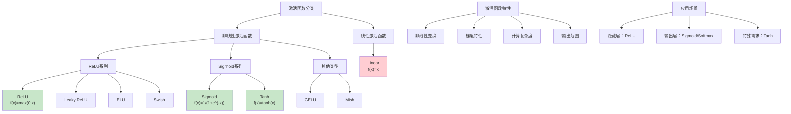

# HCIA-AI 题目分析 - 深度学习中的激活函数

## 题目内容

**问题**: 以下哪些是深度学习中常用的激活函数？

**选项**:
- A. ReLU
- B. Sigmoid
- C. Tanh
- D. Linear

## 选项分析表格

| 选项 | 内容 | 正确性 | 详细分析 | 知识点 |
|------|------|--------|----------|--------|
| A | ReLU | ✅ | ReLU(Rectified Linear Unit)是目前最常用的激活函数，f(x)=max(0,x)，具有计算简单、缓解梯度消失、稀疏激活等优点，广泛应用于CNN和DNN中。 | 非线性激活 |
| B | Sigmoid | ✅ | Sigmoid函数f(x)=1/(1+e^(-x))，输出范围(0,1)，常用于二分类输出层和早期神经网络，但存在梯度消失问题，在深层网络中较少使用。 | S型激活函数 |
| C | Tanh | ✅ | Tanh函数f(x)=(e^x-e^(-x))/(e^x+e^(-x))，输出范围(-1,1)，是Sigmoid的改进版本，零中心化，但仍存在梯度消失问题。 | 双曲正切函数 |
| D | Linear | ❌ | Linear激活函数f(x)=x是线性函数，不提供非线性变换能力。如果神经网络只使用线性激活函数，整个网络等价于单层线性变换，无法学习复杂的非线性关系。 | 线性变换 |

## 正确答案
**答案**: ABC

**解题思路**: 
1. 理解激活函数的作用：引入非线性变换
2. 掌握常用激活函数的特点和应用场景
3. 区分线性和非线性激活函数
4. 了解不同激活函数的优缺点

## 概念图解

## 知识点总结

### 核心概念
- **非线性变换**: 激活函数的核心作用是引入非线性
- **梯度流动**: 不同激活函数对梯度传播的影响
- **计算效率**: ReLU等函数计算简单高效
- **输出特性**: 不同函数的输出范围和分布

### 相关技术
- **深度神经网络**: 多层网络的非线性建模
- **反向传播**: 梯度计算和参数更新
- **梯度消失/爆炸**: 深层网络训练问题
- **网络初始化**: 配合激活函数的权重初始化

### 记忆要点
- **ReLU**: **最常用**，简单高效，缓解梯度消失
- **Sigmoid**: **二分类**输出，存在梯度消失
- **Tanh**: **零中心化**，比Sigmoid好但仍有梯度消失
- **Linear**: **无非线性**，深层网络中不适用

## 扩展学习

### 相关文档
- 深度学习激活函数详解
- ReLU及其变种比较
- 激活函数选择指南

### 实践应用
- CNN网络：ReLU作为主要激活函数
- 分类任务：输出层使用Sigmoid/Softmax
- 回归任务：输出层可使用线性激活
- 特殊网络：LSTM中使用Tanh和Sigmoid