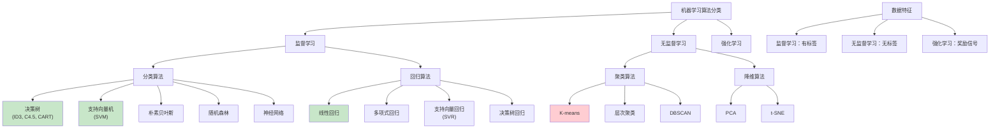

# HCIA-AI 题目分析 - 监督学习算法

## 题目内容

**问题**: 以下哪些属于监督学习算法？

**选项**:
- A. 决策树
- B. K-means
- C. 支持向量机
- D. 线性回归

## 选项分析表格

| 选项 | 内容 | 正确性 | 详细分析 | 知识点 |
|------|------|--------|----------|--------|
| A | 决策树 | ✅ | 决策树是典型的监督学习算法，通过训练数据中的特征和标签构建树状决策结构，可用于分类和回归任务，如ID3、C4.5、CART等算法。 | 树形分类器 |
| B | K-means | ❌ | K-means是无监督学习算法，用于聚类任务。它不需要标签数据，通过最小化簇内距离将数据分为K个簇，属于无监督学习范畴。 | 聚类算法 |
| C | 支持向量机 | ✅ | SVM是经典的监督学习算法，通过寻找最优分离超平面进行分类，也可用于回归(SVR)。需要训练数据的特征和标签来学习决策边界。 | 核方法 |
| D | 线性回归 | ✅ | 线性回归是最基础的监督学习算法，通过学习特征与连续目标值之间的线性关系进行预测，需要训练数据中的输入特征和输出标签。 | 回归分析 |

## 正确答案
**答案**: ACD

**解题思路**: 
1. 理解监督学习的定义：需要标签数据进行训练
2. 区分监督学习和无监督学习算法
3. 掌握常见监督学习算法的特点
4. 了解算法的应用场景和任务类型

## 概念图解

## 知识点总结

### 核心概念
- **监督学习**: 使用标签数据进行训练的学习方式
- **分类任务**: 预测离散类别标签
- **回归任务**: 预测连续数值
- **特征工程**: 输入特征的选择和处理

### 相关技术
- **决策树算法**: 信息增益、基尼系数、剪枝技术
- **支持向量机**: 核函数、软间隔、对偶问题
- **线性回归**: 最小二乘法、正则化、梯度下降
- **模型评估**: 交叉验证、混淆矩阵、ROC曲线

### 记忆要点
- **决策树**: **有标签**训练，树状结构决策
- **K-means**: **无标签**聚类，不是监督学习
- **SVM**: **有标签**分类，寻找最优超平面
- **线性回归**: **有标签**回归，学习线性关系

## 扩展学习

### 相关文档
- 监督学习算法详解
- 决策树算法原理与实现
- 支持向量机数学基础
- 线性回归与正则化

### 实践应用
- 分类任务：垃圾邮件检测、图像识别
- 回归任务：房价预测、股票预测
- 决策树：医疗诊断、信贷审批
- SVM：文本分类、生物信息学