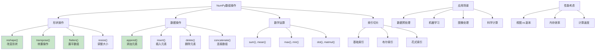

# HCIA-AI 题目分析 - NumPy数组操作

## 题目内容

**问题**: 在Python中，以下哪些是NumPy数组的常用操作？

**选项**:
- A. reshape()
- B. transpose()
- C. flatten()
- D. append()

## 选项分析表格

| 选项 | 内容 | 正确性 | 详细分析 | 知识点 |
|------|------|--------|----------|--------|
| A | reshape() | ✅ | reshape()是NumPy中最常用的数组操作之一，用于改变数组的形状而不改变数据，如arr.reshape(2,3)将一维数组重塑为2×3的二维数组，在深度学习中广泛用于数据预处理。 | 形状变换 |
| B | transpose() | ✅ | transpose()用于数组的转置操作，交换数组的轴，如二维数组的行列互换。可以使用arr.transpose()或arr.T，在矩阵运算和深度学习中经常使用。 | 轴变换 |
| C | flatten() | ✅ | flatten()将多维数组展平为一维数组，返回数组的副本。与ravel()类似但总是返回副本，常用于将图像数据转换为向量形式进行机器学习处理。 | 数组展平 |
| D | append() | ✅ | append()用于在数组末尾添加元素或数组，np.append(arr, values)。虽然不如列表的append()高效，但确实是NumPy提供的数组操作方法。 | 数组拼接 |

## 正确答案
**答案**: ABCD

**解题思路**: 
1. 了解NumPy数组的基本操作方法
2. 理解每个操作的功能和应用场景
3. 掌握数组形状变换的重要性
4. 熟悉数组操作在数据科学中的应用

## 概念图解

## 知识点总结

### 核心概念
- **形状变换**: 改变数组维度而不改变数据
- **轴操作**: 理解NumPy的轴概念和操作
- **视图与副本**: 操作是否创建新的内存空间
- **广播机制**: NumPy数组运算的自动扩展

### 相关技术
- **数据预处理**: 机器学习前的数据整理
- **矩阵运算**: 线性代数计算基础
- **图像处理**: 多维数组表示图像数据
- **深度学习**: 张量操作的基础

### 记忆要点
- **reshape()**: **改变形状**，不改变数据
- **transpose()**: **转置操作**，交换轴
- **flatten()**: **展平数组**，返回副本
- **append()**: **添加元素**，效率较低

## 扩展学习

### 相关文档
- NumPy官方文档 - 数组操作
- NumPy数组形状操作详解
- 高效NumPy编程技巧

### 实践应用
- 图像处理：reshape调整图像维度
- 机器学习：flatten将图像转为特征向量
- 矩阵运算：transpose进行矩阵转置
- 数据分析：append合并数据集