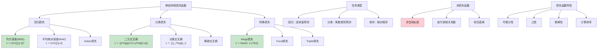

# HCIA-AI 题目分析 - 神经网络中的损失函数

## 题目内容

**问题**: 以下哪些是神经网络中常用的损失函数？

**选项**:
- A. 均方误差(MSE)
- B. 交叉熵损失
- C. Hinge损失
- D. 余弦相似度

## 选项分析表格

| 选项 | 内容 | 正确性 | 详细分析 | 知识点 |
|------|------|--------|----------|--------|
| A | 均方误差(MSE) | ✅ | MSE是回归任务中最常用的损失函数，计算预测值与真实值差的平方的平均值。公式：MSE = (1/n)∑(y_pred - y_true)²，适用于连续值预测。 | 回归损失 |
| B | 交叉熵损失 | ✅ | 交叉熵是分类任务中最重要的损失函数，包括二元交叉熵(Binary Cross-entropy)和分类交叉熵(Categorical Cross-entropy)，能有效衡量概率分布之间的差异。 | 分类损失 |
| C | Hinge损失 | ✅ | Hinge损失主要用于支持向量机(SVM)，也可用于神经网络的分类任务。公式：max(0, 1-y*f(x))，特别适用于二分类问题，具有稀疏性特点。 | SVM损失 |
| D | 余弦相似度 | ❌ | 余弦相似度是相似性度量指标，不是损失函数。它计算两个向量夹角的余弦值，范围[-1,1]，常用于文本相似性计算，但不直接作为神经网络的损失函数使用。 | 相似性度量 |

## 正确答案
**答案**: ABC

**解题思路**: 
1. 理解损失函数的定义和作用
2. 区分损失函数和相似性度量指标
3. 掌握不同任务类型对应的损失函数
4. 了解损失函数的数学原理和应用场景

## 概念图解

## 知识点总结

### 核心概念
- **损失函数**: 衡量模型预测与真实值差异的函数
- **梯度下降**: 通过损失函数梯度更新模型参数
- **任务适配**: 不同任务选择合适的损失函数
- **数值稳定性**: 避免梯度消失或爆炸问题

### 相关技术
- **反向传播**: 损失函数梯度的计算和传播
- **优化算法**: SGD、Adam等优化器
- **正则化**: L1、L2正则化防止过拟合
- **模型评估**: 损失值与评估指标的关系

### 记忆要点
- **MSE**: **回归任务**，平方误差，连续值
- **交叉熵**: **分类任务**，概率分布，离散类别
- **Hinge**: **SVM风格**，间隔最大化，二分类
- **余弦相似度**: **相似性度量**，不是损失函数

## 扩展学习

### 相关文档
- 深度学习损失函数详解
- 交叉熵损失数学原理
- 损失函数选择指南

### 实践应用
- 回归任务：房价预测使用MSE
- 图像分类：使用交叉熵损失
- 目标检测：组合多种损失函数
- 推荐系统：使用排序损失函数