# HCIA-AI 题目分析 - MindSpore nn模块

## 题目内容

**问题**: 在mindspore的python API中，mindspore.（）可以用来定义损失函数、优化器以及其他构建网络的计算单元。（填空）

**答案**: nn

## 题目分析

### 关键信息提取
1. **MindSpore Python API**: 框架的Python接口
2. **损失函数**: 模型训练中的损失计算
3. **优化器**: 参数更新算法
4. **计算单元**: 网络构建的基本组件
5. **填空位置**: mindspore.（）

### 答案解析

**正确答案**: nn

**解题思路**: 
1. 识别MindSpore的模块结构
2. 理解nn模块的核心功能
3. 确认nn模块包含损失函数、优化器等组件

## 概念图解

```mermaid
graph TD
    A[MindSpore框架] --> B[mindspore.nn]
    A --> C[mindspore.ops]
    A --> D[mindspore.dataset]
    A --> E[mindspore.train]
    A --> F[mindspore.context]
    
    B --> G[神经网络层]
    B --> H[损失函数]
    B --> I[优化器]
    B --> J[激活函数]
    B --> K[网络容器]
    
    G --> L[Dense 全连接层]
    G --> M[Conv2d 卷积层]
    G --> N[LSTM 循环层]
    G --> O[BatchNorm 归一化层]
    G --> P[Dropout 正则化层]
    
    H --> Q[SoftmaxCrossEntropyWithLogits]
    H --> R[MSELoss 均方误差]
    H --> S[BCELoss 二元交叉熵]
    H --> T[L1Loss 绝对值损失]
    
    I --> U[SGD 随机梯度下降]
    I --> V[Adam 自适应优化]
    I --> W[Momentum 动量优化]
    I --> X[AdaGrad 自适应梯度]
    
    J --> Y[ReLU]
    J --> Z[Sigmoid]
    J --> AA[Tanh]
    J --> BB[Softmax]
    
    K --> CC[Cell 基础网络单元]
    K --> DD[SequentialCell 顺序容器]
    K --> EE[CellList 网络列表]
    
    B --> FF[核心特点]
    FF --> GG[面向对象设计]
    FF --> HH[自动微分支持]
    FF --> II[GPU/CPU兼容]
    FF --> JJ[动态图执行]
    
    style B fill:#e8f5e8
    style G fill:#fff3cd
    style H fill:#fff3cd
    style I fill:#fff3cd
```



## 知识点总结

### 核心概念
- **mindspore.nn**: MindSpore的神经网络模块
- **计算单元**: 构建神经网络的基本组件
- **模块化设计**: 将不同功能封装成独立模块
- **面向对象**: 基于类的网络构建方式

### mindspore.nn模块详解

#### 1. 神经网络层（Layers）

| 层类型 | 类名 | 功能描述 | 主要参数 |
|--------|------|----------|----------|
| 全连接层 | Dense | 线性变换 | in_features, out_features |
| 卷积层 | Conv2d | 二维卷积 | in_channels, out_channels, kernel_size |
| 池化层 | MaxPool2d | 最大池化 | kernel_size, stride |
| 归一化层 | BatchNorm2d | 批归一化 | num_features |
| 循环层 | LSTM | 长短期记忆 | input_size, hidden_size |

#### 2. 损失函数（Loss Functions）

| 损失函数 | 类名 | 适用场景 | 数学表达式 |
|----------|------|----------|------------|
| 交叉熵损失 | SoftmaxCrossEntropyWithLogits | 多分类 | -∑yᵢlog(ŷᵢ) |
| 均方误差 | MSELoss | 回归 | ∑(yᵢ-ŷᵢ)² |
| 绝对值损失 | L1Loss | 回归 | ∑\|yᵢ-ŷᵢ\| |
| 二元交叉熵 | BCELoss | 二分类 | -[ylog(ŷ)+(1-y)log(1-ŷ)] |

#### 3. 优化器（Optimizers）

| 优化器 | 类名 | 特点 | 主要参数 |
|--------|------|------|----------|
| 随机梯度下降 | SGD | 简单高效 | learning_rate, momentum |
| 自适应优化 | Adam | 自适应学习率 | learning_rate, beta1, beta2 |
| 动量优化 | Momentum | 加速收敛 | learning_rate, momentum |
| 自适应梯度 | AdaGrad | 稀疏数据友好 | learning_rate |

#### 4. 激活函数（Activation Functions）

| 激活函数 | 类名 | 数学表达式 | 特点 |
|----------|------|------------|------|
| ReLU | ReLU | max(0, x) | 简单高效，缓解梯度消失 |
| Sigmoid | Sigmoid | 1/(1+e^(-x)) | 输出范围(0,1) |
| Tanh | Tanh | (e^x-e^(-x))/(e^x+e^(-x)) | 零中心，输出范围(-1,1) |
| Softmax | Softmax | e^xᵢ/∑e^xⱼ | 多分类概率输出 |

### MindSpore.nn的设计特点

#### 1. 面向对象设计
```python
import mindspore.nn as nn

# 继承nn.Cell基类
class MyNetwork(nn.Cell):
    def __init__(self):
        super(MyNetwork, self).__init__()
        self.dense1 = nn.Dense(784, 128)
        self.relu = nn.ReLU()
        self.dense2 = nn.Dense(128, 10)
    
    def construct(self, x):
        x = self.dense1(x)
        x = self.relu(x)
        x = self.dense2(x)
        return x
```

#### 2. 自动微分支持
- **前向传播**: construct方法定义
- **反向传播**: 自动计算梯度
- **参数更新**: 优化器自动处理

#### 3. 动态图执行
- **即时执行**: 代码逐行执行
- **调试友好**: 易于调试和验证
- **灵活性高**: 支持动态网络结构

### 常用组件示例

#### 1. 构建简单网络
```python
import mindspore.nn as nn
from mindspore import Tensor
import numpy as np

# 定义网络
class SimpleNet(nn.Cell):
    def __init__(self):
        super(SimpleNet, self).__init__()
        self.flatten = nn.Flatten()
        self.dense1 = nn.Dense(784, 128)
        self.relu = nn.ReLU()
        self.dropout = nn.Dropout(p=0.2)
        self.dense2 = nn.Dense(128, 10)
    
    def construct(self, x):
        x = self.flatten(x)
        x = self.dense1(x)
        x = self.relu(x)
        x = self.dropout(x)
        x = self.dense2(x)
        return x

# 实例化网络
net = SimpleNet()
```

#### 2. 定义损失函数和优化器
```python
# 损失函数
loss_fn = nn.SoftmaxCrossEntropyWithLogits(sparse=True, reduction='mean')

# 优化器
optimizer = nn.Adam(net.trainable_params(), learning_rate=0.001)

# 或者使用SGD
optimizer_sgd = nn.SGD(
    net.trainable_params(), 
    learning_rate=0.01, 
    momentum=0.9
)
```

#### 3. 训练循环
```python
import mindspore.ops as ops
from mindspore import value_and_grad

# 定义前向函数
def forward_fn(data, label):
    logits = net(data)
    loss = loss_fn(logits, label)
    return loss, logits

# 获取梯度函数
grad_fn = value_and_grad(forward_fn, None, optimizer.parameters, has_aux=True)

# 训练步骤
def train_step(data, label):
    (loss, _), grads = grad_fn(data, label)
    optimizer(grads)
    return loss
```

### nn模块的层次结构

#### 1. Cell基类
- **所有网络组件的基类**
- **提供参数管理功能**
- **支持自动微分**
- **定义construct抽象方法**

#### 2. 具体实现类
- **Dense**: 全连接层实现
- **Conv2d**: 卷积层实现
- **LSTM**: 循环层实现
- **各种损失函数和优化器**

#### 3. 容器类
- **SequentialCell**: 顺序执行容器
- **CellList**: 网络层列表
- **ParameterTuple**: 参数元组

### 与其他框架对比

| 特性 | MindSpore.nn | PyTorch.nn | TensorFlow.keras |
|------|--------------|------------|------------------|
| 基类 | Cell | Module | Layer |
| 前向方法 | construct | forward | call |
| 参数管理 | 自动 | 自动 | 自动 |
| 动态图 | 支持 | 支持 | 支持 |
| 静态图 | 支持 | 部分支持 | 支持 |

### 最佳实践

#### 1. 网络设计
- **模块化**: 将复杂网络分解为简单模块
- **可复用**: 设计可重复使用的组件
- **清晰命名**: 使用有意义的变量名

#### 2. 参数初始化
```python
# 自定义初始化
class MyNet(nn.Cell):
    def __init__(self):
        super(MyNet, self).__init__()
        self.dense = nn.Dense(784, 128)
        # 自定义权重初始化
        self.dense.weight.set_data(
            Tensor(np.random.normal(0, 0.01, (128, 784)).astype(np.float32))
        )
```

#### 3. 调试技巧
- **打印中间结果**: 在construct中添加print
- **检查参数**: 使用parameters()方法
- **验证梯度**: 检查梯度是否合理

### 记忆要点
- **核心模块**: mindspore.nn是神经网络构建的核心
- **主要功能**: 包含层、损失函数、优化器、激活函数
- **设计理念**: 面向对象，模块化，易于使用
- **基础类**: Cell是所有网络组件的基类

## 扩展学习

### 高级特性

#### 1. 自定义层
```python
class CustomLayer(nn.Cell):
    def __init__(self, input_size, output_size):
        super(CustomLayer, self).__init__()
        self.weight = Parameter(
            Tensor(np.random.normal(0, 0.01, (output_size, input_size)), 
                   mindspore.float32)
        )
        self.bias = Parameter(
            Tensor(np.zeros(output_size), mindspore.float32)
        )
    
    def construct(self, x):
        return ops.matmul(x, self.weight.T) + self.bias
```

#### 2. 模型保存和加载
```python
# 保存模型
mindspore.save_checkpoint(net, "model.ckpt")

# 加载模型
param_dict = mindspore.load_checkpoint("model.ckpt")
mindspore.load_param_into_net(net, param_dict)
```

#### 3. 模型评估
```python
# 设置评估模式
net.set_train(False)

# 评估指标
accuracy = nn.Accuracy()
loss_metric = nn.Loss()

# 计算指标
for data, label in eval_dataset:
    logits = net(data)
    accuracy.update(logits, label)
    loss_metric.update(loss_fn(logits, label))

print(f"Accuracy: {accuracy.eval()}")
print(f"Loss: {loss_metric.eval()}")
```

### 性能优化

#### 1. 混合精度训练
```python
from mindspore.amp import DynamicLossScaler, auto_mixed_precision

# 启用混合精度
net = auto_mixed_precision(net, 'O1')
loss_scaler = DynamicLossScaler()
```

#### 2. 模型并行
```python
# 设置并行模式
mindspore.set_context(mode=mindspore.GRAPH_MODE, device_target="GPU")
mindspore.set_auto_parallel_context(parallel_mode=mindspore.ParallelMode.DATA_PARALLEL)
```

### 调试和监控

#### 1. 参数监控
```python
# 查看参数
for name, param in net.parameters_and_names():
    print(f"{name}: {param.shape}")

# 参数统计
for param in net.trainable_params():
    print(f"Mean: {param.mean()}, Std: {param.std()}")
```

#### 2. 梯度检查
```python
# 检查梯度
grads = grad_fn(data, label)[1]
for i, grad in enumerate(grads):
    if grad is not None:
        print(f"Grad {i}: mean={grad.mean()}, std={grad.std()}")
```