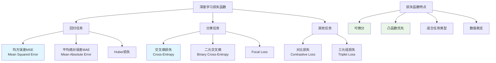

# HCIA-AI 题目分析 - 深度学习损失函数

## 题目内容

**问题**: 深度学习中常用的损失函数有？

**选项**:
- A. L1损失函数
- B. 均方误差损失函数
- C. 交叉熵误差损失函数
- D. 自下降损失函数

## 选项分析表格

| 选项 | 内容 | 正确性 | 详细分析 | 知识点 |
|------|------|--------|----------|--------|
| A | L1损失函数 | ❌ | L1损失函数虽然存在，但在深度学习中不是最常用的损失函数。L1损失对异常值较为鲁棒，但梯度不连续，在深度学习优化中使用较少 | L1损失特性 |
| B | 均方误差损失函数 | ✅ | MSE(Mean Squared Error)是回归任务中最常用的损失函数，计算预测值与真实值差的平方的平均值，梯度连续且易于优化 | 回归损失函数 |
| C | 交叉熵误差损失函数 | ✅ | Cross-Entropy Loss是分类任务中最常用的损失函数，特别适用于多分类和二分类问题，能够很好地衡量概率分布之间的差异 | 分类损失函数 |
| D | 自下降损失函数 | ❌ | 这不是一个标准的损失函数名称，可能是错误选项。深度学习中没有"自下降损失函数"这个概念 | 错误选项 |

## 正确答案
**答案**: BC

**解题思路**: 
1. 识别深度学习中的常用损失函数类型
2. 区分回归任务和分类任务的损失函数
3. 均方误差用于回归，交叉熵用于分类
4. 排除不常用或不存在的损失函数

## 概念图解

## 知识点总结

### 核心概念
- **均方误差(MSE)**: 回归任务的标准损失函数，计算预测值与真实值差的平方
- **交叉熵损失**: 分类任务的标准损失函数，衡量预测概率分布与真实分布的差异
- **L1损失**: 虽然存在但在深度学习中不是最常用的
- **损失函数选择**: 根据任务类型选择合适的损失函数

### 相关技术
- 梯度下降优化算法
- 反向传播算法
- MindSpore损失函数实现
- 深度学习框架中的损失函数API

### 记忆要点
- 回归用MSE，分类用交叉熵
- 损失函数必须可微分
- 常用损失函数：MSE、Cross-Entropy
- 避免选择不存在的损失函数名称

## 扩展学习

### 相关文档
- 深度学习损失函数原理
- MindSpore损失函数文档
- 优化算法与损失函数关系

### 实践应用
- 图像分类项目中的交叉熵损失
- 回归预测中的MSE损失
- 华为ModelArts中的损失函数选择
- 自定义损失函数设计