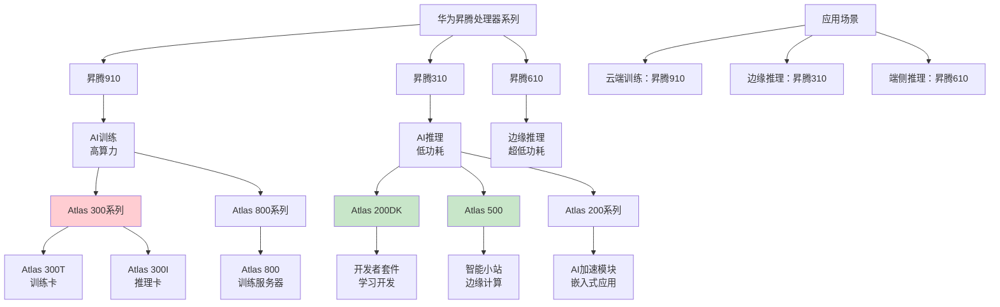

# HCIA-AI 题目分析 - 昇腾310处理器可适用的产品

## 题目内容

**问题**: 昇腾310处理器可适用于以下哪些产品？

**选项**:
- A. Atlas 200DK AI开发者套件
- B. Atlas 500 智能小站
- C. Atlas 200 AI加速模块
- D. Atlas 300 AI加速卡

## 选项分析表格

| 选项 | 内容 | 正确性 | 详细分析 | 知识点 |
|------|------|--------|----------|--------|
| A | Atlas 200DK AI开发者套件 | ✅ | Atlas 200DK是基于昇腾310处理器的AI开发者套件，专为AI应用开发和学习设计，提供完整的开发环境和丰富的接口，是昇腾310的典型应用产品。 | 开发者套件 |
| B | Atlas 500 智能小站 | ✅ | Atlas 500智能小站采用昇腾310处理器，是面向边缘计算场景的AI推理设备，具有低功耗、高性能的特点，适用于智慧城市、智能制造等场景。 | 边缘计算设备 |
| C | Atlas 200 AI加速模块 | ❌ | Atlas 200系列通常基于昇腾310处理器，但Atlas 200 AI加速模块这个具体产品名称在华为官方产品线中不常见，可能是混淆了Atlas 200DK或其他产品。 | 产品命名 |
| D | Atlas 300 AI加速卡 | ❌ | Atlas 300系列主要基于昇腾910处理器，用于AI训练场景，而昇腾310主要用于AI推理场景。Atlas 300不是昇腾310的应用产品。 | 训练vs推理 |

## 正确答案
**答案**: AB

**解题思路**: 
1. 理解昇腾310处理器的定位：AI推理芯片
2. 了解华为Atlas系列产品的分类和应用
3. 区分训练芯片(昇腾910)和推理芯片(昇腾310)
4. 掌握具体产品与处理器的对应关系

## 概念图解

## 知识点总结

### 核心概念
- **昇腾310**: 华为AI推理处理器，低功耗高效能
- **Atlas产品线**: 基于昇腾处理器的AI硬件产品
- **训练vs推理**: 不同场景使用不同的处理器
- **边缘计算**: 昇腾310的主要应用场景

### 相关技术
- **CANN**: 昇腾异构计算架构
- **MindSpore**: 华为AI框架
- **ModelArts**: 华为云AI开发平台
- **HiAI**: 华为端侧AI引擎

### 记忆要点
- **昇腾310**: **推理专用**，低功耗边缘计算
- **Atlas 200DK**: **开发套件**，基于昇腾310
- **Atlas 500**: **智能小站**，边缘推理设备
- **Atlas 300**: **训练卡**，基于昇腾910

## 扩展学习

### 相关文档
- 华为昇腾处理器产品介绍
- Atlas系列产品技术规格
- 昇腾310应用开发指南

### 实践应用
- 智慧城市：视频分析、人脸识别
- 智能制造：质量检测、设备监控
- 自动驾驶：实时推理、决策支持
- 医疗影像：图像识别、辅助诊断