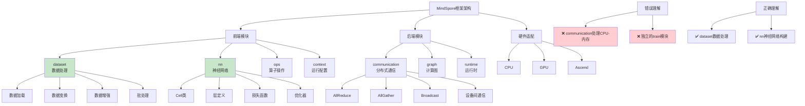

# HCIA-AI 题目分析 - MindSpore组件的描述

## 题目内容

**问题**: 以下关于MindSpore组件的描述中，正确的有哪几项？

**选项**:
- A. communication：负责处理CPU与内存间的数据流通信。
- B. dataset：数据集处理模块，如数据加载和预处理。
- C. nn：MindSpore cell(神经网络单元)，损失函数，优化器的定义。
- D. train：训练模型相关及模型量化模块。

## 选项分析表格

| 选项 | 内容 | 正确性 | 详细分析 | 知识点 |
|------|------|--------|----------|--------|
| A | communication：负责处理CPU与内存间的数据流通信 | ❌ | communication模块主要负责分布式训练中不同设备间的通信，如AllReduce、AllGather等集合通信操作，而不是CPU与内存间的数据流通信。CPU与内存间的数据传输是硬件层面的操作。 | 分布式通信 |
| B | dataset：数据集处理模块，如数据加载和预处理 | ✅ | dataset模块是MindSpore中专门处理数据的模块，提供数据加载、数据变换、数据增强、批处理等功能，是数据预处理的核心组件。 | 数据处理 |
| C | nn：MindSpore cell(神经网络单元)，损失函数，优化器的定义 | ✅ | nn模块包含了神经网络的基本构建块，包括Cell类(神经网络单元)、各种层定义、损失函数、优化器等，是构建神经网络模型的核心模块。 | 神经网络构建 |
| D | train：训练模型相关及模型量化模块 | ❌ | MindSpore中没有独立的train模块。训练相关功能分布在不同模块中，如nn模块的优化器、context模块的训练配置等。模型量化功能在compression或量化相关的专门模块中。 | 模块架构 |

## 正确答案
**答案**: BC

**解题思路**: 
1. 理解MindSpore的模块架构和功能分工
2. 区分分布式通信和硬件层面的数据传输
3. 掌握各个模块的具体职责和功能
4. 了解MindSpore的实际模块命名和组织方式

## 概念图解

## 知识点总结

### 核心概念
- **模块化设计**: MindSpore采用模块化架构
- **数据流水线**: dataset模块提供高效数据处理
- **神经网络构建**: nn模块提供完整的网络构建能力
- **分布式训练**: communication模块支持多设备协同

### 相关技术
- **数据预处理**: 数据加载、变换、增强技术
- **神经网络**: Cell类、层、损失函数、优化器
- **分布式计算**: 集合通信、参数同步
- **计算图**: 静态图和动态图执行

### 记忆要点
- **dataset**: **数据处理**专用模块
- **nn**: **神经网络**构建核心模块
- **communication**: **分布式通信**，非CPU-内存通信
- **train**: **不存在**独立的train模块

## 扩展学习

### 相关文档
- MindSpore官方架构文档
- dataset模块API参考
- nn模块使用指南
- 分布式训练配置

### 实践应用
- 数据预处理：使用dataset模块构建数据流水线
- 模型构建：使用nn模块定义网络结构
- 分布式训练：配置communication进行多卡训练
- 模型优化：结合各模块进行性能调优