# HCIA-AI 题目分析 - 过拟合问题的解决方法

## 题目内容

**问题**: 已训练模型在训练集上准确率高，在测试集上准确率偏低，可以执行以下哪些操作？

**选项**:
- A. 使用Sigmoid激活函数
- B. 做数据增强
- C. 加入正则项
- D. 删除部分训练数据

## 选项分析表格

| 选项 | 内容 | 正确性 | 详细分析 | 知识点 |
|------|------|--------|----------|--------|
| A | 使用Sigmoid激活函数 | ❌ | 激活函数的选择主要影响梯度传播和非线性表达能力，Sigmoid函数存在梯度消失问题，不能直接解决过拟合。过拟合需要通过正则化、数据增强等方法解决。 | 激活函数选择 |
| B | 做数据增强 | ✅ | 数据增强通过旋转、翻转、缩放等方式增加训练数据的多样性，提高模型的泛化能力，是解决过拟合的有效方法之一，特别适用于图像数据。 | 数据增强技术 |
| C | 加入正则项 | ✅ | 正则化(L1、L2正则化)通过在损失函数中添加惩罚项来约束模型复杂度，防止权重过大，是解决过拟合的经典方法，能有效提高模型泛化能力。 | 正则化技术 |
| D | 删除部分训练数据 | ❌ | 删除训练数据会减少模型学习的信息量，通常会降低模型性能。过拟合的问题在于模型过度拟合训练数据，应该增加数据多样性而不是减少数据量。 | 数据处理策略 |

## 正确答案
**答案**: BC

**解题思路**: 
1. 识别过拟合现象：训练集准确率高，测试集准确率低
2. 理解过拟合的本质：模型过度拟合训练数据，泛化能力差
3. 掌握解决过拟合的有效方法
4. 区分有效方法和无效方法

## 概念图解

```mermaid
flowchart TD
    A[过拟合问题] --> B[现象识别]
    A --> C[解决方法]
    A --> D[预防策略]
    
    B --> B1["训练集准确率高"]
    B --> B2["测试集准确率低"]
    B --> B3["验证集性能下降"]
    B --> B4["模型复杂度过高"]
    
    C --> C1["数据层面"]
    C --> C2["模型层面"]
    C --> C3["训练层面"]
    
    C1 --> C11["数据增强✅"]
    C1 --> C12["增加数据量"]
    C1 --> C13["数据清洗"]
    
    C2 --> C21["正则化✅"]
    C2 --> C22["Dropout"]
    C2 --> C23["减少模型复杂度"]
    C2 --> C24["早停法"]
    
    C3 --> C31["交叉验证"]
    C3 --> C32["学习率调整"]
    C3 --> C33["批归一化"]
    
    D --> D1["合理的模型选择"]
    D --> D2["充足的训练数据"]
    D --> D3["适当的特征工程"]
    
    E[无效方法] --> E1["❌使用Sigmoid"]
    E --> E2["❌删除训练数据"]
    E --> E3["❌增加模型复杂度"]
    
    F[正则化类型] --> F1["L1正则化"]
    F --> F2["L2正则化"]
    F --> F3["Elastic Net"]
    F --> F4["Dropout"]
    
    G[数据增强技术] --> G1["图像：旋转、翻转"]
    G --> G2["文本：同义词替换"]
    G --> G3["音频：噪声添加"]
    
    style C11 fill:#c8e6c9
    style C21 fill:#c8e6c9
    style E1 fill:#ffcdd2
    style E2 fill:#ffcdd2
```

## 知识点总结

### 核心概念
- **过拟合**: 模型在训练数据上表现好，但泛化能力差
- **泛化能力**: 模型在未见过数据上的表现
- **正则化**: 通过约束模型复杂度防止过拟合
- **数据增强**: 通过增加数据多样性提高泛化能力

### 相关技术
- **L1/L2正则化**: 权重惩罚技术
- **Dropout**: 随机失活技术
- **数据增强**: 图像变换、文本增强等
- **早停法**: 监控验证集性能提前停止训练

### 记忆要点
- **数据增强**: **增加多样性**，提高泛化能力
- **正则化**: **约束复杂度**，防止过拟合
- **Sigmoid**: **激活函数**，不解决过拟合
- **删除数据**: **减少信息**，加剧过拟合

## 扩展学习

### 相关文档
- 深度学习中的正则化技术
- 数据增强方法详解
- 过拟合检测与解决方案

### 实践应用
- 图像分类：使用数据增强和Dropout
- 自然语言处理：词汇替换和正则化
- 时间序列：噪声注入和早停法
- 推荐系统：特征工程和正则化