# HCIA-AI 题目分析 - 达芬奇架构中存储控制单元的格式转换操作

## 题目内容

**问题**: 在达芬奇架构中存储控制单元不能完成以下哪些格式转换操作？

**选项**:
- A. 补零和转置
- B. 压缩视频流
- C. 色彩空间转换
- D. Img2Col

## 选项分析表格

| 选项 | 内容 | 正确性 | 详细分析 | 知识点 |
|------|------|--------|----------|--------|
| A | 补零和转置 | ❌ | 补零(Zero Padding)和转置(Transpose)是达芬奇架构存储控制单元的基本功能，用于数据重排和格式调整，支持卷积操作中的边界处理和矩阵运算中的维度变换。 | 基础数据操作 |
| B | 压缩视频流 | ✅ | 视频流压缩是复杂的编解码操作，需要专门的视频处理单元(VPU)或编解码器来完成，不是存储控制单元的功能范围，存储控制单元主要负责数据搬移和简单格式转换。 | 视频编解码 |
| C | 色彩空间转换 | ❌ | 色彩空间转换(如RGB到YUV)是达芬奇架构存储控制单元支持的功能，用于图像预处理，这类转换相对简单，可以通过矩阵运算实现。 | 图像预处理 |
| D | Img2Col | ❌ | Img2Col是将图像数据重排为矩阵形式以便进行卷积运算的操作，是达芬奇架构存储控制单元的重要功能，用于优化卷积计算的数据布局。 | 卷积优化 |

## 正确答案
**答案**: B

**解题思路**: 
1. 理解达芬奇架构的组成和各单元功能
2. 区分存储控制单元和其他专用处理单元的职责
3. 掌握存储控制单元支持的数据操作类型
4. 识别需要专门硬件支持的复杂操作

## 概念图解

```mermaid
flowchart TD
    A[达芬奇架构] --> B[计算单元]
    A --> C[存储控制单元]
    A --> D[标量处理单元]
    A --> E[向量处理单元]
    
    C --> C1["数据搬移"]
    C --> C2["格式转换"]
    C --> C3["数据重排"]
    
    C2 --> C21["✅补零和转置"]
    C2 --> C22["✅色彩空间转换"]
    C2 --> C23["✅Img2Col操作"]
    C2 --> C24["❌视频流压缩"]
    
    F[支持的操作] --> F1["Zero Padding"]
    F --> F2["Matrix Transpose"]
    F --> F3["RGB↔YUV转换"]
    F --> F4["数据类型转换"]
    F --> F5["维度重排"]
    
    G[不支持的操作] --> G1["视频编解码"]
    G --> G2["复杂图像处理"]
    G --> G3["高级算法运算"]
    
    H[专用单元] --> H1["VPU：视频处理"]
    H --> H2["ISP：图像信号处理"]
    H --> H3["DSP：数字信号处理"]
    
    I[存储控制单元特点] --> I1["高带宽数据搬移"]
    I --> I2["简单格式转换"]
    I --> I3["数据预处理"]
    I --> I4["内存管理"]
    
    J[应用场景] --> J1["卷积前数据准备"]
    J --> J2["图像预处理"]
    J --> J3["数据布局优化"]
    
    style C21 fill:#c8e6c9
    style C22 fill:#c8e6c9
    style C23 fill:#c8e6c9
    style C24 fill:#ffcdd2
```

## 知识点总结

### 核心概念
- **达芬奇架构**: 华为昇腾AI芯片的核心架构
- **存储控制单元**: 负责数据搬移和简单格式转换
- **数据重排**: 优化计算的数据布局调整
- **专用处理单元**: 不同类型数据处理的专门硬件

### 相关技术
- **Zero Padding**: 卷积边界处理技术
- **Matrix Transpose**: 矩阵转置运算
- **Img2Col**: 卷积优化的数据重排技术
- **色彩空间**: RGB、YUV等颜色表示方法

### 记忆要点
- **补零转置**: **基础操作**，存储控制单元支持
- **色彩转换**: **简单转换**，矩阵运算实现
- **Img2Col**: **数据重排**，卷积优化必需
- **视频压缩**: **复杂编解码**，需专用VPU

## 扩展学习

### 相关文档
- 达芬奇架构技术白皮书
- 昇腾AI芯片架构详解
- 存储控制单元功能说明

### 实践应用
- 图像预处理：色彩空间转换、数据格式调整
- 卷积优化：Img2Col数据重排、补零操作
- 内存管理：高效数据搬移、缓存优化
- 算法加速：数据布局优化、计算流水线