# HCIA-AI 题目分析 - HiAI Engine平台模块可实现的功能

## 题目内容

**问题**: 下面哪些选项是HiAI Engine平台模块可实现的功能？

**选项**:
- A. 表格识别
- B. 关键字提取
- C. 视频总结
- D. 视频封面

## 选项分析表格

| 选项 | 内容 | 正确性 | 详细分析 | 知识点 |
|------|------|--------|----------|--------|
| A | 表格识别 | ✅ | HiAI Engine提供OCR(光学字符识别)能力，支持表格识别功能，能够识别和提取表格中的文字内容和结构信息，广泛应用于文档处理和数据提取场景。 | OCR技术 |
| B | 关键字提取 | ✅ | HiAI Engine具备自然语言处理能力，支持文本分析和关键字提取功能，能够从文本中识别和提取重要的关键词和短语，用于内容分析和信息检索。 | NLP技术 |
| C | 视频总结 | ✅ | HiAI Engine提供视频分析能力，支持视频内容理解和总结功能，能够分析视频内容并生成摘要，帮助用户快速了解视频主要内容。 | 视频分析 |
| D | 视频封面 | ✅ | HiAI Engine支持视频处理功能，包括视频封面生成，能够从视频中提取关键帧作为封面，或根据视频内容智能生成合适的封面图像。 | 视频处理 |

## 正确答案
**答案**: ABCD

**解题思路**: 
1. 了解HiAI Engine的定位：华为端侧AI引擎
2. 理解HiAI Engine提供的AI能力范围
3. 掌握各种AI功能的技术实现
4. 认识端侧AI的应用场景和能力边界

## 概念图解

```mermaid
flowchart TD
    A[HiAI Engine平台] --> B[计算机视觉]
    A --> C[自然语言处理]
    A --> D[语音处理]
    A --> E[多媒体处理]
    
    B --> B1["图像识别"]
    B --> B2["OCR文字识别"]
    B --> B3["人脸识别"]
    B --> B4["物体检测"]
    
    B2 --> B21["✅表格识别"]
    B2 --> B22["文档识别"]
    B2 --> B23["手写识别"]
    
    C --> C1["文本分析"]
    C --> C2["情感分析"]
    C --> C3["机器翻译"]
    
    C1 --> C11["✅关键字提取"]
    C1 --> C12["实体识别"]
    C1 --> C13["文本分类"]
    
    D --> D1["语音识别"]
    D --> D2["语音合成"]
    D --> D3["声纹识别"]
    
    E --> E1["视频分析"]
    E --> E2["音频处理"]
    E --> E3["图像处理"]
    
    E1 --> E11["✅视频总结"]
    E1 --> E12["✅视频封面"]
    E1 --> E13["动作识别"]
    E1 --> E14["场景分析"]
    
    F[应用场景] --> F1["智能手机"]
    F --> F2["智能家居"]
    F --> F3["车载系统"]
    F --> F4["IoT设备"]
    
    G[技术特点] --> G1["端侧推理"]
    G --> G2["低延迟"]
    G --> G3["隐私保护"]
    G --> G4["离线运行"]
    
    H[核心能力] --> H1["模型推理"]
    H --> H2["硬件加速"]
    H --> H3["资源管理"]
    H --> H4["API接口"]
    
    style B21 fill:#c8e6c9
    style C11 fill:#c8e6c9
    style E11 fill:#c8e6c9
    style E12 fill:#c8e6c9
```

## 知识点总结

### 核心概念
- **HiAI Engine**: 华为端侧AI推理引擎
- **端侧AI**: 在设备本地进行AI推理计算
- **多模态AI**: 支持图像、文本、语音、视频等多种数据类型
- **AI能力开放**: 通过API向开发者提供AI能力

### 相关技术
- **OCR技术**: 光学字符识别和表格结构分析
- **NLP技术**: 文本理解和关键信息提取
- **视频分析**: 内容理解、关键帧提取、摘要生成
- **端侧推理**: 移动设备上的AI模型推理优化

### 记忆要点
- **表格识别**: **OCR能力**，文档处理应用
- **关键字提取**: **NLP能力**，文本分析应用
- **视频总结**: **视频分析**，内容理解应用
- **视频封面**: **视频处理**，关键帧提取应用

## 扩展学习

### 相关文档
- HiAI Engine开发者指南
- 华为端侧AI技术白皮书
- HiAI SDK使用文档

### 实践应用
- 移动应用：智能相册、文档扫描
- 智能家居：语音助手、视频监控
- 车载系统：驾驶辅助、语音交互
- 办公场景：文档处理、会议记录