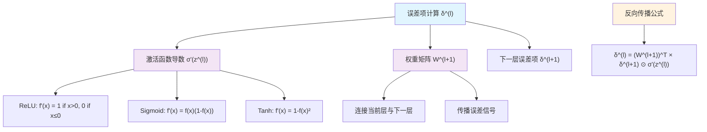

# HCIA-AI 题目分析 - 175-反向传播计算误差项

## 题目内容

**问题**: 在反向传播计算误差项的过程中，会使用到以下哪几项？

**选项**:
- A. 网络层数
- B. 激活函数
- C. 单层神经元个数
- D. 神经元权重

## 选项分析表格

| 选项 | 内容 | 正确性 | 详细分析 | 知识点 |
|------|------|--------|----------|--------|
| A | 网络层数 | ❌ | 网络层数虽然影响反向传播的计算复杂度，但在计算单个误差项时不是直接使用的参数。误差项的计算主要依赖于当前层的激活函数导数和权重，而不是总的网络层数 | 反向传播算法 |
| B | 激活函数 | ✅ | 激活函数的导数是计算误差项的核心组成部分。在反向传播中，误差项δ = (∂E/∂z) = (∂E/∂a) * (∂a/∂z)，其中∂a/∂z就是激活函数的导数 | 激活函数导数 |
| C | 单层神经元个数 | ❌ | 单层神经元个数决定了该层误差项向量的维度，但不是计算误差项数值的直接参数。误差项的计算公式中不直接包含神经元个数 | 神经网络结构 |
| D | 神经元权重 | ✅ | 权重是反向传播计算误差项的关键参数。误差项的计算需要使用下一层的权重矩阵来传播误差：δ^(l) = (W^(l+1))^T * δ^(l+1) ⊙ σ'(z^(l)) | 权重参数 |

## 正确答案
**答案**: BD

**解题思路**: 
1. 理解反向传播误差项的计算公式：δ^(l) = (W^(l+1))^T * δ^(l+1) ⊙ σ'(z^(l))
2. 分析公式中的关键组成部分：
   - σ'(z^(l))：激活函数的导数
   - W^(l+1)：下一层的权重矩阵
3. 排除不直接参与计算的因素（网络层数、神经元个数）

## 概念图解

## 知识点总结

### 核心概念
- **误差项（Error Term）**: 表示损失函数对该层加权输入的偏导数，用于计算梯度
- **反向传播算法**: 通过链式法则从输出层向输入层逐层计算梯度的算法
- **激活函数导数**: 激活函数的导数决定了误差信号的传播强度
- **权重矩阵**: 连接相邻层神经元，是误差传播的载体

### 相关技术
- **梯度下降优化**: 使用计算得到的误差项更新网络权重
- **链式法则**: 反向传播算法的数学基础
- **MindSpore自动微分**: 华为MindSpore框架中的自动梯度计算机制

### 记忆要点
- 误差项计算的两个核心要素：激活函数导数 + 权重矩阵
- 网络层数和神经元个数影响计算规模，但不直接参与误差项数值计算
- 不同激活函数有不同的导数形式，影响梯度传播效果

## 扩展学习

### 相关文档
- MindSpore自动微分机制文档
- 深度学习中的反向传播算法原理
- 各种激活函数及其导数特性

### 实践应用
- 神经网络训练中的梯度计算
- 自定义激活函数的导数实现
- 梯度消失和梯度爆炸问题的分析