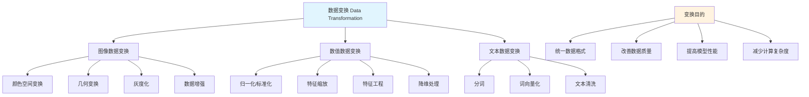

# HCIA-AI 题目分析 - 176-数据变换描述

## 题目内容

**问题**: 以下对于数据变换的描述中，哪些选项是正确的？

**选项**:
- A. 处理图像数据，如颜色空间变换、灰度化、几何变化属于数据变换。
- B. 机器学习中常对特征进行归一化，以保证同一模型的不同输入变量的值域相同。
- C. 在数据维度较高时，也需要对现有变量进行组合或转换以生成新特征，比如平均数。
- D. 所有的数据都需要进行数据变换。

## 选项分析表格

| 选项 | 内容 | 正确性 | 详细分析 | 知识点 |
|------|------|--------|----------|--------|
| A | 处理图像数据，如颜色空间变换、灰度化、几何变化属于数据变换 | ✅ | 这是典型的数据变换操作。颜色空间变换（如RGB到HSV）、灰度化（彩色图像转灰度）、几何变化（旋转、缩放、平移）都是常见的图像预处理和数据增强技术 | 图像数据预处理 |
| B | 机器学习中常对特征进行归一化，以保证同一模型的不同输入变量的值域相同 | ✅ | 归一化是重要的数据变换技术。不同特征可能有不同的量纲和数值范围，归一化（如Min-Max归一化、Z-score标准化）可以将特征缩放到相同范围，避免某些特征因数值过大而主导模型训练 | 特征归一化 |
| C | 在数据维度较高时，也需要对现有变量进行组合或转换以生成新特征，比如平均数 | ❌ | 这个描述有误导性。在高维数据中，通常是进行降维处理（如PCA、t-SNE）而不是增加新特征。虽然特征工程中确实会创建新特征，但平均数通常用于降维或汇总，而不是在高维情况下增加复杂度 | 特征工程与降维 |
| D | 所有的数据都需要进行数据变换 | ❌ | 这是绝对化的错误表述。数据变换的需求取决于具体的数据质量、模型要求和任务特点。有些数据可能已经是理想格式，不需要额外变换；有些简单任务可能不需要复杂的数据预处理 | 数据预处理策略 |

## 正确答案
**答案**: AB

**解题思路**: 
1. 识别数据变换的典型应用场景：图像处理、特征归一化
2. 理解数据变换的目的：改善数据质量、统一数据格式、提高模型性能
3. 避免绝对化思维：不是所有数据都需要变换，高维数据通常需要降维而非增维

## 概念图解

## 知识点总结

### 核心概念
- **数据变换**: 将原始数据转换为更适合分析或建模的格式的过程
- **特征归一化**: 将不同量纲的特征缩放到相同范围的技术
- **图像预处理**: 对图像数据进行格式转换、增强等操作
- **特征工程**: 利用领域知识创建新特征或转换现有特征

### 相关技术
- **Min-Max归一化**: 将数据缩放到[0,1]范围
- **Z-score标准化**: 将数据转换为均值为0、标准差为1的分布
- **PCA降维**: 主成分分析用于高维数据降维
- **数据增强**: 通过变换生成更多训练样本

### 记忆要点
- 数据变换不是万能的，需要根据具体情况决定是否使用
- 图像处理中的变换操作都属于数据变换范畴
- 归一化是机器学习中最常用的数据变换技术
- 高维数据通常需要降维而不是增加更多特征

## 扩展学习

### 相关文档
- scikit-learn数据预处理文档
- OpenCV图像处理变换函数
- pandas数据变换操作指南

### 实践应用
- 图像分类任务中的数据增强策略
- 结构化数据的特征工程实践
- 时间序列数据的标准化处理