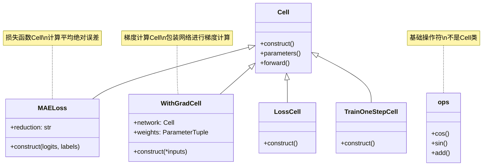

# HCIA-AI 题目分析 - 177-MindSpore预定义Cell

## 题目内容

**问题**: 以下哪几项是MindSpore中预定义的Cell？

**选项**:
- A. MAELoss
- B. TFRecord
- C. cos
- D. WithGradCell

## 选项分析表格

| 选项 | 内容 | 正确性 | 详细分析 | 知识点 |
|------|------|--------|----------|--------|
| A | MAELoss | ✅ | MAELoss（Mean Absolute Error Loss，平均绝对误差损失）是MindSpore中预定义的损失函数Cell。它继承自Cell基类，用于计算预测值与真实值之间的平均绝对误差，常用于回归任务 | MindSpore损失函数 |
| B | TFRecord | ❌ | TFRecord是TensorFlow的数据格式，不是MindSpore中的Cell。MindSpore有自己的数据处理模块，虽然可能支持读取TFRecord格式，但TFRecord本身不是MindSpore的预定义Cell | 数据格式 |
| C | cos | ❌ | cos是余弦函数，在MindSpore中作为数学运算操作存在于ops模块中（如mindspore.ops.cos），但它不是Cell类。Cell是更高级的抽象，用于构建神经网络层和模块 | MindSpore操作符 |
| D | WithGradCell | ✅ | WithGradCell是MindSpore中的预定义Cell，用于计算网络的梯度。它是一个包装器Cell，可以将普通的网络包装成能够计算梯度的Cell，常用于自定义训练循环中 | MindSpore梯度计算 |

## 正确答案
**答案**: AD

**解题思路**: 
1. 理解MindSpore中Cell的概念：Cell是构建神经网络的基本单元
2. 识别预定义Cell的特征：继承自Cell基类，具有完整的前向传播功能
3. 区分Cell与普通操作符：Cell是高级抽象，操作符是底层计算单元
4. 排除非MindSpore组件：TFRecord属于TensorFlow生态

## 概念图解

## 知识点总结

### 核心概念
- **Cell**: MindSpore中构建神经网络的基本单元，所有网络层、损失函数、优化器等都继承自Cell
- **MAELoss**: 平均绝对误差损失函数，用于回归任务的损失计算
- **WithGradCell**: 梯度计算包装器，将网络包装成可计算梯度的Cell
- **预定义Cell**: MindSpore框架中已经实现好的Cell类，可直接使用

### 相关技术
- **MindSpore Cell体系**: 包括损失函数Cell、网络层Cell、训练Cell等
- **自动微分**: WithGradCell利用MindSpore的自动微分机制计算梯度
- **模块化设计**: Cell的设计支持网络的模块化构建和复用

### 记忆要点
- Cell是MindSpore的核心抽象，所有网络组件都是Cell
- 损失函数（如MAELoss）在MindSpore中也是Cell的子类
- WithGradCell专门用于梯度计算，常用于自定义训练
- 基础数学操作（如cos）是ops模块的函数，不是Cell
- TFRecord是TensorFlow的数据格式，不属于MindSpore

## 扩展学习

### 相关文档
- MindSpore Cell API文档
- MindSpore损失函数使用指南
- MindSpore自动微分机制

### 实践应用
- 自定义损失函数的实现（继承Cell）
- 使用WithGradCell进行梯度计算
- 构建复杂网络架构的Cell组合