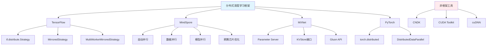

# HCIA-AI 题目分析 - 178-分布式深度学习框架

## 题目内容

**问题**: 以下哪些框架原生支持分布式深度学习框架？

**选项**:
- A. TensorFlow
- B. MindSpore
- C. CNDK
- D. MXNet

## 选项分析表格

| 选项 | 内容 | 正确性 | 详细分析 | 知识点 |
|------|------|--------|----------|--------|
| A | TensorFlow | ✅ | TensorFlow从早期版本就原生支持分布式训练。提供了tf.distribute.Strategy API，支持多种分布式策略如MirroredStrategy、MultiWorkerMirroredStrategy、ParameterServerStrategy等，可以在多GPU、多机器上进行分布式训练 | TensorFlow分布式 |
| B | MindSpore | ✅ | MindSpore是华为开发的深度学习框架，原生支持分布式训练。提供了自动并行、数据并行、模型并行等多种分布式策略，特别针对昇腾芯片优化，支持大规模分布式训练 | MindSpore分布式 |
| C | CNDK | ❌ | CNDK（CUDA Neural Network Development Kit）不是一个完整的深度学习框架，而是NVIDIA提供的神经网络开发工具包。它主要提供底层的GPU加速库和工具，不是独立的深度学习框架，更不是分布式深度学习框架 | GPU开发工具 |
| D | MXNet | ✅ | Apache MXNet原生支持分布式训练，提供了Parameter Server架构和KVStore接口进行分布式参数同步。支持数据并行和模型并行，可以在多GPU和多机器环境下进行分布式训练 | MXNet分布式 |

## 正确答案
**答案**: ABD

**解题思路**: 
1. 识别主流深度学习框架：TensorFlow、PyTorch、MindSpore、MXNet等
2. 理解"原生支持"的含义：框架本身内置分布式训练能力，无需额外插件
3. 区分完整框架与工具包：CNDK是开发工具包，不是完整的深度学习框架
4. 了解各框架的分布式特性和发展历程

## 概念图解

## 知识点总结

### 核心概念
- **分布式深度学习**: 在多个计算节点上并行训练深度学习模型的技术
- **数据并行**: 将数据分割到不同节点，每个节点使用相同模型进行训练
- **模型并行**: 将模型分割到不同节点，每个节点负责模型的一部分
- **参数服务器**: 分布式训练中用于参数同步和更新的架构模式

### 相关技术
- **TensorFlow分布式策略**: 提供多种分布式训练策略，支持同步和异步训练
- **MindSpore自动并行**: 自动分析网络结构，选择最优的并行策略
- **MXNet KVStore**: 键值存储接口，用于分布式参数同步
- **梯度同步**: 分布式训练中各节点间梯度信息的同步机制

### 记忆要点
- 主流深度学习框架（TensorFlow、MindSpore、MXNet、PyTorch）都原生支持分布式
- CNDK是NVIDIA的开发工具包，不是完整的深度学习框架
- 分布式训练主要包括数据并行和模型并行两种模式
- 华为MindSpore特别针对昇腾芯片进行了分布式优化

## 扩展学习

### 相关文档
- TensorFlow分布式训练指南
- MindSpore分布式训练教程
- MXNet分布式训练文档
- 分布式深度学习原理与实践

### 实践应用
- 大规模图像分类模型的分布式训练
- 自然语言处理大模型的分布式预训练
- 推荐系统中的分布式深度学习应用