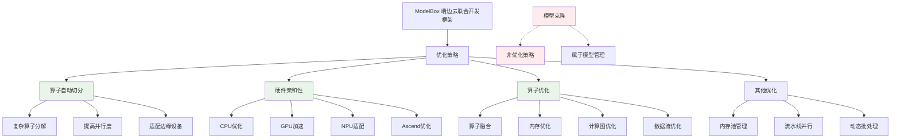
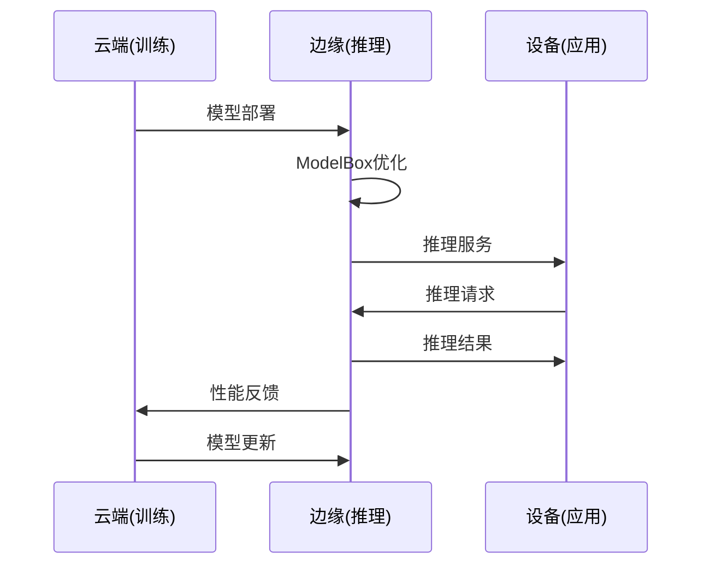

# HCIA-AI 题目分析 - ModelArts ModelBox优化策略

## 题目内容

**问题**: 18. 华为云ModelArts中推出了ModelBox用于端边云联合开发，以下哪些选项属于其优化策略？(1.00分)

**选项**:
- A. 算子自动切分 ✅
- B. 硬件亲和性 ✅  
- C. 模型克隆 ❌
- D. 算子优化 ✅

## 选项分析表格

| 选项 | 内容 | 正确性 | 详细分析 | 知识点 |
|------|------|--------|----------|--------|
| A | 算子自动切分 | ✅ | ModelBox支持算子自动切分优化，将复杂的算子自动分解为更小的计算单元，提高并行度和执行效率。这是端边云场景下重要的性能优化策略，特别适用于资源受限的边缘设备。 | 算子优化、并行计算 |
| B | 硬件亲和性 | ✅ | 硬件亲和性是ModelBox的核心优化策略，能够根据不同硬件平台(CPU、GPU、NPU、Ascend等)的特性，自动选择最优的执行方式和算子实现，实现硬件感知的智能调度。 | 硬件适配、性能优化 |
| C | 模型克隆 | ❌ | 模型克隆不是ModelBox的优化策略。ModelBox主要关注推理性能优化、硬件适配和端边云协同，而不是模型复制或克隆功能。这更多是模型管理层面的概念。 | 模型管理 |
| D | 算子优化 | ✅ | 算子优化是ModelBox的重要特性，包括算子融合、内存优化、计算图优化等技术，能够显著提升模型推理性能，特别是在边缘设备上的执行效率。 | 算子融合、计算优化 |

## 正确答案
**答案**: ABD

**解题思路**: 
1. ModelBox是华为云ModelArts推出的端边云联合开发框架
2. 分析每个选项是否属于ModelBox的优化策略
3. 算子自动切分、硬件亲和性、算子优化都是性能优化的核心技术
4. 模型克隆不属于推理优化策略，而是模型管理功能

## 概念图解



## 知识点总结

### 核心概念
- **ModelBox**: 华为云ModelArts的端边云联合开发框架
- **端边云协同**: 云端训练、边缘推理的协同开发模式
- **优化策略**: 提升模型推理性能的技术手段

### ModelBox优化策略详解

#### 1. 算子自动切分
- **原理**: 将复杂算子分解为更小的计算单元
- **优势**: 提高并行度，适配不同硬件能力
- **应用**: 特别适用于边缘设备的资源限制场景
- **技术**: 基于计算图分析和硬件特性进行智能切分

#### 2. 硬件亲和性
- **CPU优化**: 针对x86、ARM等CPU架构的专门优化
- **GPU加速**: 利用CUDA、OpenCL等进行GPU加速
- **NPU适配**: 支持华为NPU等专用AI芯片
- **Ascend优化**: 针对华为Ascend芯片的深度优化
- **自动选择**: 根据硬件特性自动选择最优执行路径

#### 3. 算子优化
- **算子融合**: 将多个算子合并为一个，减少内存访问
- **内存优化**: 优化内存分配和数据布局
- **计算图优化**: 消除冗余计算，优化执行顺序
- **数据流优化**: 优化数据在不同算子间的传递

### 端边云架构特点


### 性能优化技术栈
| 优化层级 | 技术手段 | 效果 |
|----------|----------|------|
| 算子级 | 算子融合、切分 | 减少计算开销 |
| 内存级 | 内存池、数据布局 | 提高内存效率 |
| 硬件级 | 硬件亲和性 | 充分利用硬件能力 |
| 系统级 | 流水线、并行 | 提升整体吞吐量 |

### 与传统推理框架对比
| 特性 | ModelBox | 传统框架 |
|------|----------|----------|
| 硬件适配 | 自动硬件亲和性 | 手动配置 |
| 算子优化 | 自动切分和融合 | 有限优化 |
| 端边云协同 | 原生支持 | 需要额外开发 |
| 部署便利性 | 一键部署 | 复杂配置 |

### 记忆要点
- ModelBox = 端边云 + 性能优化
- 三大优化策略：算子切分、硬件亲和性、算子优化
- 模型克隆不是优化策略，是管理功能
- 重点关注推理性能而非训练功能

## 扩展学习

### ModelArts生态系统
- **ModelArts Studio**: 一站式AI开发平台
- **ModelBox**: 端边云推理框架
- **HiLens**: 端侧AI应用开发
- **ModelHub**: 模型资产管理

### 实际应用场景
- **智能监控**: 边缘视频分析
- **工业检测**: 实时质量检测
- **智能驾驶**: 车载AI推理
- **智慧城市**: 边缘计算节点

### 技术发展趋势
- **异构计算**: 多种硬件协同工作
- **模型压缩**: 量化、剪枝等技术
- **边缘AI**: 更强的边缘推理能力
- **联邦学习**: 分布式模型训练

### 性能调优实践
```python
# ModelBox配置示例
modelbox_config = {
    "optimization": {
        "operator_split": True,      # 启用算子自动切分
        "hardware_affinity": True,   # 启用硬件亲和性
        "operator_fusion": True,     # 启用算子融合
        "memory_optimization": True  # 启用内存优化
    },
    "hardware": {
        "device_type": "auto",      # 自动选择设备
        "precision": "fp16"         # 使用半精度加速
    }
}
```

### 监控和调试
- **性能监控**: 实时监控推理延迟和吞吐量
- **资源监控**: 监控CPU、GPU、内存使用情况
- **错误诊断**: 提供详细的错误信息和调试工具
- **性能分析**: 分析瓶颈和优化建议