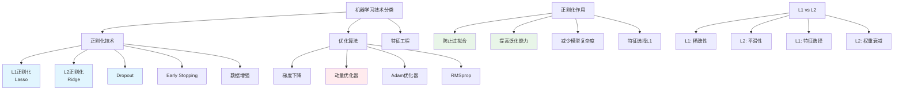

# HCIA-AI 题目分析 - 正则化技术

## 题目内容

**问题**: 正则化是传统机器学习中重要且有效的减少泛化误差的技术，以下技术属于正则化技术的是

**选项**:
- A. 动量优化器
- B. L2正则化
- C. Dropout
- D. L1正则化

## 选项分析表格

| 选项 | 内容 | 正确性 | 详细分析 | 知识点 |
|------|------|--------|----------|--------|
| A | 动量优化器 | ❌ | 动量优化器(Momentum Optimizer)是优化算法的一种，用于加速梯度下降和减少震荡，不是正则化技术。它属于优化方法而非防止过拟合的技术 | 优化算法 |
| B | L2正则化 | ✅ | L2正则化(Ridge Regression)在损失函数中添加权重平方和的惩罚项，λ∑w²，能够防止权重过大，减少模型复杂度，有效防止过拟合 | L2正则化 |
| C | Dropout | ✅ | Dropout是深度学习中重要的正则化技术，训练时随机将部分神经元输出置为0，防止神经元之间过度依赖，提高模型泛化能力 | Dropout技术 |
| D | L1正则化 | ✅ | L1正则化(Lasso Regression)在损失函数中添加权重绝对值和的惩罚项，λ∑|w|，不仅能防止过拟合，还能实现特征选择，产生稀疏模型 | L1正则化 |

## 正确答案
**答案**: BCD

**解题思路**: 
1. 理解正则化的定义：减少泛化误差，防止过拟合的技术
2. 区分正则化技术与优化算法
3. 识别经典正则化方法：L1、L2、Dropout
4. 动量优化器属于优化算法，不是正则化技术

## 概念图解

## 知识点总结

### 核心概念
- **L2正则化**: 添加权重平方和惩罚项，防止权重过大，平滑模型
- **L1正则化**: 添加权重绝对值和惩罚项，产生稀疏模型，实现特征选择
- **Dropout**: 随机失活神经元，防止过度依赖，提高泛化能力
- **动量优化器**: 属于优化算法，不是正则化技术

### 相关技术
- 权重衰减(Weight Decay)
- 批量归一化(Batch Normalization)
- 早停法(Early Stopping)
- 数据增强(Data Augmentation)

### 记忆要点
- 正则化 = 防止过拟合的技术
- L1产生稀疏性，L2产生平滑性
- Dropout是深度学习特有的正则化方法
- 优化器≠正则化技术

## 扩展学习

### 相关文档
- 正则化理论基础
- 过拟合与欠拟合
- MindSpore正则化实现

### 实践应用
- 线性回归中的Ridge和Lasso
- 深度神经网络中的Dropout
- 华为ModelArts中的正则化配置
- 模型调优中的正则化参数选择