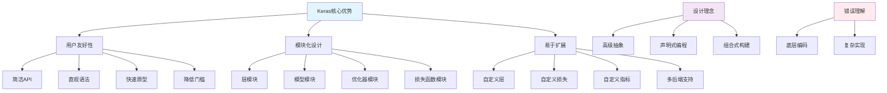

# HCIA-AI 题目分析 - 180-Keras主要优势

## 题目内容

**问题**: 以下哪些选项属于Keras的主要优势？

**选项**:
- A. 方便用户使用
- B. 编码风格偏底层
- C. 模块化和可组合
- D. 易于扩展

## 选项分析表格

| 选项 | 内容 | 正确性 | 详细分析 | 知识点 |
|------|------|--------|----------|--------|
| A | 方便用户使用 | ✅ | Keras的核心设计理念就是用户友好性。它提供了简洁直观的API，使得构建神经网络变得简单。用户可以用几行代码就构建复杂的深度学习模型，大大降低了深度学习的入门门槛 | Keras易用性 |
| B | 编码风格偏底层 | ❌ | 这与Keras的设计理念完全相反。Keras是高级API，专门设计来简化深度学习模型的构建。它抽象了底层的复杂实现细节，提供了高级的、声明式的编程接口，让用户专注于模型架构而不是底层实现 | 高级API设计 |
| C | 模块化和可组合 | ✅ | Keras采用了高度模块化的设计。层（Layer）、模型（Model）、优化器（Optimizer）、损失函数（Loss）等都是独立的模块，可以灵活组合。用户可以像搭积木一样构建复杂的神经网络架构 | 模块化设计 |
| D | 易于扩展 | ✅ | Keras提供了良好的扩展性。用户可以轻松创建自定义层、自定义损失函数、自定义指标等。同时，Keras可以作为TensorFlow的高级API，也可以运行在其他后端上，具有很好的可扩展性 | 扩展性设计 |

## 正确答案
**答案**: ACD

**解题思路**: 
1. 理解Keras的设计哲学：简单、模块化、可扩展
2. 识别Keras作为高级API的特点：抽象底层复杂性，提供简洁接口
3. 分析Keras的核心优势：用户友好、模块化、扩展性强
4. 排除与Keras设计理念相反的选项：底层编码风格

## 概念图解

## 知识点总结

### 核心概念
- **高级API**: Keras提供了高层次的抽象，隐藏了底层实现的复杂性
- **模块化设计**: 将神经网络的各个组件设计为独立可组合的模块
- **用户友好**: 通过简洁直观的API降低深度学习的使用门槛
- **扩展性**: 支持用户自定义组件和多种后端框架

### 相关技术
- **Sequential API**: 用于构建线性堆叠的神经网络
- **Functional API**: 用于构建复杂的非线性网络架构
- **Subclassing API**: 用于完全自定义的模型实现
- **TensorFlow集成**: Keras作为TensorFlow 2.x的官方高级API

### 记忆要点
- Keras = 简单 + 模块化 + 可扩展，不等于底层编码
- Keras的目标是让深度学习变得简单易用
- 模块化设计使得网络构建像搭积木一样灵活
- 扩展性强，支持自定义各种组件
- 高级API与底层实现是相对的概念

## 扩展学习

### 相关文档
- Keras官方文档和教程
- TensorFlow中的Keras使用指南
- Keras自定义组件开发指南

### 实践应用
- 快速原型开发和模型验证
- 教学和学习深度学习概念
- 生产环境中的模型部署
- 复杂网络架构的模块化构建