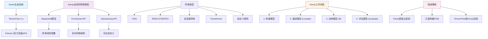

# HCIA-AI 题目分析 - 181-Keras说法错误

## 题目内容

**问题**: 关于Keras的说法中，下列哪些选项是错误的？

**选项**:
- A. 与TensorFlow一样，Keras是一个多层神经网络开发包，只是它的语法更简单、使用更方便
- B. Keras是专门用来构建CNN序贯模型的神经网络开发包，不能构建其它神经网络
- C. 使用Keras构建的神经网络模型必须经过编译（Compile）之后，才能输入数据进行训练
- D. Keras可以作为TensorFlow的后端使用

## 选项分析表格

| 选项 | 内容 | 正确性 | 详细分析 | 知识点 |
|------|------|--------|----------|--------|
| A | 与TensorFlow一样，Keras是一个多层神经网络开发包，只是它的语法更简单、使用更方便 | ❌ | 这个说法是错误的。Keras不是与TensorFlow平行的框架，而是一个高级API。在TensorFlow 2.x中，Keras已经成为TensorFlow的官方高级API（tf.keras），而不是独立的开发包。Keras的定位是简化深度学习模型构建的高级接口 | Keras与TensorFlow关系 |
| B | Keras是专门用来构建CNN序贯模型的神经网络开发包，不能构建其它神经网络 | ❌ | 这是完全错误的说法。Keras支持构建各种类型的神经网络，包括：全连接网络、CNN、RNN、LSTM、GRU、Transformer等。它提供Sequential API、Functional API和Subclassing API，可以构建从简单到复杂的各种网络架构 | Keras网络类型支持 |
| C | 使用Keras构建的神经网络模型必须经过编译（Compile）之后，才能输入数据进行训练 | ✅ | 这个说法是正确的。在Keras中，模型构建完成后必须调用compile()方法来配置训练过程，包括指定优化器、损失函数和评估指标。只有编译后的模型才能进行fit()训练 | Keras模型编译 |
| D | Keras可以作为TensorFlow的后端使用 | ❌ | 这个说法颠倒了关系。实际上是TensorFlow作为Keras的后端，而不是相反。在TensorFlow 2.x中，Keras已经完全集成到TensorFlow中作为其高级API（tf.keras），TensorFlow提供底层计算支持 | 后端关系 |

## 正确答案
**答案**: BD

**解题思路**: 
1. 理解Keras的真实定位：高级API而非独立框架
2. 了解Keras的功能范围：支持各种神经网络类型
3. 掌握Keras的使用流程：构建→编译→训练
4. 明确Keras与TensorFlow的关系：集成关系而非平行关系

## 概念图解

## 知识点总结

### 核心概念
- **Keras定位**: TensorFlow的官方高级API，不是独立的深度学习框架
- **网络类型支持**: 支持所有主流神经网络架构，不仅限于CNN
- **模型编译**: 必须经过compile()配置才能进行训练
- **API层次**: 提供Sequential、Functional、Subclassing三种API

### 相关技术
- **tf.keras**: TensorFlow 2.x中集成的Keras API
- **模型编译参数**: optimizer、loss、metrics
- **多种网络架构**: CNN、RNN、LSTM、GRU、Transformer等
- **灵活的模型构建**: 从简单到复杂的各种网络设计

### 记忆要点
- Keras现在是tf.keras，不是独立框架
- Keras支持所有类型的神经网络，不仅仅是CNN
- compile()是必须步骤，配置训练参数
- TensorFlow是底层后端，Keras是高级接口
- 避免混淆Keras与TensorFlow的层次关系

## 扩展学习

### 相关文档
- TensorFlow官方Keras指南
- Keras API文档和教程
- 深度学习模型构建最佳实践

### 实践应用
- 使用Sequential API构建简单模型
- 使用Functional API构建复杂网络
- 自定义层和模型的实现方法