# HCIA-AI 题目分析 - 182-深度学习框架描述

## 题目内容

**问题**: 关于深度学习框架的描述，下列哪些选项是正确的？

**选项**:
- A. TensorFlow是Google开源的深度学习框架，支持多种编程语言
- B. PyTorch是Facebook开源的深度学习框架，以动态计算图著称
- C. MindSpore是华为开源的深度学习框架，支持端边云全场景
- D. Caffe是专门用于图像处理的深度学习框架，不支持其他类型的神经网络

## 选项分析表格

| 选项 | 内容 | 正确性 | 详细分析 | 知识点 |
|------|------|--------|----------|--------|
| A | TensorFlow是Google开源的深度学习框架，支持多种编程语言 | ✅ | 完全正确。TensorFlow由Google开发并开源，支持Python、C++、Java、Go、JavaScript等多种编程语言。它是目前最流行的深度学习框架之一，提供了丰富的API和工具生态 | TensorFlow特性 |
| B | PyTorch是Facebook开源的深度学习框架，以动态计算图著称 | ✅ | 完全正确。PyTorch由Facebook（现Meta）开发并开源，其最大特点是动态计算图（Dynamic Computational Graph），允许在运行时构建和修改计算图，这使得调试和开发更加灵活 | PyTorch特性 |
| C | MindSpore是华为开源的深度学习框架，支持端边云全场景 | ✅ | 完全正确。MindSpore是华为自主研发的开源深度学习框架，设计目标是支持端（手机等终端设备）、边（边缘计算设备）、云（云服务器）全场景的AI应用部署，具有自动并行、自动微分等特性 | MindSpore特性 |
| D | Caffe是专门用于图像处理的深度学习框架，不支持其他类型的神经网络 | ❌ | 这个说法是错误的。虽然Caffe最初主要用于计算机视觉任务，但它并不仅限于图像处理。Caffe支持各种类型的神经网络，包括全连接网络、循环神经网络等，只是在图像处理领域应用较多 | Caffe功能范围 |

## 正确答案
**答案**: ABC

**解题思路**: 
1. 了解主流深度学习框架的开发公司和特点
2. 理解各框架的核心优势和应用场景
3. 避免对框架功能范围的误解
4. 掌握国产框架MindSpore的特色功能

## 概念图解

```mermaid
flowchart TD
    A["主流深度学习框架"] --> B["TensorFlow (Google)"]
    A --> C["PyTorch (Meta/Facebook)"]
    A --> D["MindSpore (华为)"]
    A --> E["Caffe (Berkeley)"]
    
    B --> F["静态计算图"]
    B --> G["多语言支持"]
    B --> H["TensorBoard可视化"]
    B --> I["生产部署优势"]
    
    C --> J["动态计算图"]
    C --> K["Python友好"]
    C --> L["研究导向"]
    C --> M["易于调试"]
    
    D --> N["端边云全场景"]
    D --> O["自动并行"]
    D --> P["昇腾芯片优化"]
    D --> Q["国产自主"]
    
    E --> R["配置文件驱动"]
    E --> S["C++高性能"]
    E --> T["模型定义简洁"]
    E --> U["多领域支持"]
    
    V["计算图类型"] --> W["静态计算图"]
    V --> X["动态计算图"]
    
    W --> Y["TensorFlow 1.x"]
    W --> Z["编译时优化"]
    
    X --> AA["PyTorch"]
    X --> BB["运行时构建"]
    
    CC["应用场景"] --> DD["研究开发"]
    CC --> EE["生产部署"]
    CC --> FF["边缘计算"]
    CC --> GG["移动端"]
    
    style A fill:#e1f5fe
    style V fill:#f3e5f5
    style CC fill:#fff3e0
```

## 知识点总结

### 核心概念
- **TensorFlow**: Google开源，多语言支持，静态计算图，生产部署强
- **PyTorch**: Meta开源，动态计算图，研究友好，Python生态好
- **MindSpore**: 华为开源，端边云全场景，自动并行，昇腾优化
- **Caffe**: Berkeley开源，配置驱动，不仅限于图像处理

### 相关技术
- **计算图类型**: 静态vs动态计算图的优缺点
- **多语言支持**: Python、C++、Java、JavaScript等
- **部署场景**: 云端训练、边缘推理、移动端部署
- **硬件优化**: GPU、TPU、昇腾等专用芯片支持

### 记忆要点
- TensorFlow：Google + 多语言 + 生产部署
- PyTorch：Facebook + 动态图 + 研究开发
- MindSpore：华为 + 端边云 + 自动并行
- Caffe：不仅限于图像，支持多种网络类型
- 避免将框架功能范围理解得过于狭窄

## 扩展学习

### 相关文档
- 各框架官方文档和教程
- 深度学习框架对比分析
- MindSpore端边云部署指南
- 计算图原理和实现机制

### 实践应用
- 根据项目需求选择合适的框架
- 框架间模型转换和迁移
- 多框架混合开发策略
- 华为昇腾生态的MindSpore应用