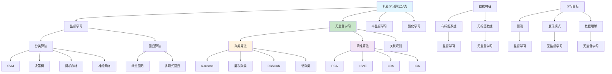

# HCIA-AI 题目分析 - 183-机器学习算法分类

## 题目内容

**问题**: 下列哪些算法属于无监督学习算法？

**选项**:
- A. K-means聚类
- B. 主成分分析（PCA）
- C. 支持向量机（SVM）
- D. 层次聚类

## 选项分析表格

| 选项 | 内容 | 正确性 | 详细分析 | 知识点 |
|------|------|--------|----------|--------|
| A | K-means聚类 | ✅ | 完全正确。K-means是典型的无监督学习算法，用于将数据点分成k个簇。算法不需要标签信息，仅根据数据点之间的相似性（通常是欧氏距离）进行聚类，目标是最小化簇内平方和 | 聚类算法 |
| B | 主成分分析（PCA） | ✅ | 完全正确。PCA是无监督学习中的降维算法，通过线性变换将高维数据投影到低维空间，保留最大方差的主成分。不需要标签信息，仅基于数据的协方差矩阵进行特征提取和降维 | 降维算法 |
| C | 支持向量机（SVM） | ❌ | 这是错误的。SVM是监督学习算法，需要带标签的训练数据来学习决策边界。SVM通过寻找最优超平面来分离不同类别的数据点，必须依赖标签信息进行训练 | 分类算法 |
| D | 层次聚类 | ✅ | 完全正确。层次聚类是无监督学习算法，包括凝聚层次聚类（自底向上）和分裂层次聚类（自顶向下）。算法不需要预先指定簇的数量，也不需要标签信息，仅基于数据点间的距离构建层次结构 | 聚类算法 |

## 正确答案
**答案**: ABD

**解题思路**: 
1. 理解监督学习vs无监督学习的根本区别：是否需要标签
2. 识别聚类算法：K-means、层次聚类都是无监督的
3. 识别降维算法：PCA是无监督的特征提取方法
4. 区分分类算法：SVM需要标签，属于监督学习

## 概念图解

## 知识点总结

### 核心概念
- **无监督学习**: 不需要标签信息，从数据中发现隐藏模式
- **聚类算法**: K-means、层次聚类、DBSCAN等
- **降维算法**: PCA、t-SNE、LDA等
- **监督学习**: 需要标签信息，如SVM、决策树等

### 相关技术
- **K-means**: 基于距离的划分聚类，需要预设k值
- **层次聚类**: 构建树状聚类结构，不需要预设簇数
- **PCA**: 线性降维，保留最大方差的主成分
- **SVM**: 寻找最优分离超平面的监督学习算法

### 记忆要点
- 无监督学习的关键：不需要标签（目标变量）
- 聚类算法都是无监督的：K-means、层次聚类、DBSCAN
- 降维算法通常是无监督的：PCA、t-SNE、自编码器
- SVM是监督学习：需要训练标签来学习决策边界
- 区分方法：看算法是否需要"正确答案"来训练

## 扩展学习

### 相关文档
- 机器学习算法分类详解
- 聚类算法原理和应用
- 降维技术在数据分析中的应用
- 监督vs无监督学习的选择策略

### 实践应用
- 客户细分：使用K-means聚类
- 数据可视化：使用PCA降维
- 异常检测：无监督学习方法
- 特征工程：PCA特征提取
- 市场篮子分析：关联规则挖掘