# HCIA-AI 题目分析 - 184-神经网络优化器

## 题目内容

**问题**: 在神经网络训练中，下列哪些是常用的优化器？

**选项**:
- A. SGD（随机梯度下降）
- B. Adam
- C. RMSprop
- D. Dropout

## 选项分析表格

| 选项 | 内容 | 正确性 | 详细分析 | 知识点 |
|------|------|--------|----------|--------|
| A | SGD（随机梯度下降） | ✅ | 完全正确。SGD是最基础和经典的优化器，通过计算损失函数关于参数的梯度来更新网络权重。虽然简单，但在很多情况下仍然有效，是其他高级优化器的基础 | 基础优化器 |
| B | Adam | ✅ | 完全正确。Adam（Adaptive Moment Estimation）是目前最流行的优化器之一，结合了动量法和RMSprop的优点，能够自适应调整学习率，对超参数不敏感，收敛速度快 | 自适应优化器 |
| C | RMSprop | ✅ | 完全正确。RMSprop是一种自适应学习率的优化器，通过维护梯度平方的指数移动平均来调整每个参数的学习率，特别适合处理非平稳目标和RNN训练 | 自适应优化器 |
| D | Dropout | ❌ | 这是错误的。Dropout不是优化器，而是一种正则化技术，用于防止过拟合。它在训练过程中随机将一些神经元的输出设为0，从而减少神经元之间的依赖关系，提高模型的泛化能力 | 正则化技术 |

## 正确答案
**答案**: ABC

**解题思路**: 
1. 理解优化器的定义：用于更新网络参数的算法
2. 识别经典优化器：SGD是基础，Adam和RMSprop是改进版本
3. 区分优化器与正则化技术：Dropout是防止过拟合的方法
4. 掌握各优化器的特点和适用场景

## 概念图解

```mermaid
flowchart TD
    A["神经网络训练组件"] --> B["优化器 (Optimizers)"]
    A --> C["正则化技术"]
    A --> D["损失函数"]
    A --> E["激活函数"]
    
    B --> F["基础优化器"]
    B --> G["动量优化器"]
    B --> H["自适应优化器"]
    
    F --> I["SGD"]
    F --> J["Mini-batch GD"]
    
    G --> K["Momentum"]
    G --> L["Nesterov"]
    
    H --> M["AdaGrad"]
    H --> N["RMSprop"]
    H --> O["Adam"]
    H --> P["AdamW"]
    
    C --> Q["Dropout"]
    C --> R["Batch Normalization"]
    C --> S["L1/L2正则化"]
    C --> T["Early Stopping"]
    
    U["优化器特点对比"] --> V["SGD: 简单稳定"]
    U --> W["Adam: 自适应快速"]
    U --> X["RMSprop: 适合RNN"]
    
    Y["学习率调整策略"] --> Z["固定学习率"]
    Y --> AA["学习率衰减"]
    Y --> BB["自适应学习率"]
    
    Z --> CC["SGD"]
    AA --> DD["SGD + Scheduler"]
    BB --> EE["Adam, RMSprop"]
    
    FF["优化器选择原则"] --> GG["数据集大小"]
    FF --> HH["网络架构"]
    FF --> II["训练稳定性"]
    FF --> JJ["收敛速度"]
    
    style A fill:#e1f5fe
    style B fill:#c8e6c9
    style C fill:#ffecb3
    style U fill:#f3e5f5
```

## 知识点总结

### 核心概念
- **优化器**: 用于更新神经网络参数的算法
- **SGD**: 最基础的梯度下降优化器
- **Adam**: 结合动量和自适应学习率的高级优化器
- **RMSprop**: 自适应学习率优化器，适合RNN训练
- **Dropout**: 正则化技术，不是优化器

### 相关技术
- **梯度下降变种**: SGD、Mini-batch GD、Batch GD
- **动量方法**: Momentum、Nesterov Accelerated Gradient
- **自适应方法**: AdaGrad、RMSprop、Adam、AdamW
- **学习率调度**: StepLR、ExponentialLR、CosineAnnealingLR

### 记忆要点
- 优化器的作用：更新网络权重参数
- SGD：简单但有效，需要调整学习率
- Adam：最流行，自适应学习率，收敛快
- RMSprop：适合RNN，解决梯度消失问题
- Dropout：正则化技术，不是优化器
- 选择原则：Adam通用性好，SGD稳定性高

## 扩展学习

### 相关文档
- 深度学习优化器原理详解
- Adam优化器的数学推导
- 优化器选择和超参数调优
- 学习率调度策略

### 实践应用
- 不同优化器的性能对比实验
- 学习率和批次大小的调优
- 针对特定任务的优化器选择
- 优化器与正则化技术的组合使用
- MindSpore中优化器的使用方法