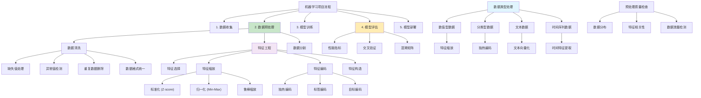

# HCIA-AI 题目分析 - 185-数据预处理技术

## 题目内容

**问题**: 在机器学习项目中，下列哪些属于常见的数据预处理技术？

**选项**:
- A. 数据清洗
- B. 特征缩放
- C. 独热编码
- D. 模型评估

## 选项分析表格

| 选项 | 内容 | 正确性 | 详细分析 | 知识点 |
|------|------|--------|----------|--------|
| A | 数据清洗 | ✅ | 完全正确。数据清洗是数据预处理的核心步骤，包括处理缺失值、异常值、重复数据、数据格式统一等。这是确保数据质量的关键步骤，直接影响模型的性能和可靠性 | 数据质量处理 |
| B | 特征缩放 | ✅ | 完全正确。特征缩放是重要的数据预处理技术，包括标准化（Z-score）、归一化（Min-Max）、鲁棒缩放等。目的是将不同量纲的特征统一到相同的尺度，避免某些特征因数值范围大而主导模型训练 | 特征工程 |
| C | 独热编码 | ✅ | 完全正确。独热编码（One-Hot Encoding）是处理分类变量的常用预处理技术，将分类变量转换为二进制向量表示。这样可以让机器学习算法正确处理非数值的分类特征 | 特征编码 |
| D | 模型评估 | ❌ | 这是错误的。模型评估不属于数据预处理技术，而是机器学习流程中的后续步骤。模型评估是在模型训练完成后，使用测试集或交叉验证来评估模型性能的过程，包括准确率、精确率、召回率等指标的计算 | 模型验证 |

## 正确答案
**答案**: ABC

**解题思路**: 
1. 理解数据预处理的定义：模型训练前对原始数据的处理
2. 识别数据质量处理：数据清洗是基础步骤
3. 识别特征工程：特征缩放和编码是核心技术
4. 区分预处理与后处理：模型评估在训练后进行

## 概念图解

## 知识点总结

### 核心概念
- **数据预处理**: 模型训练前对原始数据的清洗和转换
- **数据清洗**: 处理缺失值、异常值、重复数据等质量问题
- **特征缩放**: 统一不同特征的数值范围和分布
- **独热编码**: 将分类变量转换为机器学习可处理的数值格式
- **模型评估**: 训练后的性能评估，不属于预处理

### 相关技术
- **缺失值处理**: 删除、均值填充、插值、模型预测
- **异常值检测**: IQR方法、Z-score、孤立森林
- **特征缩放方法**: StandardScaler、MinMaxScaler、RobustScaler
- **编码技术**: One-Hot、Label Encoding、Target Encoding
- **特征选择**: 过滤法、包装法、嵌入法

### 记忆要点
- 预处理在模型训练之前进行
- 数据清洗：保证数据质量和完整性
- 特征缩放：避免数值范围差异影响模型
- 独热编码：处理分类变量的标准方法
- 模型评估：在训练后进行，不是预处理
- 预处理质量直接影响模型性能

## 扩展学习

### 相关文档
- 数据预处理最佳实践指南
- Pandas数据清洗技术
- Scikit-learn预处理工具
- 特征工程实战案例

### 实践应用
- 使用Pandas进行数据清洗
- Scikit-learn预处理管道构建
- 不同类型数据的预处理策略
- 自动化数据预处理流程设计
- MindSpore数据预处理API使用
- 大规模数据预处理优化技巧