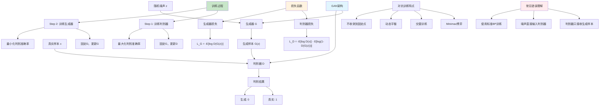

# HCIA-AI 题目分析 - 187-生成对抗网络描述

## 题目内容

**问题**: 以下关于生成对抗网络的描述中，哪几项是错误的？

**选项**:
- A. 判别器的输入主要是噪声数据和真实样本数据
- B. 生成对抗网络是一种框架，通过对抗过程，训练生成器和判别器
- C. 训练GAN框架采用BP算法
- D. 判别器的输入主要是生成器生成的样本数据

## 选项分析表格

| 选项 | 内容 | 正确性 | 详细分析 | 知识点 |
|------|------|--------|----------|--------|
| A | 判别器的输入主要是噪声数据和真实样本数据 | ❌ | 这个说法是错误的。判别器的输入不是噪声数据，而是生成器生成的假样本和真实样本数据。噪声数据是输入到生成器的，生成器将噪声转换为假样本，然后判别器接收这些假样本和真实样本进行判别 | GAN架构理解 |
| B | 生成对抗网络是一种框架，通过对抗过程，训练生成器和判别器 | ✅ | 这个说法是正确的。GAN确实是一种框架，包含生成器G和判别器D两个网络，通过对抗训练的方式：生成器试图生成逼真的假样本来欺骗判别器，判别器试图准确区分真假样本，两者相互博弈提升 | GAN基本原理 |
| C | 训练GAN框架采用BP算法 | ❌ | 这个说法是错误的。虽然GAN中的生成器和判别器网络内部使用反向传播算法更新参数，但GAN的整体训练不是简单的BP算法。GAN采用的是对抗训练机制，需要交替训练生成器和判别器，涉及minimax博弈论，比标准BP更复杂 | GAN训练机制 |
| D | 判别器的输入主要是生成器生成的样本数据 | ❌ | 这个说法是错误的。判别器的输入不仅仅是生成器生成的样本数据，还包括真实样本数据。判别器需要同时接收真实样本（标签为1）和生成样本（标签为0）来学习区分真假，如果只有生成样本就无法学习判别能力 | 判别器输入 |

## 正确答案
**答案**: ACD

**解题思路**: 
1. 理解GAN的基本架构：生成器G + 判别器D
2. 明确数据流向：噪声→生成器→假样本→判别器
3. 理解判别器输入：真实样本 + 生成样本
4. 区分GAN训练与标准BP：对抗训练 vs 标准监督学习

## 概念图解

## 知识点总结

### 核心概念
- **GAN架构**: 生成器G + 判别器D的对抗框架
- **数据流**: 噪声→生成器→假样本→判别器
- **判别器输入**: 真实样本 + 生成样本（不是噪声）
- **训练机制**: 对抗训练，不是简单的BP算法
- **博弈论**: Minimax游戏，生成器最小化判别器最大化

### 相关技术
- **生成器网络**: 将随机噪声映射为数据样本
- **判别器网络**: 二分类器，区分真实样本和生成样本
- **对抗损失**: 生成器和判别器的对抗目标函数
- **训练技巧**: 交替训练、学习率调整、梯度惩罚等
- **GAN变种**: DCGAN、WGAN、StyleGAN等改进版本

### 记忆要点
- 判别器输入：真实样本 + 生成样本（不是噪声）
- 噪声只输入给生成器，不直接给判别器
- GAN训练是对抗机制，不是标准BP
- 生成器目标：欺骗判别器（生成逼真样本）
- 判别器目标：准确识别真假样本
- 训练过程：交替优化，动态平衡

## 扩展学习

### 相关文档
- GAN原始论文：Generative Adversarial Networks
- DCGAN：深度卷积生成对抗网络
- WGAN：Wasserstein GAN改进版本
- StyleGAN：高质量图像生成

### 实践应用
- 图像生成：人脸生成、艺术创作
- 数据增强：扩充训练数据集
- 图像修复：超分辨率、去噪
- 风格迁移：图像风格转换
- 华为云ModelArts中的GAN应用