# HCIA-AI 题目分析 - 188-TensorFlow说法错误

## 题目内容

**问题**: 下列关于TensorFlow的说法，哪些选项是错误的？

**选项**:
- A. TensorFlow只能用于实现深度学习算法
- B. TensorFlow只支持GPU和CPU
- C. TensorFlow2.0默认使用动态图机制，其运行效率要高于静态图机制
- D. TensorFlow1.0使用图-会话机制

## 选项分析表格

| 选项 | 内容 | 正确性 | 详细分析 | 知识点 |
|------|------|--------|----------|--------|
| A | TensorFlow只能用于实现深度学习算法 | ❌ | 这个说法是错误的。TensorFlow不仅可以用于深度学习，还支持传统机器学习算法、数值计算、科学计算等。它提供了丰富的数学运算库，可以实现线性回归、逻辑回归、SVM等传统算法，以及各种数值优化和统计分析任务 | TensorFlow应用范围 |
| B | TensorFlow只支持GPU和CPU | ❌ | 这个说法是错误的。TensorFlow支持多种硬件平台，包括CPU、GPU、TPU（Google的张量处理单元）、以及各种移动设备和嵌入式设备。还支持分布式计算，可以在多台机器上运行 | 硬件支持 |
| C | TensorFlow2.0默认使用动态图机制，其运行效率要高于静态图机制 | ❌ | 这个说法是错误的。虽然TensorFlow 2.0确实默认使用动态图机制（Eager Execution），但动态图的运行效率通常低于静态图。动态图的优势在于易于调试和开发，而静态图在生产环境中通常有更好的性能优化和执行效率 | 计算图机制 |
| D | TensorFlow1.0使用图-会话机制 | ✅ | 这个说法是正确的。TensorFlow 1.x确实使用图-会话（Graph-Session）机制，需要先定义计算图，然后在会话中执行。这是静态图的典型特征，需要显式创建Session来运行计算图 | TensorFlow版本特性 |

## 正确答案
**答案**: ABC

**解题思路**: 
1. 理解TensorFlow的功能范围：不仅限于深度学习
2. 了解TensorFlow的硬件支持：CPU、GPU、TPU等多种平台
3. 区分动态图与静态图的性能特点
4. 掌握TensorFlow不同版本的特性差异

## 概念图解

```mermaid
flowchart TD
    A["TensorFlow生态系统"] --> B["应用领域"]
    A --> C["硬件支持"]
    A --> D["版本演进"]
    
    B --> E["深度学习"]
    B --> F["传统机器学习"]
    B --> G["数值计算"]
    B --> H["科学计算"]
    
    E --> I["CNN, RNN, Transformer"]
    F --> J["线性回归, SVM, 决策树"]
    G --> K["矩阵运算, 优化算法"]
    H --> L["统计分析, 信号处理"]
    
    C --> M["CPU"]
    C --> N["GPU (CUDA)"]
    C --> O["TPU"]
    C --> P["移动设备"]
    C --> Q["分布式集群"]
    
    D --> R["TensorFlow 1.x"]
    D --> S["TensorFlow 2.x"]
    
    R --> T["静态图"]
    R --> U["图-会话机制"]
    R --> V["显式Session"]
    R --> W["高执行效率"]
    
    S --> X["动态图 (默认)"]
    S --> Y["Eager Execution"]
    S --> Z["易于调试"]
    S --> AA["Keras集成"]
    
    BB["计算图对比"] --> CC["静态图"]
    BB --> DD["动态图"]
    
    CC --> EE["预先定义"]
    CC --> FF["编译优化"]
    CC --> GG["高性能"]
    CC --> HH["调试困难"]
    
    DD --> II["即时执行"]
    DD --> JJ["易于调试"]
    DD --> KK["开发友好"]
    DD --> LL["性能相对较低"]
    
    MM["TensorFlow功能模块"] --> NN["tf.keras"]
    MM --> OO["tf.data"]
    MM --> PP["tf.lite"]
    MM --> QQ["tf.js"]
    MM --> RR["tf.serving"]
    
    style A fill:#e1f5fe
    style B fill:#c8e6c9
    style C fill:#fff3e0
    style BB fill:#f3e5f5
```

## 知识点总结

### 核心概念
- **TensorFlow应用**: 深度学习、传统ML、数值计算、科学计算
- **硬件支持**: CPU、GPU、TPU、移动设备、分布式
- **版本差异**: 1.x静态图 vs 2.x动态图
- **性能对比**: 静态图效率高，动态图易调试
- **图-会话机制**: TensorFlow 1.x的核心特征

### 相关技术
- **Eager Execution**: TensorFlow 2.x的动态执行模式
- **tf.function**: 将动态图转换为静态图优化
- **AutoGraph**: 自动将Python代码转换为图操作
- **分布式训练**: tf.distribute策略
- **模型部署**: TensorFlow Serving、TensorFlow Lite

### 记忆要点
- TensorFlow不仅限于深度学习，支持多种计算任务
- 硬件支持广泛：CPU、GPU、TPU、移动设备等
- 动态图易调试但性能较低，静态图性能高但调试困难
- TF 1.x：静态图 + 图-会话机制
- TF 2.x：动态图 + Eager Execution（默认）
- 可通过tf.function获得静态图的性能优势

## 扩展学习

### 相关文档
- TensorFlow官方文档和教程
- TensorFlow 1.x到2.x迁移指南
- 静态图vs动态图性能对比
- TensorFlow硬件优化指南

### 实践应用
- 使用tf.function优化动态图性能
- TensorFlow在不同硬件平台的部署
- 传统机器学习算法的TensorFlow实现
- TensorFlow分布式训练实践
- 移动端TensorFlow Lite应用开发