# HCIA-AI 题目分析 - 189-ModelArts数据管理功能

## 题目内容

**问题**: 下面哪几项属于ModelArts中数据管理的功能？

**选项**:
- A. 全数据格式存储
- B. 团队标注支持
- C. 智能数据筛选
- D. 自动数据迁移

## 选项分析表格

| 选项 | 内容 | 正确性 | 详细分析 | 知识点 |
|------|------|--------|----------|--------|
| A | 全数据格式存储 | ✅ | 完全正确。ModelArts数据管理支持多种数据格式的存储，包括图像、文本、音频、视频等各种格式的数据。它基于华为云OBS（对象存储服务）提供统一的数据存储能力，支持结构化和非结构化数据 | 数据存储能力 |
| B | 团队标注支持 | ✅ | 完全正确。ModelArts提供强大的数据标注功能，支持团队协作标注。包括多人同时标注、标注任务分配、标注质量控制、标注进度管理等团队协作特性，大大提高标注效率和质量 | 协作标注功能 |
| C | 智能数据筛选 | ✅ | 完全正确。ModelArts具备智能数据筛选功能，可以根据数据质量、标注完整性、数据分布等条件自动筛选数据。还支持基于模型预测结果的难例挖掘，帮助用户找到对模型训练最有价值的数据 | 智能数据处理 |
| D | 自动数据迁移 | ❌ | 这个说法是错误的。虽然ModelArts支持数据导入导出功能，但"自动数据迁移"不是其核心的数据管理功能。数据迁移通常需要用户手动配置和触发，ModelArts更多提供的是数据管理、标注、版本控制等功能 | 数据迁移限制 |

## 正确答案
**答案**: ABC

**解题思路**: 
1. 理解ModelArts数据管理的核心功能模块
2. 识别数据存储、标注、处理等关键能力
3. 区分核心功能与辅助功能
4. 了解华为云AI平台的数据管理特色

## 概念图解

```mermaid
flowchart TD
    A["ModelArts数据管理"] --> B["数据存储"]
    A --> C["数据标注"]
    A --> D["数据处理"]
    A --> E["数据版本管理"]
    
    B --> F["全格式支持"]
    B --> G["OBS集成"]
    B --> H["分布式存储"]
    
    F --> I["图像数据"]
    F --> J["文本数据"]
    F --> K["音频数据"]
    F --> L["视频数据"]
    F --> M["表格数据"]
    
    C --> N["团队协作"]
    C --> O["标注工具"]
    C --> P["质量控制"]
    
    N --> Q["多人标注"]
    N --> R["任务分配"]
    N --> S["进度管理"]
    N --> T["权限控制"]
    
    O --> U["图像标注"]
    O --> V["文本标注"]
    O --> W["音频标注"]
    O --> X["视频标注"]
    
    D --> Y["智能筛选"]
    D --> Z["数据清洗"]
    D --> AA["格式转换"]
    
    Y --> BB["质量评估"]
    Y --> CC["难例挖掘"]
    Y --> DD["分布分析"]
    Y --> EE["自动筛选"]
    
    E --> FF["版本控制"]
    E --> GG["变更追踪"]
    E --> HH["回滚机制"]
    
    II["数据管理流程"] --> JJ["数据导入"]
    II --> KK["数据预处理"]
    II --> LL["数据标注"]
    II --> MM["数据验证"]
    II --> NN["数据发布"]
    
    OO["集成服务"] --> PP["华为云OBS"]
    OO --> QQ["ModelArts训练"]
    OO --> RR["ModelArts推理"]
    OO --> SS["数据湖服务"]
    
    TT["非核心功能"] --> UU["自动数据迁移"]
    TT --> VV["跨云数据同步"]
    TT --> WW["实时数据流"]
    
    style A fill:#e1f5fe
    style C fill:#c8e6c9
    style D fill:#fff3e0
    style TT fill:#ffebee
```

## 知识点总结

### 核心概念
- **全格式存储**: 支持图像、文本、音频、视频等多种数据格式
- **团队标注**: 多人协作、任务分配、质量控制的标注体系
- **智能筛选**: 基于质量和价值的自动数据筛选能力
- **数据管理**: 存储、标注、处理、版本控制的完整流程

### 相关技术
- **华为云OBS**: 底层对象存储服务支持
- **标注工具**: 图像、文本、音频、视频的专业标注界面
- **质量评估**: 自动化的数据质量检测和评估
- **难例挖掘**: 基于模型预测的困难样本识别
- **版本管理**: 数据集的版本控制和变更追踪

### 记忆要点
- ModelArts数据管理三大核心：存储、标注、处理
- 全格式存储：支持AI训练所需的各种数据类型
- 团队标注：支持大规模协作标注项目
- 智能筛选：自动化的数据质量和价值评估
- 自动数据迁移不是核心功能
- 与华为云生态深度集成

## 扩展学习

### 相关文档
- ModelArts数据管理官方文档
- 华为云OBS对象存储服务
- AI数据标注最佳实践
- 数据质量评估方法

### 实践应用
- 大规模图像数据集的团队标注
- 多模态数据的统一管理
- 数据质量自动化评估流程
- 标注质量控制和一致性检查
- 数据版本管理和实验追踪
- ModelArts端到端AI开发流程