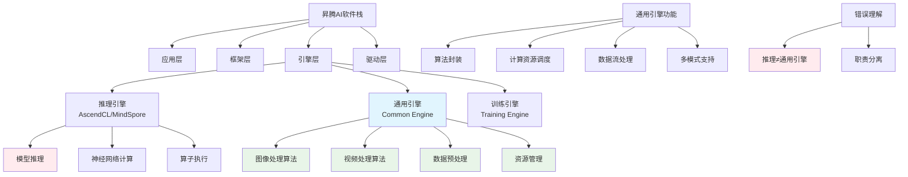

# HCIA-AI 题目分析 - 昇腾AI软件栈通用引擎

## 题目内容

**问题**: 以下关于昇腾AI软件栈的通用引擎描述错误的是哪些选项？

**选项**:
- A. 提供视频或图像处理的算法封装
- B. 为昇腾AI提供计算资源
- C. 提供通用的神经网络推理能力
- D. 支持在线和离线模型的加速模型

## 选项分析表格

| 选项 | 内容 | 正确性 | 详细分析 | 知识点 |
|------|------|--------|----------|--------|
| A | 提供视频或图像处理的算法封装 | ✅ | 昇腾AI软件栈的通用引擎确实提供了丰富的视频和图像处理算法封装，包括图像预处理、后处理、视频编解码等功能，这是其核心功能之一 | 图像视频处理 |
| B | 为昇腾AI提供计算资源 | ✅ | 通用引擎作为昇腾AI软件栈的重要组成部分，负责为AI应用提供底层计算资源的调度和管理，包括NPU资源的分配和使用 | 计算资源管理 |
| C | 提供通用的神经网络推理能力 | ❌ | 这个描述是错误的。通用引擎主要负责数据预处理、后处理和资源管理，而神经网络推理能力主要由推理引擎(如AscendCL、MindSpore Lite)提供，不是通用引擎的职责 | 推理引擎职责 |
| D | 支持在线和离线模型的加速模型 | ✅ | 昇腾AI软件栈支持多种部署模式，包括在线推理和离线批处理，通用引擎为这些不同模式提供相应的加速和优化支持 | 模型部署模式 |

## 正确答案
**答案**: ABD (题目问的是错误选项，所以答案是C)

**解题思路**: 
1. 理解昇腾AI软件栈的架构层次
2. 区分通用引擎与推理引擎的职责
3. 通用引擎主要负责数据处理和资源管理
4. 推理引擎负责神经网络模型的推理计算

## 概念图解

## 知识点总结

### 核心概念
- **通用引擎**: 负责数据处理、算法封装、资源管理，不负责神经网络推理
- **推理引擎**: 专门负责神经网络模型的推理计算和算子执行
- **职责分离**: 不同引擎有明确的功能边界和职责划分
- **昇腾架构**: 分层设计，各层协同工作

### 相关技术
- 昇腾AI处理器架构
- AscendCL推理框架
- MindSpore深度学习框架
- 华为AI全栈解决方案

### 记忆要点
- 通用引擎 = 数据处理 + 资源管理
- 推理引擎 = 神经网络推理
- 不要混淆不同引擎的职责
- 昇腾软件栈采用分层架构

## 扩展学习

### 相关文档
- 昇腾AI软件栈架构文档
- AscendCL开发指南
- 华为AI处理器技术白皮书

### 实践应用
- 昇腾AI应用开发
- 华为云ModelArts集成
- AI推理服务部署
- 边缘AI解决方案