# HCIA-AI 题目分析 - 190-优化器说法错误

## 题目内容

**问题**: 以下关于常用优化器的说法中，错误的是哪几项？

**选项**:
- A. Adagrad优化器的优点之一是不会过早结束参数更新操作
- B. 采用动量优化器时，每一个参数都用相同的学习率进行更新，但动量系数会随着迭代的进行而得到调整
- C. Adam的思想是为不同的参数设置不同的学习率
- D. RMSprop优化器通过引入一个衰减系数，让梯度每回合都衰减一定的比例

## 选项分析表格

| 选项 | 内容 | 正确性 | 详细分析 | 知识点 |
|------|------|--------|----------|--------|
| A | Adagrad优化器的优点之一是不会过早结束参数更新操作 | ❌ | 这个说法是错误的。Adagrad的主要缺点恰恰是容易过早结束参数更新操作。由于Adagrad累积所有历史梯度的平方，分母会不断增大，导致学习率逐渐趋近于0，最终可能过早停止学习，这是其最大的问题 | Adagrad缺点 |
| B | 采用动量优化器时，每一个参数都用相同的学习率进行更新，但动量系数会随着迭代的进行而得到调整 | ❌ | 这个说法是错误的。在标准的动量优化器中，动量系数（通常记为β或momentum）是一个固定的超参数，不会随着迭代自动调整。动量系数通常设置为0.9等固定值，在整个训练过程中保持不变 | 动量优化器机制 |
| C | Adam的思想是为不同的参数设置不同的学习率 | ✅ | 这个说法是正确的。Adam优化器的核心思想确实是为每个参数自适应地设置不同的学习率。它结合了动量法和RMSprop的优点，通过维护每个参数的一阶矩估计和二阶矩估计来自适应调整学习率 | Adam自适应机制 |
| D | RMSprop优化器通过引入一个衰减系数，让梯度每回合都衰减一定的比例 | ✅ | 这个说法是正确的。RMSprop确实引入了衰减系数（通常记为ρ或decay_rate），用于计算梯度平方的指数移动平均，让历史梯度信息按指数衰减，避免了Adagrad中梯度平方无限累积的问题 | RMSprop衰减机制 |

## 正确答案
**答案**: AB

**解题思路**: 
1. 理解各优化器的核心机制和特点
2. 识别Adagrad的主要缺点：学习率衰减过快
3. 明确动量优化器中动量系数是固定超参数
4. 掌握Adam和RMSprop的自适应学习率机制

## 概念图解

```mermaid
flowchart TD
    A["常用优化器对比"] --> B["SGD"]
    A --> C["Momentum"]
    A --> D["Adagrad"]
    A --> E["RMSprop"]
    A --> F["Adam"]
    
    B --> G["固定学习率"]
    B --> H["简单直接"]
    B --> I["可能震荡"]
    
    C --> J["动量机制"]
    C --> K["固定动量系数β"]
    C --> L["加速收敛"]
    C --> M["减少震荡"]
    
    D --> N["自适应学习率"]
    D --> O["累积梯度平方"]
    D --> P["学习率衰减过快"]
    D --> Q["容易过早停止"]
    
    E --> R["指数移动平均"]
    E --> S["衰减系数ρ"]
    E --> T["解决Adagrad问题"]
    E --> U["适合非平稳目标"]
    
    F --> V["一阶矩估计"]
    F --> W["二阶矩估计"]
    F --> X["偏差修正"]
    F --> Y["自适应学习率"]
    
    Z["优化器特点对比"] --> AA["学习率调整"]
    Z --> BB["收敛速度"]
    Z --> CC["参数敏感性"]
    Z --> DD["适用场景"]
    
    AA --> EE["固定: SGD, Momentum"]
    AA --> FF["自适应: Adagrad, RMSprop, Adam"]
    
    GG["常见误解"] --> HH["Adagrad不会过早停止"]
    GG --> II["动量系数会自动调整"]
    GG --> JJ["Adam只是SGD的改进"]
    
    KK["优化器选择原则"] --> LL["数据集大小"]
    KK --> MM["网络架构"]
    KK --> NN["训练稳定性"]
    KK --> OO["收敛速度"]
    
    PP["数学公式"] --> QQ["Momentum: v_t = βv_{t-1} + ∇f(θ)"]
    PP --> RR["Adagrad: θ_t = θ_{t-1} - η/√(G_t + ε) * ∇f(θ)"]
    PP --> SS["RMSprop: E[g²]_t = ρE[g²]_{t-1} + (1-ρ)g²_t"]
    PP --> TT["Adam: 结合动量和RMSprop"]
    
    style A fill:#e1f5fe
    style GG fill:#ffebee
    style KK fill:#c8e6c9
    style PP fill:#fff3e0
```

## 知识点总结

### 核心概念
- **Adagrad缺点**: 学习率衰减过快，容易过早停止训练
- **动量系数**: 固定超参数，不会自动调整
- **Adam自适应**: 为每个参数设置不同的学习率
- **RMSprop衰减**: 通过衰减系数实现梯度信息的指数衰减

### 相关技术
- **梯度累积**: Adagrad累积所有历史梯度平方
- **指数移动平均**: RMSprop和Adam使用的平滑技术
- **偏差修正**: Adam中修正初期估计偏差的技术
- **自适应学习率**: 根据参数历史信息调整学习率

### 记忆要点
- Adagrad的致命缺点：学习率衰减太快，容易过早停止
- 动量优化器的动量系数是固定的，不会自动调整
- Adam的核心：为不同参数设置不同的自适应学习率
- RMSprop通过衰减系数解决Adagrad的问题
- 选择优化器要考虑数据特性和网络架构
- Adam通用性好，RMSprop适合RNN，SGD稳定性高

## 扩展学习

### 相关文档
- 深度学习优化器原理详解
- Adam优化器的数学推导
- 优化器选择和超参数调优指南
- 自适应学习率算法比较

### 实践应用
- 不同优化器在各种任务上的性能对比
- 学习率调度与优化器的配合使用
- 大规模训练中的优化器选择策略
- MindSpore中各种优化器的使用方法
- 优化器超参数的网格搜索和贝叶斯优化