# HCIA-AI 题目分析 - 191-优化器说法正确

## 题目内容

**问题**: 以下关于常用优化器的说法中，正确的是哪几项？

**选项**:
- A. 采用动量优化器时，每一个参数都用相同的学习率进行更新，但动量系数会随着迭代的进行而得到调整
- B. Adagrad的思想是为不同的参数设置不同的学习率
- C. Adagrad优化器的缺点之一是容易过早结束参数更新操作
- D. RMSprop优化器通过引入一个衰减系数，让梯度每回合都衰减一定的比例

## 选项分析表格

| 选项 | 内容 | 正确性 | 详细分析 | 知识点 |
|------|------|--------|----------|--------|
| A | 采用动量优化器时，每一个参数都用相同的学习率进行更新，但动量系数会随着迭代的进行而得到调整 | ❌ | 这个说法是错误的。在标准的动量优化器中，动量系数（momentum coefficient，通常记为β）是一个固定的超参数，在整个训练过程中保持不变，通常设置为0.9。动量系数不会随着迭代自动调整 | 动量优化器机制 |
| B | Adagrad的思想是为不同的参数设置不同的学习率 | ✅ | 完全正确。Adagrad的核心思想确实是为每个参数自适应地设置不同的学习率。它通过累积每个参数的历史梯度平方来调整学习率，使得更新频繁的参数获得较小的学习率，更新稀少的参数获得较大的学习率 | Adagrad自适应机制 |
| C | Adagrad优化器的缺点之一是容易过早结束参数更新操作 | ✅ | 完全正确。这是Adagrad的主要缺点。由于Adagrad累积所有历史梯度的平方，分母会单调递增，导致有效学习率不断减小，最终趋近于0，可能在达到最优解之前就停止学习，这被称为"过早停止"问题 | Adagrad缺点 |
| D | RMSprop优化器通过引入一个衰减系数，让梯度每回合都衰减一定的比例 | ✅ | 完全正确。RMSprop引入衰减系数（decay rate，通常记为ρ），用于计算梯度平方的指数移动平均：E[g²]_t = ρE[g²]_{t-1} + (1-ρ)g²_t。这样历史梯度信息会按指数衰减，解决了Adagrad中梯度平方无限累积的问题 | RMSprop衰减机制 |

## 正确答案
**答案**: BCD

**解题思路**: 
1. 理解各优化器的核心原理和机制
2. 区分固定超参数与自适应参数
3. 掌握Adagrad的优点和主要缺点
4. 理解RMSprop如何改进Adagrad的问题

## 概念图解

```mermaid
flowchart TD
    A["优化器演进历程"] --> B["SGD"]
    A --> C["Momentum"]
    A --> D["Adagrad"]
    A --> E["RMSprop"]
    A --> F["Adam"]
    
    B --> G["基础梯度下降"]
    B --> H["固定学习率"]
    B --> I["可能震荡"]
    
    C --> J["引入动量项"]
    C --> K["v_t = βv_{t-1} + ∇f(θ)"]
    C --> L["β固定不变"]
    C --> M["加速收敛"]
    
    D --> N["自适应学习率"]
    D --> O["G_t = G_{t-1} + g_t²"]
    D --> P["η_t = η/√(G_t + ε)"]
    D --> Q["学习率单调递减"]
    
    E --> R["指数移动平均"]
    E --> S["E[g²]_t = ρE[g²]_{t-1} + (1-ρ)g_t²"]
    E --> T["衰减系数ρ"]
    E --> U["解决过早停止"]
    
    F --> V["结合Momentum和RMSprop"]
    F --> W["一阶矩和二阶矩估计"]
    F --> X["偏差修正"]
    
    Y["Adagrad详细分析"] --> Z["优点"]
    Y --> AA["缺点"]
    
    Z --> BB["自适应学习率"]
    Z --> CC["稀疏梯度友好"]
    Z --> DD["无需手动调整学习率"]
    
    AA --> EE["学习率单调递减"]
    AA --> FF["容易过早停止"]
    AA --> GG["后期学习能力弱"]
    
    HH["RMSprop改进"] --> II["引入衰减系数"]
    HH --> JJ["梯度信息衰减"]
    HH --> KK["保持学习能力"]
    
    LL["动量优化器特点"] --> MM["固定超参数"]
    LL --> NN["动量系数β"]
    LL --> OO["通常β=0.9"]
    LL --> PP["整个训练过程不变"]
    
    QQ["优化器选择指南"] --> RR["稀疏数据: Adagrad"]
    QQ --> SS["非平稳目标: RMSprop"]
    QQ --> TT["通用场景: Adam"]
    QQ --> UU["稳定训练: SGD+Momentum"]
    
    VV["数学公式对比"] --> WW["SGD: θ = θ - η∇f(θ)"]
    VV --> XX["Momentum: θ = θ - ηv_t"]
    VV --> YY["Adagrad: θ = θ - η/√G_t * ∇f(θ)"]
    VV --> ZZ["RMSprop: θ = θ - η/√E[g²]_t * ∇f(θ)"]
    
    style A fill:#e1f5fe
    style Y fill:#c8e6c9
    style HH fill:#fff3e0
    style LL fill:#f3e5f5
```

## 知识点总结

### 核心概念
- **动量系数**: 固定超参数，不会自动调整
- **Adagrad自适应**: 为每个参数设置不同的学习率
- **Adagrad缺点**: 容易过早结束参数更新
- **RMSprop衰减**: 通过衰减系数让梯度信息按比例衰减

### 相关技术
- **自适应学习率**: 根据参数历史信息动态调整
- **梯度累积**: Adagrad累积所有历史梯度平方
- **指数移动平均**: RMSprop使用的平滑技术
- **衰减机制**: 控制历史信息的影响程度

### 记忆要点
- 动量优化器的动量系数是固定的，不会自动调整
- Adagrad的核心思想：自适应学习率，为不同参数设置不同学习率
- Adagrad的主要缺点：学习率单调递减，容易过早停止
- RMSprop通过衰减系数解决Adagrad的过早停止问题
- 优化器选择要根据数据特性和任务需求
- 理解各优化器的数学原理有助于正确使用

## 扩展学习

### 相关文档
- 深度学习优化算法详解
- Adagrad论文：Adaptive Subgradient Methods
- RMSprop算法原理和实现
- 优化器超参数调优指南

### 实践应用
- 不同优化器在稀疏数据上的表现
- 学习率调度策略与优化器的配合
- 大规模分布式训练中的优化器选择
- MindSpore中优化器的配置和使用
- 自定义优化器的实现方法
- 优化器性能监控和调试技巧