# HCIA-AI 题目分析 - 192-TensorFlow2.x-EagerExecution特点

## 题目内容

**问题**: 以下哪些选项是TensorFlow 2.x Eager Execution的特点？

**选项**:
- A. 高性能
- B. 可部署性
- C. 直观
- D. 灵活

## 选项分析表格

| 选项 | 内容 | 正确性 | 详细分析 | 知识点 |
|------|------|--------|----------|--------|
| A | 高性能 | ❌ | 这个说法是错误的。Eager Execution虽然提供了更好的调试体验，但在性能方面通常不如Graph模式。Eager模式下每个操作都会立即执行，无法进行全局优化，因此性能相对较低。高性能通常是Graph模式的优势 | Eager vs Graph性能对比 |
| B | 可部署性 | ❌ | 这个说法是错误的。Eager Execution主要用于开发和调试阶段，在生产部署时通常需要转换为Graph模式或使用tf.function装饰器来获得更好的部署性能。直接部署Eager模式的模型在生产环境中效率较低 | 部署模式选择 |
| C | 直观 | ✅ | 完全正确。Eager Execution的最大特点就是直观性。代码按照Python的自然执行顺序运行，操作立即执行并返回具体值，无需构建计算图，使得调试和开发更加直观易懂，符合Python开发者的习惯 | Eager执行模式 |
| D | 灵活 | ✅ | 完全正确。Eager Execution提供了极大的灵活性。可以使用标准Python控制流（if、while、for等），支持动态模型构建，可以在运行时改变网络结构，使用Python调试器进行调试，这些都体现了其灵活性 | 动态图灵活性 |

## 正确答案
**答案**: CD

**解题思路**: 
1. 理解Eager Execution与Graph模式的区别
2. 分析Eager模式的优势和劣势
3. 区分开发阶段特性与生产部署特性
4. 掌握TensorFlow 2.x的执行模式特点

## 概念图解

```mermaid
flowchart TD
    A["TensorFlow执行模式对比"] --> B["Graph模式 (TF 1.x默认)"]
    A --> C["Eager模式 (TF 2.x默认)"]
    
    B --> D["构建计算图"]
    B --> E["会话执行"]
    B --> F["高性能"]
    B --> G["适合生产部署"]
    B --> H["调试困难"]
    B --> I["静态图结构"]
    
    C --> J["立即执行"]
    C --> K["直观易懂"]
    C --> L["灵活性强"]
    C --> M["调试友好"]
    C --> N["性能相对较低"]
    C --> O["动态图结构"]
    
    P["Eager Execution特点详解"] --> Q["直观性"]
    P --> R["灵活性"]
    P --> S["性能考虑"]
    P --> T["部署考虑"]
    
    Q --> U["代码按顺序执行"]
    Q --> V["操作立即返回结果"]
    Q --> W["无需构建计算图"]
    Q --> X["符合Python习惯"]
    
    R --> Y["支持Python控制流"]
    R --> Z["动态模型构建"]
    R --> AA["运行时修改网络"]
    R --> BB["使用Python调试器"]
    
    S --> CC["每个操作立即执行"]
    S --> DD["无法全局优化"]
    S --> EE["内存开销较大"]
    S --> FF["适合开发调试"]
    
    T --> GG["开发阶段优势"]
    T --> HH["生产需要优化"]
    T --> II["tf.function装饰器"]
    T --> JJ["转换为Graph模式"]
    
    KK["TensorFlow 2.x改进"] --> LL["默认Eager模式"]
    KK --> MM["保留Graph优势"]
    KK --> NN["@tf.function"]
    KK --> OO["AutoGraph"]
    
    LL --> PP["开发体验提升"]
    LL --> QQ["学习曲线降低"]
    LL --> RR["调试更容易"]
    
    MM --> SS["tf.function装饰"]
    MM --> TT["图优化保留"]
    MM --> UU["部署性能保证"]
    
    VV["最佳实践"] --> WW["开发: Eager模式"]
    VV --> XX["调试: Eager模式"]
    VV --> YY["训练: @tf.function"]
    VV --> ZZ["部署: Graph模式"]
    
    AAA["性能优化策略"] --> BBB["使用tf.function"]
    AAA --> CCC["批处理操作"]
    AAA --> DDD["避免频繁Python调用"]
    AAA --> EEE["合理使用GPU"]
    
    style A fill:#e1f5fe
    style P fill:#c8e6c9
    style KK fill:#fff3e0
    style VV fill:#f3e5f5
```

## 知识点总结

### 核心概念
- **Eager Execution**: TensorFlow 2.x默认执行模式，操作立即执行
- **直观性**: 代码按Python自然顺序执行，易于理解和调试
- **灵活性**: 支持动态图构建和Python控制流
- **性能权衡**: 开发友好但性能不如Graph模式

### 相关技术
- **Graph模式**: 静态图执行，高性能但调试困难
- **tf.function**: 将Eager代码转换为图执行
- **AutoGraph**: 自动将Python控制流转换为图操作
- **动态图vs静态图**: 不同执行模式的优劣对比

### 记忆要点
- Eager模式的核心优势是直观和灵活，不是高性能
- 高性能是Graph模式的特点，不是Eager模式的优势
- 部署时通常需要优化，不能直接说Eager模式可部署性好
- TensorFlow 2.x通过tf.function平衡了开发体验和性能
- 理解不同执行模式的适用场景很重要
- 开发调试用Eager，生产部署用Graph

## 扩展学习

### 相关文档
- TensorFlow 2.x Eager Execution官方文档
- Graph模式与Eager模式性能对比
- tf.function使用指南和最佳实践
- TensorFlow执行模式演进历史

### 实践应用
- 开发阶段使用Eager模式进行快速原型开发
- 使用tf.function装饰器优化关键函数性能
- 生产部署时的模型优化策略
- 调试技巧：利用Eager模式的即时执行特性
- 混合使用Eager和Graph模式的最佳实践
- 性能分析和优化工具的使用方法