# HCIA-AI 题目分析 - 193-矩形窗和汉明窗描述

## 题目内容

**问题**: 以下关于矩形窗和汉明窗的描述，正确的是哪些选项？

**选项**:
- A. 矩形窗平滑性较好，但波形细节丢失，并且会产生泄露现象
- B. 汉明窗的主瓣宽度大于矩形窗，具有较高的频谱分辨率（矩形窗具有较高频谱分辨率）
- C. 汉明窗可以有效克服泄露现象，应用范围最为广泛
- D. 矩形窗的旁瓣峰值较大，因此其频谱泄漏比较严重

## 选项分析表格

| 选项 | 内容 | 正确性 | 详细分析 | 知识点 |
|------|------|--------|----------|--------|
| A | 矩形窗平滑性较好，但波形细节丢失，并且会产生泄露现象 | ❌ | 这个说法是错误的。矩形窗的特点恰恰相反：矩形窗平滑性较差（因为边缘突变），但能较好保持波形细节，确实会产生频谱泄漏现象。矩形窗在时域是矩形函数，边缘有突变，所以平滑性不好 | 矩形窗特性 |
| B | 汉明窗的主瓣宽度大于矩形窗，具有较高的频谱分辨率（矩形窗具有较高频谱分辨率） | ❌ | 这个说法是错误的。汉明窗的主瓣宽度确实大于矩形窗，但频谱分辨率与主瓣宽度成反比。主瓣越宽，频谱分辨率越低。因此矩形窗具有较高的频谱分辨率，汉明窗的频谱分辨率较低。括号中的说法是正确的 | 频谱分辨率 |
| C | 汉明窗可以有效克服泄露现象，应用范围最为广泛 | ✅ | 完全正确。汉明窗通过在边缘逐渐衰减到零，有效减少了频谱泄漏现象。它在抑制泄漏和保持合理分辨率之间取得了良好平衡，因此在信号处理中应用最为广泛，是最常用的窗函数之一 | 汉明窗优势 |
| D | 矩形窗的旁瓣峰值较大，因此其频谱泄漏比较严重 | ✅ | 完全正确。矩形窗在频域的旁瓣峰值约为-13dB，相对较大，这导致了严重的频谱泄漏问题。当信号频率不是FFT频率分辨率的整数倍时，能量会泄漏到相邻频率分量，造成频谱失真 | 频谱泄漏 |

## 正确答案
**答案**: CD

**解题思路**: 
1. 理解不同窗函数的时域和频域特性
2. 掌握频谱分辨率与主瓣宽度的关系
3. 理解频谱泄漏现象的产生机制
4. 比较矩形窗和汉明窗的优缺点

## 概念图解

```mermaid
flowchart TD
    A["窗函数对比分析"] --> B["矩形窗特性"]
    A --> C["汉明窗特性"]
    A --> D["性能对比"]
    
    B --> E["时域特性"]
    B --> F["频域特性"]
    B --> G["优缺点"]
    
    E --> H["w(n) = 1, 0≤n≤N-1"]
    E --> I["边缘突变"]
    E --> J["平滑性差"]
    E --> K["保持波形细节"]
    
    F --> L["主瓣窄"]
    F --> M["旁瓣高(-13dB)"]
    F --> N["频谱分辨率高"]
    F --> O["频谱泄漏严重"]
    
    G --> P["优点: 高分辨率"]
    G --> Q["缺点: 严重泄漏"]
    G --> R["适用: 理想信号"]
    
    C --> S["时域特性"]
    C --> T["频域特性"]
    C --> U["优缺点"]
    
    S --> V["w(n) = 0.54 - 0.46cos(2πn/(N-1))"]
    S --> W["边缘平滑"]
    S --> X["逐渐衰减到零"]
    S --> Y["平滑性好"]
    
    T --> Z["主瓣宽"]
    T --> AA["旁瓣低(-43dB)"]
    T --> BB["频谱分辨率低"]
    T --> CC["频谱泄漏小"]
    
    U --> DD["优点: 抑制泄漏"]
    U --> EE["缺点: 分辨率降低"]
    U --> FF["适用: 实际信号"]
    
    D --> GG["分辨率对比"]
    D --> HH["泄漏对比"]
    D --> II["应用场景"]
    
    GG --> JJ["矩形窗: 高分辨率"]
    GG --> KK["汉明窗: 低分辨率"]
    GG --> LL["主瓣宽度反比关系"]
    
    HH --> MM["矩形窗: 严重泄漏"]
    HH --> NN["汉明窗: 轻微泄漏"]
    HH --> OO["旁瓣抑制效果"]
    
    II --> PP["矩形窗: 理论分析"]
    II --> QQ["汉明窗: 实际应用"]
    II --> RR["工程实践选择"]
    
    SS["频谱泄漏机制"] --> TT["产生原因"]
    SS --> UU["表现形式"]
    SS --> VV["解决方案"]
    
    TT --> WW["信号截断"]
    TT --> XX["频率不匹配"]
    TT --> YY["边缘不连续"]
    
    UU --> ZZ["能量扩散"]
    UU --> AAA["虚假频率分量"]
    UU --> BBB["频谱失真"]
    
    VV --> CCC["选择合适窗函数"]
    VV --> DDD["增加数据长度"]
    VV --> EEE["零填充技术"]
    
    FFF["窗函数选择指南"] --> GGG["高分辨率需求"]
    FFF --> HHH["低泄漏需求"]
    FFF --> III["平衡需求"]
    
    GGG --> JJJ["选择矩形窗"]
    GGG --> KKK["适用理想信号"]
    
    HHH --> LLL["选择汉明窗"]
    HHH --> MMM["适用实际信号"]
    
    III --> NNN["汉明窗最常用"]
    III --> OOO["工程实践首选"]
    
    PPP["数学表达式对比"] --> QQQ["矩形窗: w(n) = 1"]
    PPP --> RRR["汉明窗: w(n) = 0.54 - 0.46cos(2πn/(N-1))"]
    PPP --> SSS["频域主瓣宽度比: 2:1"]
    PPP --> TTT["旁瓣抑制比: -13dB vs -43dB"]
    
    style A fill:#e1f5fe
    style SS fill:#c8e6c9
    style FFF fill:#fff3e0
    style PPP fill:#f3e5f5
```

## 知识点总结

### 核心概念
- **矩形窗**: 时域矩形，频域主瓣窄但旁瓣高，高分辨率但严重泄漏
- **汉明窗**: 时域平滑，频域主瓣宽但旁瓣低，低分辨率但轻微泄漏
- **频谱分辨率**: 与主瓣宽度成反比，主瓣越窄分辨率越高
- **频谱泄漏**: 由信号截断和窗函数边缘不连续引起

### 相关技术
- **窗函数设计**: 在分辨率和泄漏之间权衡
- **FFT分析**: 窗函数对频谱分析结果的影响
- **信号处理**: 不同应用场景的窗函数选择
- **频域分析**: 主瓣和旁瓣特性的理解

### 记忆要点
- 矩形窗平滑性差（边缘突变），不是平滑性好
- 主瓣宽度与频谱分辨率成反比关系
- 汉明窗是实际应用中最常用的窗函数
- 矩形窗旁瓣峰值大(-13dB)，泄漏严重
- 汉明窗旁瓣峰值小(-43dB)，有效抑制泄漏
- 窗函数选择要根据具体应用需求权衡

## 扩展学习

### 相关文档
- 数字信号处理中的窗函数理论
- FFT分析中窗函数的选择指南
- 各种窗函数的数学表达式和特性对比
- 频谱泄漏现象的深入分析

### 实践应用
- 语音信号处理中的窗函数应用
- 频谱分析软件中的窗函数设置
- 实时信号处理系统的窗函数优化
- 不同窗函数对信号分析结果的影响实验
- 自定义窗函数的设计方法
- 窗函数参数调优的实践技巧