# HCIA-AI 题目分析 - 194-HarmonyOS关键能力

## 题目内容

**问题**: 以下哪些选项属于HarmonyOS的关键能力？

**选项**:
- A. 分布式能力
- B. 万能卡片
- C. MLKit
- D. HMSCore

## 选项分析表格

| 选项 | 内容 | 正确性 | 详细分析 | 知识点 |
|------|------|--------|----------|--------|
| A | 分布式能力 | ✅ | 完全正确。分布式能力是HarmonyOS的核心特性之一，包括分布式软总线、分布式数据管理、分布式任务调度等。它实现了多设备间的无缝协同，让不同设备能够像一个超级终端一样工作，这是HarmonyOS区别于其他操作系统的重要特征 | 分布式软总线 |
| B | 万能卡片 | ✅ | 完全正确。万能卡片（Service Widget）是HarmonyOS的重要UI组件和交互方式，允许应用在桌面、负一屏等位置展示关键信息和提供快捷操作，无需打开完整应用即可获取服务，提升了用户体验和操作效率 | UI组件系统 |
| C | MLKit | ❌ | 这个说法是错误的。MLKit是Google提供的机器学习SDK，主要用于Android和iOS平台，不是HarmonyOS的关键能力。HarmonyOS有自己的AI能力框架，如HiAI等，但MLKit不属于HarmonyOS生态 | 第三方ML框架 |
| D | HMSCore | ✅ | 完全正确。HMS Core（Huawei Mobile Services Core）是华为移动服务的核心，为HarmonyOS应用提供丰富的API和服务能力，包括账号、支付、地图、推送、广告等服务，是HarmonyOS生态的重要组成部分 | 华为移动服务 |

## 正确答案
**答案**: ABD

**解题思路**: 
1. 理解HarmonyOS的核心架构和特性
2. 区分HarmonyOS自有能力与第三方服务
3. 掌握华为生态系统的组成部分
4. 了解分布式操作系统的关键特征

## 概念图解

```mermaid
flowchart TD
    A["HarmonyOS关键能力体系"] --> B["分布式能力"]
    A --> C["应用框架"]
    A --> D["服务生态"]
    A --> E["AI能力"]
    
    B --> F["分布式软总线"]
    B --> G["分布式数据管理"]
    B --> H["分布式任务调度"]
    B --> I["分布式安全"]
    
    F --> J["设备发现"]
    F --> K["连接建立"]
    F --> L["数据传输"]
    F --> M["协议适配"]
    
    G --> N["跨设备数据同步"]
    G --> O["分布式数据库"]
    G --> P["数据一致性"]
    
    H --> Q["任务迁移"]
    H --> R["任务协同"]
    H --> S["负载均衡"]
    
    C --> T["万能卡片"]
    C --> U["原子化服务"]
    C --> V["统一UI框架"]
    C --> W["多模态交互"]
    
    T --> X["桌面卡片"]
    T --> Y["负一屏卡片"]
    T --> Z["通知栏卡片"]
    T --> AA["实时信息展示"]
    
    U --> BB["免安装体验"]
    U --> CC["按需加载"]
    U --> DD["轻量化服务"]
    
    D --> EE["HMS Core"]
    D --> FF["AppGallery"]
    D --> GG["华为账号"]
    D --> HH["华为支付"]
    
    EE --> II["基础服务"]
    EE --> JJ["媒体服务"]
    EE --> KK["图形服务"]
    EE --> LL["AI服务"]
    
    II --> MM["账号服务"]
    II --> NN["推送服务"]
    II --> OO["地图服务"]
    II --> PP["广告服务"]
    
    E --> QQ["HiAI"]
    E --> RR["端侧AI"]
    E --> SS["云侧AI"]
    E --> TT["AI开放平台"]
    
    QQ --> UU["NPU调度"]
    QQ --> VV["模型推理"]
    QQ --> WW["AI算子"]
    
    XXX["技术对比分析"] --> YYY["HarmonyOS vs Android"]
    XXX --> ZZZ["华为生态 vs Google生态"]
    
    YYY --> AAAA["分布式 vs 单设备"]
    YYY --> BBBB["万能卡片 vs Widget"]
    YYY --> CCCC["原子化服务 vs App"]
    
    ZZZ --> DDDD["HMS Core vs GMS"]
    ZZZ --> EEEE["HiAI vs MLKit"]
    ZZZ --> FFFF["AppGallery vs Play Store"]
    
    GGGG["MLKit说明"] --> HHHH["Google开发"]
    GGGG --> IIII["Android/iOS平台"]
    GGGG --> JJJJ["机器学习SDK"]
    GGGG --> KKKK["非HarmonyOS能力"]
    
    HHHH --> LLLL["文本识别"]
    HHHH --> MMMM["人脸检测"]
    HHHH --> NNNN["条码扫描"]
    HHHH --> OOOO["语言翻译"]
    
    PPPP["HarmonyOS AI能力"] --> QQQQ["HiAI Engine"]
    PPPP --> RRRR["MindSpore Lite"]
    PPPP --> SSSS["AI开放能力"]
    
    TTTT["分布式场景示例"] --> UUUU["多屏协同"]
    TTTT --> VVVV["跨设备剪贴板"]
    TTTT --> WWWW["分布式相机"]
    TTTT --> XXXX["任务流转"]
    
    YYYY["万能卡片应用"] --> ZZZZ["天气信息"]
    YYYY --> AAAAA["日程提醒"]
    YYYY --> BBBBB["快捷操作"]
    YYYY --> CCCCC["实时数据"]
    
    style A fill:#e1f5fe
    style XXX fill:#c8e6c9
    style GGGG fill:#ffebee
    style PPPP fill:#fff3e0
```

## 知识点总结

### 核心概念
- **分布式能力**: HarmonyOS的核心特性，实现多设备协同
- **万能卡片**: 轻量化UI组件，提供快捷信息和操作
- **HMS Core**: 华为移动服务核心，提供丰富API服务
- **MLKit**: Google的ML SDK，不属于HarmonyOS生态

### 相关技术
- **分布式软总线**: 设备间通信的统一底座
- **原子化服务**: 免安装的轻量化应用形态
- **HiAI**: 华为自研的AI能力框架
- **多模态交互**: 支持触控、语音、手势等交互方式

### 记忆要点
- HarmonyOS三大核心能力：分布式、万能卡片、HMS Core
- MLKit是Google产品，不是华为/HarmonyOS的能力
- 分布式能力是HarmonyOS最重要的差异化特性
- HMS Core替代GMS，为华为生态提供服务支撑
- 万能卡片提升用户体验，减少应用启动次数
- 要区分华为自研技术与第三方技术

## 扩展学习

### 相关文档
- HarmonyOS开发者官方文档
- 分布式软总线技术白皮书
- HMS Core服务接入指南
- 万能卡片开发教程

### 实践应用
- 分布式应用开发实践
- 万能卡片设计和开发
- HMS Core服务集成
- 多设备协同场景设计
- HarmonyOS应用迁移指南
- 原子化服务开发最佳实践