# HCIA-AI 题目分析 - 196-昇腾AICore存储控制单元操作

## 题目内容

**问题**: 在昇腾AI处理器中，AICore的存储控制单元可以完成以下哪些操作？

**选项**:
- A. 补零
- B. 转置
- C. 解压缩
- D. Img2Col

## 选项分析表格

| 选项 | 内容 | 正确性 | 详细分析 | 知识点 |
|------|------|--------|----------|--------|
| A | 补零 | ✅ | 完全正确。AICore的存储控制单元支持补零操作，这是深度学习中常见的数据预处理操作，特别是在卷积神经网络中进行padding操作时需要在数据边缘补零，存储控制单元可以硬件加速完成这一操作 | 数据预处理 |
| B | 转置 | ✅ | 完全正确。存储控制单元支持矩阵转置操作，这是线性代数中的基本操作，在深度学习的矩阵运算中经常需要，如权重矩阵的转置、特征图的维度变换等，硬件层面的转置操作可以显著提升性能 | 矩阵操作 |
| C | 解压缩 | ✅ | 完全正确。存储控制单元支持数据解压缩操作，这对于处理压缩存储的模型权重和特征数据非常重要，可以在数据传输和存储时节省带宽和存储空间，在计算时进行实时解压缩 | 数据压缩 |
| D | Img2Col | ✅ | 完全正确。Img2Col是将图像数据重排为矩阵形式的操作，是卷积神经网络中将卷积操作转换为矩阵乘法的关键步骤。AICore的存储控制单元支持这种数据重排操作，可以高效地完成卷积计算的数据准备工作 | 卷积优化 |

## 正确答案
**答案**: ABCD

**解题思路**: 
1. 理解AICore架构中存储控制单元的功能定位
2. 掌握深度学习计算中常见的数据操作类型
3. 了解硬件加速器如何优化数据处理流程
4. 认识昇腾AI处理器的技术特点

## 概念图解

```mermaid
flowchart TD
    A["昇腾AI处理器架构"] --> B["AICore"]
    A --> C["AI CPU"]
    A --> D["DVPP"]
    A --> E["内存子系统"]
    
    B --> F["计算单元"]
    B --> G["存储控制单元"]
    B --> H["指令处理单元"]
    
    F --> I["矩阵计算单元"]
    F --> J["向量计算单元"]
    F --> K["标量计算单元"]
    
    G --> L["数据搬移"]
    G --> M["数据变换"]
    G --> N["存储管理"]
    
    L --> O["DDR到L1"]
    L --> P["L1到L0"]
    L --> Q["多级缓存"]
    
    M --> R["补零操作"]
    M --> S["转置操作"]
    M --> T["解压缩操作"]
    M --> U["Img2Col操作"]
    
    R --> V["Padding实现"]
    R --> W["边界扩展"]
    R --> X["卷积预处理"]
    
    S --> Y["矩阵转置"]
    S --> Z["维度变换"]
    S --> AA["数据重排"]
    
    T --> BB["权重解压"]
    T --> CC["特征解压"]
    T --> DD["实时解压"]
    
    U --> EE["卷积展开"]
    U --> FF["矩阵化转换"]
    U --> GG["GEMM优化"]
    
    HH["存储层次结构"] --> II["DDR内存"]
    HH --> JJ["L2缓存"]
    HH --> KK["L1缓存"]
    HH --> LL["L0缓存"]
    
    II --> MM["大容量存储"]
    II --> NN["模型权重"]
    II --> OO["输入数据"]
    
    JJ --> PP["共享缓存"]
    JJ --> QQ["多核访问"]
    
    KK --> RR["AICore专用"]
    KK --> SS["高速访问"]
    
    LL --> TT["计算单元直连"]
    LL --> UU["最高带宽"]
    
    VV["补零操作详解"] --> WW["Padding类型"]
    VV --> XX["实现方式"]
    VV --> YY["性能优化"]
    
    WW --> ZZ["SAME padding"]
    WW --> AAA["VALID padding"]
    WW --> BBB["自定义padding"]
    
    XX --> CCC["硬件加速"]
    XX --> DDD["并行处理"]
    XX --> EEE["零拷贝"]
    
    FFF["转置操作详解"] --> GGG["转置类型"]
    FFF --> HHH["优化策略"]
    
    GGG --> III["矩阵转置"]
    GGG --> JJJ["张量转置"]
    GGG --> KKK["批量转置"]
    
    HHH --> LLL["缓存友好"]
    HHH --> MMM["分块处理"]
    HHH --> NNN["流水线"]
    
    OOO["Img2Col详解"] --> PPP["原理说明"]
    OOO --> QQQ["实现细节"]
    OOO --> RRR["性能影响"]
    
    PPP --> SSS["卷积转矩阵乘"]
    PPP --> TTT["滑动窗口展开"]
    PPP --> UUU["GEMM调用"]
    
    QQQ --> VVV["内存布局"]
    QQQ --> WWW["数据重排"]
    QQQ --> XXX["并行展开"]
    
    RRR --> YYY["内存开销"]
    RRR --> ZZZ["计算效率"]
    RRR --> AAAA["缓存利用"]
    
    BBBB["解压缩操作详解"] --> CCCC["压缩算法"]
    BBBB --> DDDD["解压策略"]
    BBBB --> EEEE["应用场景"]
    
    CCCC --> FFFF["权重量化"]
    CCCC --> GGGG["稀疏压缩"]
    CCCC --> HHHH["无损压缩"]
    
    DDDD --> IIII["实时解压"]
    DDDD --> JJJJ["流式解压"]
    DDDD --> KKKK["并行解压"]
    
    EEEE --> LLLL["模型压缩"]
    EEEE --> MMMM["带宽优化"]
    EEEE --> NNNN["存储节省"]
    
    style A fill:#e1f5fe
    style VV fill:#c8e6c9
    style FFF fill:#fff3e0
    style OOO fill:#f3e5f5
    style BBBB fill:#e8f5e8
```

## 知识点总结

### 核心概念
- **存储控制单元**: AICore中负责数据搬移和变换的硬件模块
- **补零操作**: 深度学习中的padding操作，用于卷积边界处理
- **转置操作**: 矩阵/张量维度变换，线性代数基本操作
- **Img2Col**: 将卷积操作转换为矩阵乘法的数据重排技术

### 相关技术
- **多级存储层次**: DDR-L2-L1-L0的缓存体系
- **数据压缩**: 权重量化、稀疏化等模型压缩技术
- **GEMM优化**: 通用矩阵乘法的高效实现
- **流水线处理**: 计算与数据搬移的并行执行

### 记忆要点
- AICore存储控制单元支持所有四种操作：补零、转置、解压缩、Img2Col
- 这些操作都是深度学习计算中的常见数据处理需求
- 硬件加速这些操作可以显著提升整体性能
- 存储控制单元是连接计算单元和存储系统的关键桥梁
- 昇腾AI处理器通过硬件优化常见的数据操作
- 理解这些操作有助于优化AI模型在昇腾平台上的性能

## 扩展学习

### 相关文档
- 昇腾AI处理器架构白皮书
- AICore编程指南和优化手册
- 深度学习中的数据操作优化技术
- 卷积神经网络的硬件加速方法

### 实践应用
- 昇腾平台上的模型优化实践
- AICore编程和性能调优
- 深度学习模型的硬件适配
- 数据流优化和内存管理
- 卷积操作的Img2Col实现
- 模型压缩和量化部署技术