# HCIA-AI 题目分析 - 197-数字图像传感器成像质量因素

## 题目内容

**问题**: 数字图像的采集过程类似人眼使用大量的光敏传感器构成阵列以获取图像。传感器成像的质量由以下哪些项决定？

**选项**:
- A. 传感器的单元数
- B. 灰度化
- C. 传感器重量
- D. 传感器的传感性能

## 选项分析表格

| 选项 | 内容 | 正确性 | 详细分析 | 知识点 |
|------|------|--------|----------|--------|
| A | 传感器的单元数 | ✅ | 完全正确。传感器单元数直接决定了图像的分辨率，单元数越多，能够捕获的图像细节越丰富，空间分辨率越高。这是影响成像质量的关键因素之一，类似于相机的像素数量，更多的传感器单元意味着更高的图像清晰度 | 空间分辨率 |
| B | 灰度化 | ❌ | 这个说法是错误的。灰度化是图像处理过程中的一个步骤，将彩色图像转换为灰度图像，它不是决定传感器成像质量的因素，而是后期的图像处理操作。传感器本身的成像质量在灰度化之前就已经确定了 | 图像处理步骤 |
| C | 传感器重量 | ❌ | 这个说法是错误的。传感器的重量是物理特性，与成像质量没有直接关系。重量主要影响设备的便携性和机械设计，但不会影响光电转换的质量、图像分辨率或色彩还原等成像性能指标 | 物理特性 |
| D | 传感器的传感性能 | ✅ | 完全正确。传感器的传感性能是决定成像质量的核心因素，包括光敏度、动态范围、信噪比、色彩还原能力、响应速度等。这些性能参数直接影响传感器将光信号转换为电信号的质量，进而决定最终图像的质量 | 光电转换性能 |

## 正确答案
**答案**: AD

**解题思路**: 
1. 理解数字图像传感器的工作原理
2. 区分影响成像质量的直接因素和无关因素
3. 掌握图像质量评价的关键指标
4. 了解传感器技术参数与成像效果的关系

## 概念图解

```mermaid
flowchart TD
    A["数字图像传感器成像系统"] --> B["光学系统"]
    A --> C["传感器阵列"]
    A --> D["信号处理"]
    A --> E["图像输出"]
    
    B --> F["镜头"]
    B --> G["光圈"]
    B --> H["滤光片"]
    
    C --> I["传感器单元数"]
    C --> J["传感器性能"]
    C --> K["阵列排列"]
    
    I --> L["空间分辨率"]
    I --> M["像素密度"]
    I --> N["图像细节"]
    
    L --> O["水平分辨率"]
    L --> P["垂直分辨率"]
    L --> Q["总像素数"]
    
    J --> R["光敏度"]
    J --> S["动态范围"]
    J --> T["信噪比"]
    J --> U["色彩还原"]
    
    R --> V["低光性能"]
    R --> W["感光能力"]
    R --> X["ISO性能"]
    
    S --> Y["明暗对比"]
    S --> Z["细节保留"]
    S --> AA["过曝控制"]
    
    T --> BB["图像纯净度"]
    T --> CC["噪声抑制"]
    T --> DD["信号质量"]
    
    U --> EE["色彩准确性"]
    U --> FF["色域范围"]
    U --> GG["白平衡"]
    
    D --> HH["模数转换"]
    D --> II["信号放大"]
    D --> JJ["噪声处理"]
    D --> KK["图像处理"]
    
    KK --> LL["去马赛克"]
    KK --> MM["色彩校正"]
    KK --> NN["锐化"]
    KK --> OO["灰度化"]
    
    PP["成像质量影响因素分析"] --> QQ["直接影响因素"]
    PP --> RR["间接影响因素"]
    PP --> SS["无关因素"]
    
    QQ --> TT["传感器单元数"]
    QQ --> UU["传感器性能"]
    QQ --> VV["光学系统"]
    QQ --> WW["信号处理算法"]
    
    RR --> XX["环境光照"]
    RR --> YY["目标距离"]
    RR --> ZZ["拍摄参数"]
    
    SS --> AAA["传感器重量"]
    SS --> BBB["外观设计"]
    SS --> CCC["制造成本"]
    
    DDD["传感器技术类型"] --> EEE["CCD传感器"]
    DDD --> FFF["CMOS传感器"]
    DDD --> GGG["BSI传感器"]
    
    EEE --> HHH["高画质"]
    EEE --> III["低噪声"]
    EEE --> JJJ["功耗较高"]
    
    FFF --> KKK["集成度高"]
    FFF --> LLL["功耗低"]
    FFF --> MMM["成本低"]
    
    GGG --> NNN["背照式结构"]
    GGG --> OOO["光敏度提升"]
    GGG --> PPP["低光性能好"]
    
    QQQ["图像质量评价指标"] --> RRR["分辨率"]
    QQQ --> SSS["清晰度"]
    QQQ --> TTT["色彩还原"]
    QQQ --> UUU["噪声水平"]
    QQQ --> VVV["动态范围"]
    
    RRR --> WWW["空间分辨率"]
    RRR --> XXX["时间分辨率"]
    RRR --> YYY["光谱分辨率"]
    
    SSS --> ZZZ["MTF曲线"]
    SSS --> AAAA["锐度测试"]
    SSS --> BBBB["边缘响应"]
    
    CCCC["灰度化说明"] --> DDDD["后期处理步骤"]
    CCCC --> EEEE["RGB到灰度转换"]
    CCCC --> FFFF["不影响原始成像质量"]
    CCCC --> GGGG["算法实现"]
    
    DDDD --> HHHH["Y = 0.299R + 0.587G + 0.114B"]
    DDDD --> IIII["加权平均算法"]
    DDDD --> JJJJ["软件处理"]
    
    KKKK["传感器重量说明"] --> LLLL["物理属性"]
    KKKK --> MMMM["与成像无关"]
    KKKK --> NNNN["影响便携性"]
    KKKK --> OOOO["机械设计考虑"]
    
    PPPP["优化策略"] --> QQQQ["增加传感器单元"]
    PPPP --> RRRR["提升传感器性能"]
    PPPP --> SSSS["优化光学设计"]
    PPPP --> TTTT["改进信号处理"]
    
    style A fill:#e1f5fe
    style PP fill:#c8e6c9
    style QQQ fill:#fff3e0
    style CCCC fill:#ffebee
    style KKKK fill:#ffebee
```

## 知识点总结

### 核心概念
- **传感器单元数**: 决定图像空间分辨率的关键因素
- **传感器性能**: 包括光敏度、动态范围、信噪比等核心指标
- **成像质量**: 由传感器硬件特性和光学系统共同决定
- **灰度化**: 后期图像处理步骤，不影响原始成像质量

### 相关技术
- **CCD/CMOS技术**: 不同类型传感器的特点和应用
- **像素技术**: 像素大小、排列方式对成像的影响
- **信号处理**: 模数转换、噪声抑制、图像增强
- **光学系统**: 镜头、光圈、滤光片的配合

### 记忆要点
- 传感器单元数决定分辨率，是成像质量的重要因素
- 传感器性能（光敏度、动态范围、信噪比）直接影响成像质量
- 灰度化是后期处理，不是成像质量的决定因素
- 传感器重量是物理属性，与成像质量无关
- 成像质量主要由硬件特性决定，而非后期处理
- 要区分传感器本身特性与图像处理算法的作用

## 扩展学习

### 相关文档
- 数字图像传感器技术原理
- CCD与CMOS传感器对比分析
- 图像质量评价标准和测试方法
- 传感器性能参数详解

### 实践应用
- 相机传感器选型和评估
- 图像采集系统设计优化
- 传感器性能测试和标定
- 低光环境下的成像优化
- 高分辨率图像采集技术
- 工业视觉系统中的传感器应用