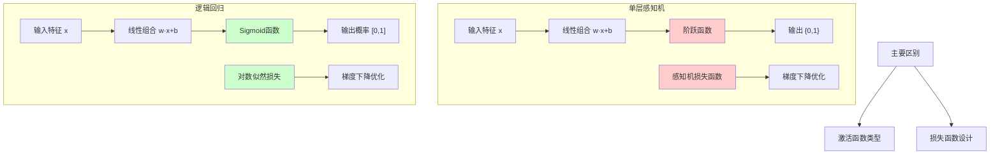

# HCIA-AI 题目分析 - 198-单层感知机和逻辑回归区别

## 题目内容

**问题**: 以下哪些项是单层感知机和逻辑回归的主要区别？

**选项**:
- A. 激活函数
- B. 处理的任务
- C. 损失函数
- D. 优化方法

## 选项分析表格

| 选项 | 内容 | 正确性 | 详细分析 | 知识点 |
|------|------|--------|----------|--------|
| A | 激活函数 | ✅ | 单层感知机使用阶跃函数(step function)作为激活函数，输出0或1；逻辑回归使用Sigmoid函数作为激活函数，输出0到1之间的概率值。这是两者最核心的区别之一。 | 激活函数类型 |
| B | 处理的任务 | ❌ | 两者都主要用于二分类任务，在任务类型上没有本质区别。单层感知机和逻辑回归都是线性分类器，都用于解决线性可分的二分类问题。 | 分类任务 |
| C | 损失函数 | ✅ | 单层感知机使用感知机损失函数（对误分类样本的距离求和）；逻辑回归使用对数似然损失函数（交叉熵损失）。损失函数的不同导致了优化目标和训练过程的差异。 | 损失函数设计 |
| D | 优化方法 | ❌ | 两者都可以使用梯度下降法进行优化，在优化方法上没有根本性区别。虽然具体的梯度计算公式不同，但优化策略是相似的。 | 优化算法 |

## 正确答案
**答案**: AC

**解题思路**: 
1. 分析单层感知机的特点：使用阶跃函数，输出离散值，使用感知机损失函数
2. 分析逻辑回归的特点：使用Sigmoid函数，输出概率值，使用对数似然损失
3. 对比两者在激活函数、任务类型、损失函数、优化方法四个方面的异同
4. 确定主要区别在于激活函数和损失函数

## 概念图解

## 知识点总结

### 核心概念
- **激活函数差异**: 阶跃函数 vs Sigmoid函数，决定了输出的连续性
- **损失函数差异**: 感知机损失 vs 对数似然损失，影响优化目标
- **输出特性**: 离散分类 vs 概率输出，影响模型的解释性

### 相关技术
- **线性分类器**: 两者都属于线性分类器家族
- **二分类算法**: 都是经典的二分类算法
- **梯度下降**: 都可以使用梯度下降进行参数优化

### 记忆要点
- **激活函数**: 感知机用阶跃，逻辑回归用Sigmoid
- **输出形式**: 感知机输出类别，逻辑回归输出概率
- **损失函数**: 感知机关注误分类距离，逻辑回归关注概率似然
- **应用场景**: 逻辑回归更常用，因为提供概率解释

## 扩展学习

### 相关文档
- 《机器学习》周志华 - 线性模型章节
- 《统计学习方法》李航 - 感知机和逻辑回归
- 华为MindSpore线性模型实现文档

### 实践应用
- **MindSpore实现**: 使用nn.Dense + nn.Sigmoid构建逻辑回归
- **ModelArts应用**: 在二分类任务中选择合适的线性模型
- **对比实验**: 在同一数据集上比较两种算法的性能差异