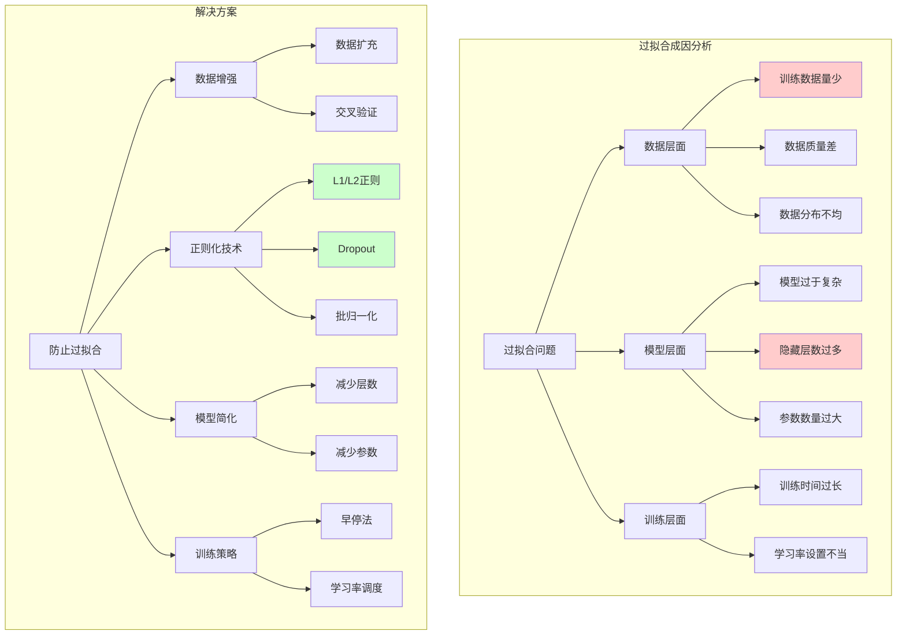

# HCIA-AI 题目分析 - 199-深度学习过拟合解决方案

## 题目内容

**问题**: 深度学习神经网络比较容易出现过拟合问题，以下哪些选项可能导致过拟合问题？

**选项**:
- A. 数据集样本数目少
- B. 使用正则项
- C. 使用Sigmoid激活函数
- D. 隐藏层数过多

## 选项分析表格

| 选项 | 内容 | 正确性 | 详细分析 | 知识点 |
|------|------|--------|----------|--------|
| A | 数据集样本数目少 | ✅ | 当训练数据量不足时，模型容易记住训练样本的特定模式而不是学习到泛化的规律，导致在训练集上表现很好但在测试集上表现差，这是过拟合的典型表现。数据量不足是过拟合的主要原因之一。 | 数据量与泛化 |
| B | 使用正则项 | ❌ | 正则项（如L1、L2正则化）是防止过拟合的重要技术，通过在损失函数中添加参数的惩罚项来约束模型复杂度，使模型更加简单，从而减少过拟合风险。这是解决过拟合的方法，而不是导致过拟合的原因。 | 正则化技术 |
| C | 使用Sigmoid激活函数 | ❌ | Sigmoid激活函数本身不会直接导致过拟合。虽然Sigmoid函数存在梯度消失问题，可能影响训练效果，但这与过拟合没有直接关系。过拟合主要与模型复杂度、数据量等因素相关。 | 激活函数特性 |
| D | 隐藏层数过多 | ✅ | 隐藏层数过多会显著增加模型的复杂度和参数数量，使模型具有更强的拟合能力。当模型过于复杂而训练数据相对不足时，模型容易学习到训练数据中的噪声和特殊模式，导致过拟合。 | 模型复杂度 |

## 正确答案
**答案**: AD

**解题思路**: 
1. 理解过拟合的本质：模型在训练集上表现好，但泛化能力差
2. 分析过拟合的主要原因：数据不足、模型过于复杂
3. 识别防止过拟合的技术：正则化、Dropout、早停等
4. 排除与过拟合无直接关系的因素：激活函数类型

## 概念图解

## 知识点总结

### 核心概念
- **过拟合定义**: 模型在训练集上表现优秀，但在验证集/测试集上表现差
- **数据量影响**: 训练数据不足是过拟合的主要原因
- **模型复杂度**: 过深的网络容易导致过拟合
- **正则化作用**: 通过约束参数来防止过拟合

### 相关技术
- **正则化方法**: L1正则、L2正则、Dropout、批归一化
- **数据增强**: 通过变换扩充训练数据
- **模型选择**: 交叉验证选择合适的模型复杂度
- **早停策略**: 监控验证集性能，及时停止训练

### 记忆要点
- **数据少 + 模型复杂 = 过拟合**
- **正则化是解决方案，不是问题原因**
- **激活函数类型与过拟合无直接关系**
- **深度增加需要配合正则化技术**

## 扩展学习

### 相关文档
- 《深度学习》Ian Goodfellow - 正则化章节
- MindSpore正则化API文档
- ModelArts模型训练最佳实践

### 实践应用
- **MindSpore实现**: 使用nn.Dropout、nn.L2Loss等防止过拟合
- **ModelArts应用**: 在训练过程中监控过拟合指标
- **调参策略**: 平衡模型复杂度与泛化能力