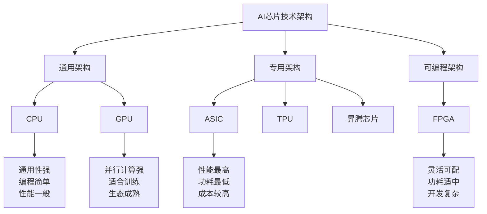

# HCIA-AI 题目分析 - AI芯片架构分类

## 题目内容

**问题**: 从技术架构来看AI芯片的分类包括？

**选项**:
- A. FPGA
- B. CPU
- C. GPU
- D. ASIC

## 选项分析表格

| 选项 | 内容 | 正确性 | 详细分析 | 知识点 |
|------|------|--------|----------|--------|
| A | FPGA | ✅ | FPGA（Field-Programmable Gate Array，现场可编程门阵列）是一种可重新配置的硬件架构，可以通过编程实现特定的AI算法，具有灵活性高、功耗相对较低的特点，广泛应用于AI推理和训练场景 | 可编程硬件架构 |
| B | CPU | ✅ | CPU（Central Processing Unit，中央处理器）虽然不是专门为AI设计，但可以执行AI算法，特别是在AI推理阶段，具有通用性强、编程简单的优势，是AI计算的基础架构之一 | 通用处理器架构 |
| C | GPU | ✅ | GPU（Graphics Processing Unit，图形处理器）具有大量并行计算单元，非常适合AI训练和推理中的矩阵运算，是目前AI计算最主流的硬件架构，NVIDIA的GPU在深度学习领域占主导地位 | 并行计算架构 |
| D | ASIC | ✅ | ASIC（Application-Specific Integrated Circuit，专用集成电路）是专门为特定AI算法设计的芯片，如Google的TPU、华为的昇腾芯片，具有性能高、功耗低的特点，是AI芯片发展的重要方向 | 专用集成电路架构 |

## 正确答案
**答案**: ABCD（多选题）

**解题思路**: 
1. 题目问的是从技术架构角度AI芯片的分类
2. 需要理解不同类型处理器在AI计算中的作用和特点
3. FPGA、CPU、GPU、ASIC都是AI计算中使用的不同技术架构
4. 每种架构都有其特定的应用场景和优势

## 概念图解

## 知识点总结

### 核心概念
- **CPU架构**: 通用处理器，适合控制逻辑和串行计算，在AI推理中作为主控使用
- **GPU架构**: 并行处理器，擅长矩阵运算，是深度学习训练的主流选择
- **FPGA架构**: 可编程硬件，可根据算法需求重新配置，平衡了灵活性和性能
- **ASIC架构**: 专用集成电路，为特定AI算法定制，性能和功耗表现最优

### 相关技术
- **华为昇腾系列**: 基于ASIC架构的AI芯片，包括昇腾910（训练）和昇腾310（推理）
- **NVIDIA GPU**: 基于CUDA架构，在AI训练领域占主导地位
- **Intel CPU**: 集成AI加速指令集，如AVX-512、DL Boost等
- **Xilinx FPGA**: 提供AI开发套件和优化库

### 记忆要点
- **性能排序**: ASIC > GPU > FPGA > CPU（针对特定AI任务）
- **灵活性排序**: CPU > FPGA > GPU > ASIC
- **开发难度**: CPU < GPU < FPGA < ASIC
- **功耗效率**: ASIC > FPGA > GPU > CPU

## 扩展学习

### 相关文档
- 华为昇腾AI处理器架构白皮书
- NVIDIA GPU深度学习性能指南
- Intel AI加速技术文档
- Xilinx AI开发平台介绍

### 实践应用
- **训练场景**: 主要使用GPU集群，如V100、A100等
- **推理场景**: 根据需求选择GPU、FPGA或ASIC
- **边缘计算**: 多使用低功耗的ASIC或FPGA
- **云端服务**: 华为云ModelArts支持多种AI芯片架构