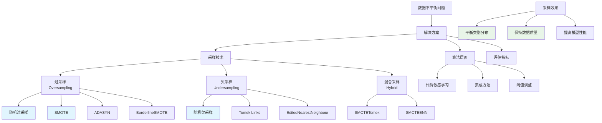

# HCIA-AI 题目分析 - 数据不平衡解决方法

## 题目内容

**问题**: 在深度学习任务中，遇到数据不平衡问题时，我们可以用以下哪些方法进行解决？

**选项**:
- A. 批量删除
- B. 随机过采样
- C. 随机欠采样
- D. 合成采样

## 选项分析表格

| 选项 | 内容 | 正确性 | 详细分析 | 知识点 |
|------|------|--------|----------|--------|
| A | 批量删除 | ❌ | 批量删除不是解决数据不平衡的标准方法。简单删除数据会导致信息丢失，且不能有效解决类别不平衡问题，可能使问题更加严重 | 错误方法 |
| B | 随机过采样 | ✅ | 随机过采样(Random Oversampling)通过复制少数类样本来增加其数量，使各类别样本数量趋于平衡。虽然可能导致过拟合，但是有效的基础方法 | 过采样技术 |
| C | 随机欠采样 | ✅ | 随机欠采样(Random Undersampling)通过随机删除多数类样本来减少其数量，使各类别平衡。可能丢失有用信息，但在数据量大时是有效方法 | 欠采样技术 |
| D | 合成采样 | ✅ | 合成采样如SMOTE(Synthetic Minority Oversampling Technique)通过在少数类样本间插值生成新样本，比简单复制更能提高模型泛化能力 | 合成采样技术 |

## 正确答案
**答案**: BCD

**解题思路**: 
1. 理解数据不平衡问题的本质
2. 识别有效的数据平衡技术
3. 过采样增加少数类，欠采样减少多数类
4. 合成采样生成新的少数类样本
5. 批量删除不是标准解决方案

## 概念图解

## 知识点总结

### 核心概念
- **随机过采样**: 复制少数类样本，简单有效但可能过拟合
- **随机欠采样**: 删除多数类样本，快速但可能丢失信息
- **合成采样**: 如SMOTE，生成新样本，效果通常更好
- **批量删除**: 不是标准的数据平衡方法

### 相关技术
- SMOTE及其变种算法
- 代价敏感学习
- 集成学习方法
- 评估指标：精确率、召回率、F1-score

### 记忆要点
- 过采样增加少数类样本数量
- 欠采样减少多数类样本数量
- 合成采样生成新的人工样本
- 选择方法需考虑数据量和质量

## 扩展学习

### 相关文档
- 数据不平衡处理技术综述
- SMOTE算法原理与实现
- 不平衡学习评估指标

### 实践应用
- 医疗诊断中的罕见病检测
- 金融风控中的欺诈检测
- 华为云ModelArts中的数据处理
- 工业质检中的缺陷检测