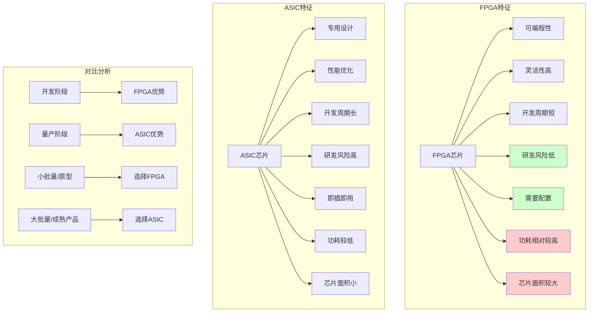

# HCIA-AI 题目分析 - 200-FPGA芯片特征

## 题目内容

**问题**: 与ASIC芯片相比，以下哪些选项是FPGA芯片的特征？

**选项**:
- A. 实现相同功能时，需要的芯片规模更大。
- B. 相同工艺条件下，功耗更小。
- C. 研发风险较低。
- D. 运行时无需加载配置，可立即运行。

## 选项分析表格

| 选项 | 内容 | 正确性 | 详细分析 | 知识点 |
|------|------|--------|----------|--------|
| A | 实现相同功能时，需要的芯片规模更大 | ❌ | 这个说法是错误的。FPGA由于其可编程特性和通用架构，在实现相同功能时通常需要更多的逻辑资源和更大的芯片面积，但题目选项表述有误导性。实际上FPGA的芯片规模通常比专用ASIC要大。 | 芯片面积对比 |
| B | 相同工艺条件下，功耗更小 | ❌ | FPGA的功耗通常比ASIC更高，不是更小。由于FPGA的可编程特性需要额外的配置电路和开关矩阵，这些都会增加功耗。ASIC是专用设计，电路更加优化，功耗更低。 | 功耗特性 |
| C | 研发风险较低 | ✅ | FPGA的研发风险确实比ASIC低。FPGA可以通过软件编程实现功能，开发周期短，可以快速验证和修改设计。而ASIC需要流片制造，一旦设计有误，修改成本极高，风险很大。 | 开发风险 |
| D | 运行时无需加载配置，可立即运行 | ✅ | FPGA在上电后需要从外部存储器（如Flash）加载配置文件来定义其功能，配置完成后即可运行。相比之下，ASIC的功能是固化在硬件中的，上电即可工作，无需配置过程。 | 配置特性 |

## 正确答案
**答案**: ACD

**解题思路**: 
1. 理解FPGA和ASIC的基本特性差异
2. 分析FPGA的优势：灵活性高、开发周期短、风险低
3. 分析FPGA的劣势：功耗高、性能相对较低
4. 对比两种芯片在不同维度的特征

## 概念图解

## 知识点总结

### 核心概念
- **FPGA特点**: 可编程、灵活、开发快、风险低、需配置
- **ASIC特点**: 专用、高效、开发慢、风险高、即用
- **应用场景**: FPGA适合原型验证，ASIC适合大规模量产
- **技术权衡**: 灵活性 vs 性能，开发速度 vs 优化程度

### 相关技术
- **FPGA架构**: 查找表(LUT)、可编程互连、配置存储
- **ASIC设计**: 全定制、标准单元、IP复用
- **华为芯片**: 昇腾系列采用ASIC架构，鲲鹏采用ARM架构
- **AI加速**: FPGA用于算法验证，ASIC用于产品化

### 记忆要点
- **FPGA = 灵活 + 快速开发 + 低风险 + 需配置**
- **ASIC = 高效 + 低功耗 + 高风险 + 即用**
- **开发阶段选FPGA，量产阶段选ASIC**
- **功耗：ASIC < FPGA，面积：ASIC < FPGA**

## 扩展学习

### 相关文档
- 《数字集成电路设计》- FPGA与ASIC对比
- 华为昇腾AI芯片技术白皮书
- FPGA开发工具链使用指南

### 实践应用
- **华为AI芯片**: 昇腾910/310采用ASIC架构实现高性能AI计算
- **原型验证**: 使用FPGA验证AI算法后再转为ASIC实现
- **边缘计算**: 根据应用场景选择合适的芯片架构
- **成本分析**: 考虑开发成本、制造成本、时间成本的综合权衡