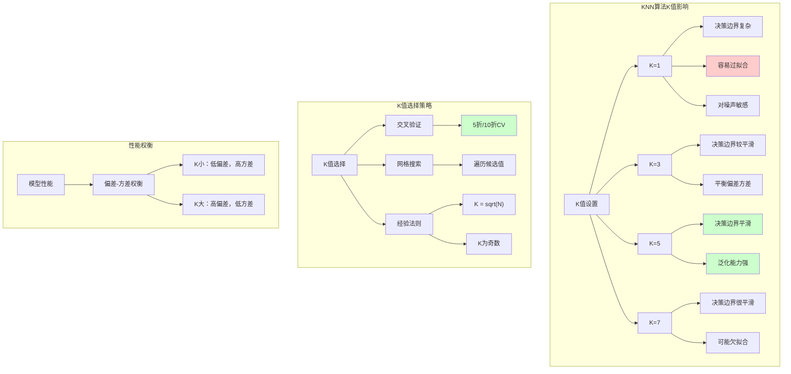

# HCIA-AI 题目分析 - 202-KNN算法k值描述

## 题目内容

**问题**: 以下关于KNN算法当中k值描述正确的是？

**选项**:
- A. K值越大，模型越容易过拟合
- B. K值越大，分类的分割面越平滑
- C. K值是超参数
- D. 可以将k值设为0

## 选项分析表格

| 选项 | 内容 | 正确性 | 详细分析 | 知识点 |
|------|------|--------|----------|--------|
| A | K值越大，模型越容易过拟合 | ❌ | 这个说法是错误的。实际上K值越大，模型越不容易过拟合。当K值很小（如K=1）时，模型会严格按照最近邻进行分类，容易受到噪声影响，导致过拟合。K值增大时，决策会考虑更多邻居，模型更加平滑，泛化能力更强。 | 过拟合与K值关系 |
| B | K值越大，分类的分割面越平滑 | ✅ | 这个说法是正确的。K值越大，分类决策会考虑更多的邻居样本，使得决策边界更加平滑。当K=1时，决策边界会很复杂，可能出现锯齿状；K值增大时，决策边界变得更加平滑和规整。 | 决策边界特性 |
| C | K值是超参数 | ✅ | 这个说法是正确的。K值是KNN算法中需要人工设定的参数，不是通过训练数据学习得到的，因此属于超参数。通常需要通过交叉验证等方法来选择最优的K值。 | 超参数概念 |
| D | 可以将k值设为0 | ❌ | 这个说法是错误的。K值必须是正整数，不能为0。如果K=0，算法无法进行分类决策，因为没有邻居可以参考。KNN算法的核心就是基于K个最近邻进行决策，K=0没有意义。 | K值取值范围 |

## 正确答案
**答案**: BC

**解题思路**: 
1. 理解KNN算法的工作原理：基于K个最近邻进行分类
2. 分析K值对模型复杂度的影响：K小→复杂→易过拟合，K大→简单→不易过拟合
3. 理解K值对决策边界的影响：K大→边界平滑
4. 确认K值的参数性质：属于超参数，需要调优

## 概念图解

## 知识点总结

### 核心概念
- **K值作用**: 控制模型复杂度和决策边界平滑程度
- **过拟合关系**: K值小容易过拟合，K值大不易过拟合
- **超参数性质**: K值需要通过验证集或交叉验证来选择
- **取值限制**: K值必须是正整数，通常选择奇数避免平票

### 相关技术
- **距离度量**: 欧氏距离、曼哈顿距离、余弦距离
- **K值选择**: 交叉验证、网格搜索、贝叶斯优化
- **算法优化**: KD树、Ball树、LSH等加速方法
- **权重策略**: 距离加权、一致权重

### 记忆要点
- **K值越大，边界越平滑，越不容易过拟合**
- **K值是超参数，需要调优**
- **K值不能为0，通常选择奇数**
- **K=1时最复杂，K=N时最简单（退化为多数类分类器）**

## 扩展学习

### 相关文档
- 《机器学习》周志华 - K近邻学习章节
- 《统计学习方法》李航 - K近邻法
- MindSpore KNN实现文档

### 实践应用
- **MindSpore实现**: 使用mindspore.nn.KNearestNeighbors
- **ModelArts应用**: 在分类任务中调优K值
- **参数调优**: 使用交叉验证选择最优K值
- **性能优化**: 在大数据集上使用近似KNN算法