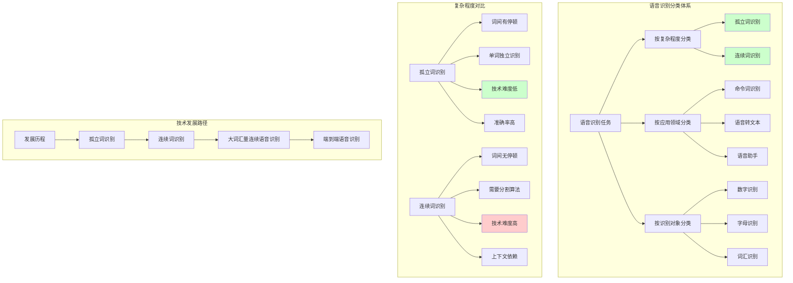

# HCIA-AI 题目分析 - 203-语音识别任务复杂程度分类

## 题目内容

**问题**: 语音识别任务按照复杂程度分为哪两类？

**选项**:
- A. 短句识别
- B. 连续词识别
- C. 数字识别
- D. 孤立词识别

## 选项分析表格

| 选项 | 内容 | 正确性 | 详细分析 | 知识点 |
|------|------|--------|----------|--------|
| A | 短句识别 | ❌ | 短句识别不是按复杂程度划分的标准分类。虽然短句识别确实存在，但它更多是按照识别内容长度来分类，而不是按照算法复杂程度的标准分类方法。 | 识别内容分类 |
| B | 连续词识别 | ✅ | 连续词识别是语音识别按复杂程度分类的一种，属于较复杂的识别任务。在连续词识别中，词与词之间没有明显的停顿，需要算法能够自动分割和识别连续的语音流，技术难度较高。 | 复杂度分类 |
| C | 数字识别 | ❌ | 数字识别是按照识别内容来分类的，不是按照复杂程度分类。数字识别通常指识别0-9的数字语音，这是按照应用领域或识别对象来划分的，而不是复杂程度。 | 应用领域分类 |
| D | 孤立词识别 | ✅ | 孤立词识别是语音识别按复杂程度分类的另一种，属于相对简单的识别任务。在孤立词识别中，每个词之间有明显的停顿，算法只需要识别单个词汇，技术难度相对较低。 | 复杂度分类 |

## 正确答案
**答案**: BD

**解题思路**: 
1. 理解语音识别的分类维度：按复杂程度、按应用领域、按识别对象等
2. 识别按复杂程度分类的两个主要类别：孤立词识别和连续词识别
3. 分析两种识别方式的技术难度差异
4. 排除其他分类维度的选项

## 概念图解

## 知识点总结

### 核心概念
- **孤立词识别**: 词间有停顿，单独识别每个词，技术相对简单
- **连续词识别**: 词间无停顿，需要自动分割，技术复杂
- **复杂程度**: 主要体现在分割难度和上下文处理
- **技术演进**: 从孤立词到连续词是语音识别发展的重要里程碑

### 相关技术
- **孤立词技术**: 模板匹配、DTW动态时间规整、HMM隐马尔可夫模型
- **连续词技术**: 语言模型、声学模型、解码算法
- **深度学习**: CNN、RNN、Transformer在语音识别中的应用
- **端到端模型**: CTC、Attention、Wav2Vec等现代方法

### 记忆要点
- **按复杂程度分类：孤立词识别 + 连续词识别**
- **孤立词 = 简单 + 有停顿 + 高准确率**
- **连续词 = 复杂 + 无停顿 + 需分割**
- **技术发展：孤立词 → 连续词 → 大词汇量 → 端到端**

## 扩展学习

### 相关文档
- 《语音信号处理》- 语音识别基础理论
- 华为云语音识别服务API文档
- MindSpore语音识别模型实现

### 实践应用
- **华为云ASR**: 支持孤立词和连续词识别
- **HiAI语音**: 在华为设备上的语音识别应用
- **ModelArts**: 训练自定义语音识别模型
- **实时识别**: 在智能音箱、手机等设备上的应用