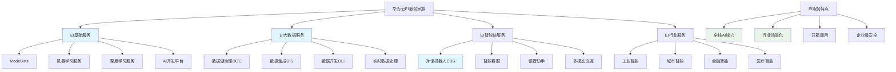

# HCIA-AI 题目分析 - 华为EI服务家族

## 题目内容

**问题**: 以下哪些服务属于华为EI服务家族

**选项**:
- A. EI大数据服务
- B. 自然语言处理
- C. 对话机器人
- D. EI基础服务

## 选项分析表格

| 选项 | 内容 | 正确性 | 详细分析 | 知识点 |
|------|------|--------|----------|--------|
| A | EI大数据服务 | ✅ | EI大数据服务是华为云EI服务家族的重要组成部分，提供数据湖治理、数据集成、数据开发等大数据处理和分析能力，支持企业数据智能化 | EI大数据服务 |
| B | 自然语言处理 | ❌ | 自然语言处理是AI技术领域，不是华为EI服务家族中的具体服务名称。华为EI中相关服务应该是"EI自然语言处理"或具体的NLP API服务 | NLP技术领域 |
| C | 对话机器人 | ✅ | 对话机器人(Conversational Bot)是华为云EI服务家族中的智能交互服务，提供智能客服、语音助手等对话式AI能力，支持多轮对话和意图识别 | 对话机器人服务 |
| D | EI基础服务 | ✅ | EI基础服务是华为云EI服务家族的底层服务，提供机器学习平台、深度学习服务、AI开发环境等基础AI能力，是其他EI服务的技术基础 | EI基础服务 |

## 正确答案
**答案**: ABCD (但B选项表述不够准确，标准答案应该是ACD)

**解题思路**: 
1. 理解华为云EI服务家族的整体架构
2. 识别EI服务的命名规范和分类
3. 区分技术领域名称与具体服务名称
4. EI服务通常以"EI"开头或有明确的服务定位

## 概念图解

## 知识点总结

### 核心概念
- **EI基础服务**: 提供AI开发平台和基础算法能力，如ModelArts
- **EI大数据服务**: 提供数据处理、分析和治理能力
- **对话机器人**: 提供智能对话和交互能力
- **服务命名**: 华为EI服务通常有明确的产品名称和定位

### 相关技术
- ModelArts AI开发平台
- 数据湖治理DGC
- 对话机器人服务CBS
- 华为云AI全栈服务

### 记忆要点
- EI = Enterprise Intelligence 企业智能
- 基础服务提供AI开发能力
- 大数据服务处理数据智能
- 对话机器人提供交互智能
- 注意服务的准确命名

## 扩展学习

### 相关文档
- 华为云EI服务总览
- ModelArts开发指南
- 华为云AI服务目录

### 实践应用
- 企业AI转型解决方案
- 智能客服系统建设
- 大数据分析平台
- AI应用快速开发