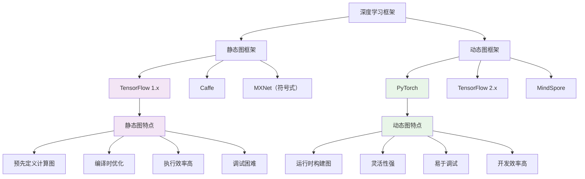

# HCIA-AI 题目分析 - PyTorch静态图特点

## 题目内容

**问题**: 静态图是PyTorch的特点之一。

**选项**:
- A. 正确
- B. 错误

## 选项分析表格

| 选项 | 内容 | 正确性 | 详细分析 | 知识点 |
|------|------|--------|----------|--------|
| A | 正确 | ❌ | 这是错误的。PyTorch的核心特点是动态图（Dynamic Graph），而不是静态图。PyTorch采用动态计算图机制，允许在运行时构建和修改计算图 | PyTorch动态图机制 |
| B | 错误 | ✅ | 这是正确答案。静态图不是PyTorch的特点，而是TensorFlow 1.x的特点。PyTorch以动态图（Eager Execution）著称，提供更灵活的编程体验 | 深度学习框架对比 |

## 正确答案
**答案**: B（错误）

**解题思路**: PyTorch的核心特点是动态图机制，而静态图是TensorFlow 1.x的特点。需要明确区分不同深度学习框架的技术特色。

## 概念图解



## 知识点总结

### 核心概念

#### 1. PyTorch动态图机制
- **定义**：计算图在运行时动态构建
- **特点**：Eager Execution（即时执行）
- **优势**：灵活、直观、易调试
- **实现**：每次前向传播都重新构建计算图

#### 2. 静态图 vs 动态图对比

| 特性 | 静态图 | 动态图 |
|------|--------|--------|
| **定义时机** | 编译时预定义 | 运行时构建 |
| **灵活性** | 较低，结构固定 | 高，可动态修改 |
| **调试难度** | 困难，需要Session | 容易，Python原生调试 |
| **执行效率** | 高，编译优化 | 相对较低 |
| **内存使用** | 优化较好 | 相对较高 |
| **代表框架** | TensorFlow 1.x | PyTorch, TensorFlow 2.x |

#### 3. PyTorch核心特点

**动态计算图**：
```python
import torch
import torch.nn as nn

# 动态图示例
x = torch.randn(3, 4, requires_grad=True)
y = x * 2
z = y.mean()

# 每次运行都会重新构建计算图
z.backward()  # 动态构建反向传播图
print(x.grad)  # 梯度计算结果
```

**即时执行**：
```python
# PyTorch中的操作立即执行
a = torch.tensor([1, 2, 3])
b = torch.tensor([4, 5, 6])
c = a + b  # 立即计算，无需Session
print(c)   # 直接输出结果
```

### 框架演进历史

#### 1. TensorFlow的演进
- **TensorFlow 1.x**：静态图，需要Session执行
- **TensorFlow 2.x**：默认Eager Execution，支持动态图
- **转变原因**：提高开发效率和用户体验

#### 2. PyTorch的设计理念
- **研究友好**：快速原型开发
- **Python原生**：符合Python编程习惯
- **动态性**：支持变长序列、条件分支
- **可视化调试**：可以使用标准Python调试工具

### 技术实现细节

#### 1. PyTorch动态图实现
```python
import torch
import torch.nn as nn

class DynamicNet(nn.Module):
    def __init__(self):
        super(DynamicNet, self).__init__()
        self.linear1 = nn.Linear(10, 20)
        self.linear2 = nn.Linear(20, 1)
    
    def forward(self, x):
        # 动态控制流
        if x.sum() > 0:
            h = torch.relu(self.linear1(x))
        else:
            h = torch.tanh(self.linear1(x))
        
        # 动态循环
        for i in range(x.size(0)):
            if i % 2 == 0:
                h = h * 2
        
        return self.linear2(h)

# 每次前向传播可能有不同的计算图
model = DynamicNet()
x1 = torch.randn(5, 10)  # 正数和
x2 = torch.randn(5, 10) * -1  # 负数和

y1 = model(x1)  # 使用ReLU路径
y2 = model(x2)  # 使用Tanh路径
```

#### 2. 自动微分机制
```python
# PyTorch的自动微分
x = torch.tensor(2.0, requires_grad=True)
y = x**2 + 3*x + 1

# 动态构建计算图
y.backward()
print(f"dy/dx = {x.grad}")  # 输出: dy/dx = 7.0

# 可以多次计算不同的梯度
x.grad.zero_()  # 清零梯度
z = x**3
z.backward()
print(f"dz/dx = {x.grad}")  # 输出: dz/dx = 12.0
```

### 优缺点分析

#### ✅ PyTorch动态图优点
1. **开发效率高**：代码直观，易于理解
2. **调试友好**：可以使用Python调试器
3. **灵活性强**：支持动态网络结构
4. **研究友好**：快速实验和原型开发
5. **Python原生**：无缝集成Python生态

#### ❌ PyTorch动态图缺点
1. **执行效率**：相比静态图略低
2. **内存开销**：动态构建图的开销
3. **部署复杂**：生产环境部署相对复杂
4. **优化限制**：编译时优化机会较少

### 现代发展趋势

#### 1. 框架融合
- **TensorFlow 2.x**：默认Eager Execution
- **PyTorch 2.0**：引入编译优化（torch.compile）
- **统一趋势**：动态开发，静态部署

#### 2. 最佳实践
```python
# PyTorch 2.0 编译优化
import torch

model = torch.nn.Linear(10, 1)
optimized_model = torch.compile(model)  # 编译优化

# 开发时使用动态图
x = torch.randn(32, 10)
y = model(x)  # 动态执行

# 部署时使用优化版本
y_opt = optimized_model(x)  # 编译优化执行
```

### 实际应用场景

#### 1. 研究开发
- **快速原型**：新算法验证
- **实验对比**：不同模型架构测试
- **论文复现**：研究代码实现

#### 2. 教育培训
- **教学演示**：直观展示计算过程
- **学习调试**：逐步执行和检查
- **概念理解**：清晰的代码逻辑

#### 3. 复杂模型
- **变长序列**：RNN、Transformer
- **条件网络**：根据输入动态选择路径
- **递归结构**：树形网络、图神经网络

### 与其他框架对比

#### 1. TensorFlow对比
```python
# TensorFlow 1.x (静态图)
import tensorflow.compat.v1 as tf
tf.disable_v2_behavior()

# 定义计算图
x = tf.placeholder(tf.float32, [None, 10])
y = tf.layers.dense(x, 1)

# 执行计算图
with tf.Session() as sess:
    sess.run(tf.global_variables_initializer())
    result = sess.run(y, feed_dict={x: data})

# PyTorch (动态图)
import torch
import torch.nn as nn

model = nn.Linear(10, 1)
x = torch.randn(32, 10)
y = model(x)  # 直接执行
```

#### 2. MindSpore对比
```python
# MindSpore 动态图模式
import mindspore as ms
import mindspore.nn as nn
from mindspore import context

# 设置动态图模式
context.set_context(mode=context.PYNATIVE_MODE)

class Net(nn.Cell):
    def __init__(self):
        super(Net, self).__init__()
        self.dense = nn.Dense(10, 1)
    
    def construct(self, x):
        return self.dense(x)

model = Net()
x = ms.Tensor(np.random.randn(32, 10), ms.float32)
y = model(x)  # 动态执行
```

### 记忆要点

1. **PyTorch特点**："动态图，不是静态图"
2. **核心机制**："Eager Execution，即时执行"
3. **主要优势**："灵活、直观、易调试"
4. **框架对比**："TensorFlow 1.x静态图，PyTorch动态图"
5. **发展趋势**："动态开发，静态部署"

## 扩展学习

### PyTorch动态图深入理解

```python
import torch
import torch.nn as nn
from torch.autograd import Variable

class DynamicRNN(nn.Module):
    """
    动态RNN示例：展示PyTorch动态图的优势
    """
    def __init__(self, input_size, hidden_size):
        super(DynamicRNN, self).__init__()
        self.hidden_size = hidden_size
        self.i2h = nn.Linear(input_size + hidden_size, hidden_size)
        self.i2o = nn.Linear(input_size + hidden_size, 1)
        self.softmax = nn.LogSoftmax(dim=1)
    
    def forward(self, input_seq):
        hidden = torch.zeros(1, self.hidden_size)
        outputs = []
        
        # 动态处理变长序列
        for i in range(input_seq.size(0)):
            combined = torch.cat((input_seq[i], hidden), 1)
            hidden = torch.tanh(self.i2h(combined))
            output = self.i2o(combined)
            outputs.append(output)
        
        return torch.cat(outputs, 0)

# 处理不同长度的序列
model = DynamicRNN(10, 20)

# 序列1：长度为5
seq1 = torch.randn(5, 1, 10)
out1 = model(seq1)

# 序列2：长度为8
seq2 = torch.randn(8, 1, 10)
out2 = model(seq2)

print(f"序列1输出形状: {out1.shape}")
print(f"序列2输出形状: {out2.shape}")
```

### 计算图可视化

```python
import torch
import torchviz
from torch.autograd import Variable

# 创建简单网络
x = Variable(torch.randn(1, 10), requires_grad=True)
model = torch.nn.Sequential(
    torch.nn.Linear(10, 5),
    torch.nn.ReLU(),
    torch.nn.Linear(5, 1)
)

y = model(x)

# 可视化计算图
dot = torchviz.make_dot(y, params=dict(model.named_parameters()))
dot.render('pytorch_graph', format='png')
```

### 性能优化技巧

```python
import torch
import time

# 1. 使用torch.jit进行静态化
@torch.jit.script
def optimized_function(x, y):
    return x * y + torch.sin(x)

# 2. 使用torch.compile (PyTorch 2.0+)
model = torch.nn.Linear(1000, 1000)
compiled_model = torch.compile(model)

# 3. 内存优化
with torch.no_grad():  # 不计算梯度
    result = model(x)

# 4. 设备优化
device = torch.device('cuda' if torch.cuda.is_available() else 'cpu')
model = model.to(device)
x = x.to(device)
```

### 调试技巧

```python
import torch
import pdb

class DebuggableModel(torch.nn.Module):
    def __init__(self):
        super().__init__()
        self.linear1 = torch.nn.Linear(10, 5)
        self.linear2 = torch.nn.Linear(5, 1)
    
    def forward(self, x):
        # 可以在任何地方设置断点
        h = torch.relu(self.linear1(x))
        
        # 检查中间结果
        print(f"隐藏层输出: {h.shape}, 均值: {h.mean().item()}")
        
        # 条件调试
        if torch.isnan(h).any():
            pdb.set_trace()  # 进入调试器
        
        return self.linear2(h)

# 使用标准Python调试工具
model = DebuggableModel()
x = torch.randn(32, 10)
y = model(x)
```

### 生产部署策略

```python
# 1. TorchScript导出
model = torch.nn.Linear(10, 1)
scripted_model = torch.jit.script(model)
scripted_model.save('model.pt')

# 2. ONNX导出
import torch.onnx
torch.onnx.export(model, x, 'model.onnx')

# 3. TensorRT优化（NVIDIA GPU）
import torch_tensorrt
trt_model = torch_tensorrt.compile(model, 
                                  inputs=[torch_tensorrt.Input((1, 10))])

# 4. 移动端部署
mobile_model = torch.jit.script(model)
mobile_model._save_for_lite_interpreter('model_mobile.ptl')
```