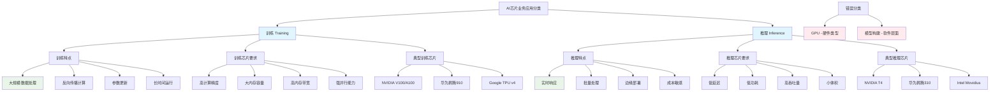

# HCIA-AI 题目分析 - AI芯片业务应用分类

## 题目内容

**问题**: AI芯片从业务应用上来分，可以分为？

**选项**:
- A. 训练
- B. GPU
- C. 模型构建
- D. 推理

## 选项分析表格

| 选项 | 内容 | 正确性 | 详细分析 | 知识点 |
|------|------|--------|----------|--------|
| A | 训练 | ✅ | 训练是AI芯片的主要业务应用场景之一。训练芯片需要支持大规模并行计算、高精度浮点运算、大内存带宽等特性，用于深度学习模型的训练过程 | AI训练应用 |
| B | GPU | ❌ | GPU是芯片的硬件类型，不是业务应用分类。GPU可以用于训练也可以用于推理，它是实现AI计算的硬件平台，而不是业务应用场景 | 硬件类型 |
| C | 模型构建 | ❌ | 模型构建是软件层面的工作，主要涉及算法设计和网络架构定义，不是AI芯片的业务应用分类。芯片主要负责计算执行，而不是模型设计 | 软件层面 |
| D | 推理 | ✅ | 推理是AI芯片的另一个主要业务应用场景。推理芯片注重低延迟、低功耗、高吞吐量，用于已训练模型的实际应用和部署 | AI推理应用 |

## 正确答案
**答案**: AD

**解题思路**: 
1. 理解AI芯片的业务应用场景分类
2. 区分硬件类型与业务应用
3. 区分软件层面与硬件层面的工作
4. 掌握训练和推理的不同需求特点

## 概念图解

## 知识点总结

### 核心概念
- **训练应用**: 模型训练阶段，需要高精度计算和大内存
- **推理应用**: 模型部署阶段，注重效率和实时性
- **业务分类**: 按照AI工作流程的不同阶段进行分类
- **硬件vs应用**: 区分硬件类型(GPU)和业务应用(训练/推理)

### 相关技术
- 华为昇腾AI处理器
- NVIDIA GPU加速
- 边缘AI计算
- 云端AI服务

### 记忆要点
- 业务应用分类：训练 + 推理
- GPU是硬件类型，不是业务分类
- 模型构建属于软件层面
- 训练重计算，推理重效率

## 扩展学习

### 相关文档
- AI芯片架构设计原理
- 华为昇腾处理器技术白皮书
- AI计算加速技术综述

### 实践应用
- 华为云ModelArts训练服务
- 边缘AI推理部署
- 昇腾AI应用开发
- 企业AI解决方案