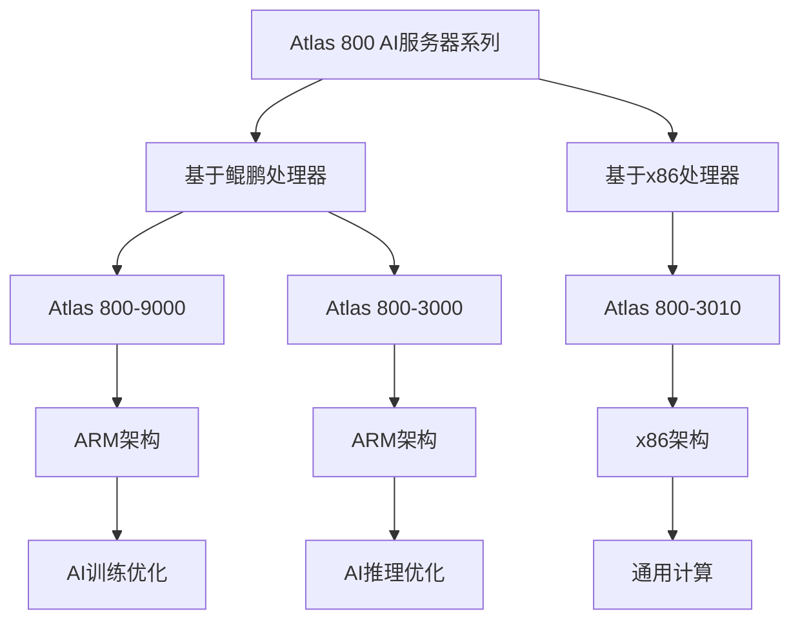

# HCIA-AI 题目分析 - Atlas 800 AI服务器型号

## 题目内容

**问题**: Atlas 800 AI服务器有多个型号，其中基于鲲鹏处理器平台的是？

**选项**:
- A. Atlas800型号:9000
- B. Atlas800型号:3000
- C. Atlas800型号:3010

## 选项分析表格

| 选项 | 内容 | 正确性 | 详细分析 | 知识点 |
|------|------|--------|----------|--------|
| A | Atlas800型号:9000 | ✅ | Atlas 800-9000是基于鲲鹏920处理器的AI服务器，采用ARM架构，专为AI训练和推理设计 | 华为AI硬件生态 |
| B | Atlas800型号:3000 | ✅ | Atlas 800-3000也是基于鲲鹏处理器平台的AI服务器型号，同样采用ARM架构 | 华为AI硬件生态 |
| C | Atlas800型号:3010 | ❌ | Atlas 800-3010是基于x86架构的AI服务器，不是基于鲲鹏处理器平台 | 华为AI硬件生态 |

## 正确答案
**答案**: AB

**解题思路**: 
1. 理解鲲鹏处理器是华为自研的ARM架构处理器
2. Atlas 800系列中，9000和3000型号都基于鲲鹏处理器
3. 3010型号基于x86架构，不符合题目要求

## 概念图解

## 知识点总结

### 核心概念
- **鲲鹏处理器**: 华为自研的ARM架构服务器处理器，专为数据中心设计
- **Atlas 800系列**: 华为AI服务器产品线，支持不同处理器架构
- **ARM vs x86**: 不同的处理器架构，各有优势和应用场景

### 相关技术
- 鲲鹏920处理器特性和性能优势
- Atlas系列AI服务器的产品定位
- ARM架构在AI计算中的应用

### 记忆要点
- Atlas 800-9000/3000 = 鲲鹏处理器 = ARM架构
- Atlas 800-3010 = x86架构
- 鲲鹏处理器是华为自研ARM架构

## 扩展学习

### 相关文档
- 华为Atlas系列AI服务器产品手册
- 鲲鹏处理器技术白皮书
- ARM架构在AI计算中的应用指南

### 实践应用
- AI训练集群部署方案选择
- 不同架构服务器的性能对比
- 华为AI全栈解决方案集成