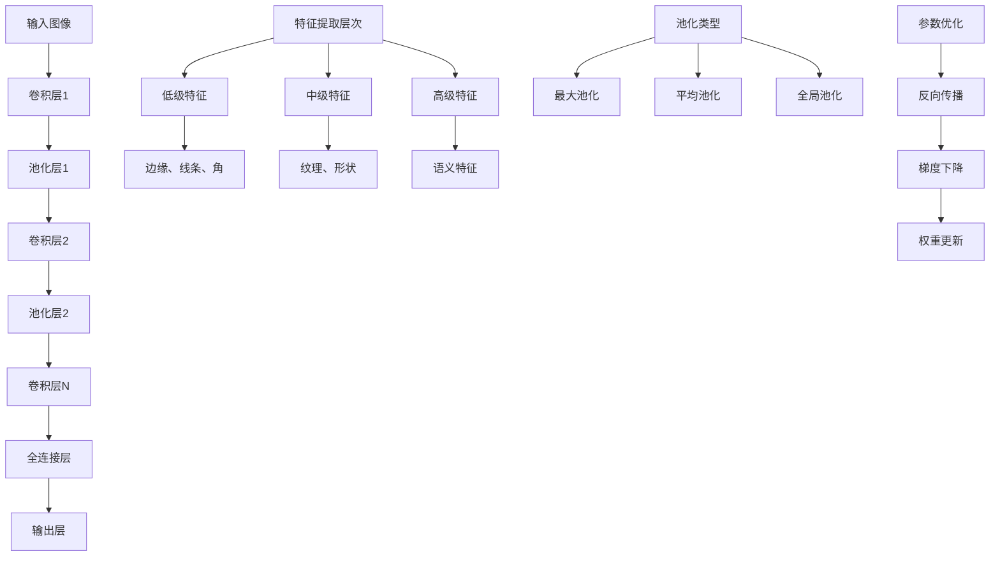

# HCIA-AI 题目分析 - 卷积神经网络结构

## 题目内容

**问题**: 关于卷积神经网络的结构，下列哪些说法是正确的？

**选项**:
- A. 在卷积神经网络格中，池化层只能选择最大池化，而不能选择其他方法。
- B. 卷积运算的目的是提取输入的不同特征，第一层卷积层可能只能提取一些低级的特征如边缘、线条和角，更多层的网络能从低级特征中逐代提取更复杂的特征。
- C. 全连接层把所有局部特征结合变成全局特征用来计算最后每一类的得分。
- D. 卷积神经网络中每层卷积层由若干卷积单元组成，每个卷积单元的参数都是通过反向传播算法优化得到的。

## 选项分析表格

| 选项 | 内容 | 正确性 | 详细分析 | 知识点 |
|------|------|--------|----------|--------|
| A | 池化层只能选择最大池化，而不能选择其他方法 | ❌ | 池化层有多种方法：最大池化(Max Pooling)、平均池化(Average Pooling)、全局池化等，不仅限于最大池化 | 池化层类型 |
| B | 卷积运算提取不同特征，层次化特征提取 | ✅ | 正确描述了CNN的层次化特征提取机制：低层提取边缘、线条等基础特征，高层提取更复杂的语义特征 | 特征提取机制 |
| C | 全连接层结合局部特征成全局特征计算分类得分 | ✅ | 全连接层的作用是将卷积层提取的局部特征进行全局整合，输出最终的分类概率 | 全连接层功能 |
| D | 卷积单元参数通过反向传播优化 | ✅ | CNN中的卷积核参数确实通过反向传播算法和梯度下降进行优化学习 | 参数优化 |

## 正确答案
**答案**: BCD

**解题思路**: 
1. 分析每个选项对CNN结构描述的准确性
2. A选项错误：池化层有多种类型，不仅限于最大池化
3. B、C、D选项正确描述了CNN的核心机制

## 概念图解



## 知识点总结

### 核心概念
- **层次化特征提取**: CNN通过多层卷积逐步提取从低级到高级的特征
- **池化层多样性**: 包括最大池化、平均池化、全局池化等多种方法
- **全连接层作用**: 将局部特征整合为全局特征，用于最终分类
- **参数学习机制**: 通过反向传播算法优化卷积核参数

### 相关技术
- 卷积操作的数学原理
- 不同池化方法的特点和应用场景
- 反向传播算法在CNN中的应用
- 特征图的维度变化规律

### 记忆要点
- 池化层≠只有最大池化，还有平均池化等
- CNN特征提取：低级→中级→高级
- 全连接层：局部特征→全局特征→分类得分
- 所有参数都通过反向传播优化

## 扩展学习

### 相关文档
- 深度学习经典教材：CNN章节
- TensorFlow/PyTorch卷积层API文档
- 计算机视觉中的CNN应用

### 实践应用
- 图像分类网络设计
- 目标检测中的特征提取
- 不同池化策略的性能对比
- CNN可视化和特征分析

### 代码示例

```python
# CNN结构示例
model = tf.keras.Sequential([
    # 卷积层 - 提取低级特征
    tf.keras.layers.Conv2D(32, (3,3), activation='relu'),
    tf.keras.layers.MaxPooling2D(2,2),  # 最大池化
    
    # 卷积层 - 提取中级特征
    tf.keras.layers.Conv2D(64, (3,3), activation='relu'),
    tf.keras.layers.AveragePooling2D(2,2),  # 平均池化
    
    # 全连接层 - 整合全局特征
    tf.keras.layers.Flatten(),
    tf.keras.layers.Dense(128, activation='relu'),
    tf.keras.layers.Dense(10, activation='softmax')  # 分类输出
])
```